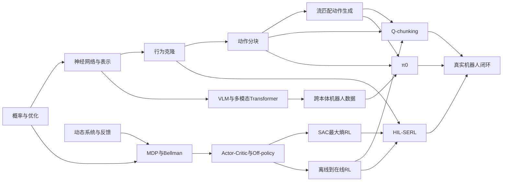

# 知识图谱（可读版）

机器可读图见 `graph.json`，PINE.docx 中提供分层可视化。

## 关键链条解释

1. `概率与优化 → SAC`：随机策略、熵和重参数化构成最大熵 actor 更新的数学基础。
2. `MDP/Bellman → off-policy → offline-to-online`：价值递推让经验复用成为可能，也引入分布偏移与 bootstrap 风险。
3. `行为克隆 → 动作分块 → 流匹配`：从单步回归升级为未来动作联合分布建模，能表达时序一致和多模态行为。
4. `动作分块 + TD → Q-chunking`：动作块不只是策略输出格式，也成为 critic 的复合动作和加速价值传播的时间尺度。
5. `VLM + 跨本体 + 流匹配 → π0`：语义表示、数据规模与精细连续控制三者汇合。
6. `SAC/RLPD + 示范 + 人类纠正 + 系统工程 → HIL-SERL`：算法必须嵌入奖励、安全、重置与基础设施闭环。

## 综合推论节点

“通用先验的安全在线适配”是本库从四篇论文归纳出的研究节点：以 π0 类策略提供先验，以 Q-chunking/critic 做任务优化，用 HIL-SERL 类人类介入和低层控制保障真实训练。该节点标记为 synthesis，目前不能当作已有实验结论。
