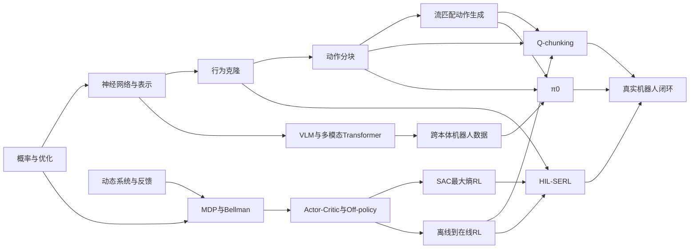

# PINE 机器人学习 References 知识库与知识图谱

> 本文件由分章知识库自动汇总。论文内容首先转换为逐页可追溯 Markdown；数学公式以经验证的论文 TeX 源码为准，行内公式使用 `$...$`，块级公式使用 `$$...$$`；源 PDF 仅作为版式与视觉核对依据。

## 目录

- [PINE References 知识库](#pine-references-知识库)
- [前置知识：从数学到机器人控制](#前置知识：从数学到机器人控制)
- [强化学习核心](#强化学习核心)
- [机器人学习：模型、数据与系统](#机器人学习：模型、数据与系统)
- [四篇论文精读指南](#四篇论文精读指南)
- [知识图谱（可读版）](#知识图谱（可读版）)
- [来源账本](#来源账本)
- [从易到难学习路径](#从易到难学习路径)

---

<!-- chapter-source: 00-index.md -->

# PINE References 知识库

## 定位

本知识库把当前四篇论文组织成一条面向初学者的机器人学习路线，而非按文件名堆叠摘要。论文首先转换为 `references/Markdown/` 下逐页可追溯的 Markdown；数学内容从论文官方 TeX 源包恢复，自定义宏展开为可独立渲染的标准 LaTeX，行内公式使用 `$...$`，块级公式使用 `$$...$$`。知识更新只检索这些 Markdown，遇到公式上下文、图表或双栏顺序歧义时再核对链接页图或源 PDF。主问题是：机器人怎样从数据、奖励与人类反馈中获得可泛化、可精细执行且能在真实世界持续改进的策略？

转换采用官方 TeX 公式层、Poppler 主文本提取、pypdf 文本覆盖交叉基线、MarkItDown 诊断对比和 PDFium 独立视觉验收。完整实测见 `Markdown/conversion-quality-report.md`；验收同时检查公式来源、公式数量、LaTeX 定界符、页数、哈希、图片链接、90% 交叉词项召回阈值和视觉抽查。

## 一张路线图

1. 数学与控制：概率、期望、梯度、动态系统、反馈与坐标系。
2. 学习基础：监督学习、表示学习、序列模型与生成模型。
3. 强化学习：MDP、价值函数、Bellman 方程、actor-critic、off-policy、最大熵。
4. 数据范式：模仿学习、离线 RL、离线到在线 RL、人类示范与纠正。
5. 时间抽象：单步动作、动作块、n 步回报与长时程稀疏奖励。
6. 通用机器人：视觉-语言-动作模型、跨本体数据、流匹配动作专家。
7. 真实系统：感知、低层控制、安全、奖励、重置、actor-learner 与人类介入。

## 当前材料

- `Markdown/1801.01290v2/1801.01290v2.md`（源：`1801.01290v2.pdf`）：SAC，以最大熵目标把稳定探索和 off-policy actor-critic 结合起来。[S1]
- `Markdown/2410.24164v4/2410.24164v4.md`（源：`2410.24164v4.pdf`）：π0，以预训练 VLM 加流匹配动作专家建立跨机器人通用策略。[S2]
- `Markdown/2507.07969v4/2507.07969v4.md`（源：`2507.07969v4.pdf`）：Q-chunking，把动作块直接纳入 TD 学习以改善离线到在线探索和价值传播。[S3]
- `Markdown/hil-serl-paper/hil-serl-paper.md`（源：`hil-serl-paper.pdf`）：HIL-SERL，把示范、纠正、稀疏奖励、样本高效 RL 和真实机器人基础设施整合为系统。[S4]

## 推荐阅读方式

首次阅读可直接打开汇总版 `PINE.md`，或依次阅读 `01-foundations.md`、`02-reinforcement-learning.md`、`03-robot-learning.md`、`04-paper-guides.md`。需要快速定位关系时看 `05-knowledge-graph.md`，要执行学习计划时看 `07-learning-path.md`。文中 `[S#]` 均可在 `06-source-ledger.md` 追溯。

## 三条贯穿全库的问题

- 数据从哪里来：随机交互、历史数据、人类示范/纠正、跨本体数据分别解决什么问题？
- 策略怎样表示：高斯单步动作、动作序列分布、流匹配生成器与 VLA 模型分别带来什么能力？
- 真实部署怎样闭环：如何同时处理探索效率、分布偏移、延迟、安全、奖励与恢复？

---

<!-- chapter-source: 01-foundations.md -->

# 前置知识：从数学到机器人控制

## 1. 概率、条件分布与期望

策略通常写作 $\pi(a\mid s)$：在状态 $s$ 下动作 $a$ 的条件分布。随机策略不是“随便行动”，而是在有约束的分布中采样；它既可表达多种合理动作，也可承担探索。期望 $\mathbb{E}[X]$ 是按概率加权的平均，强化学习目标则是轨迹回报的期望。方差刻画不确定性，熵 $\mathcal{H}(\pi)=-\mathbb{E}[\log \pi(a\mid s)]$ 刻画分布的分散程度。SAC 把熵直接加入目标，使策略同时追求高回报与足够多样性。[S1]

初学者应能解释：条件概率与联合概率的区别；为何连续动作策略要用概率密度；为何最大熵并不等于无约束噪声。

## 2. 微积分、梯度与随机优化

神经网络训练通过梯度下降最小化损失。链式法则把输出误差传回每层参数；随机梯度用小批数据近似总体梯度。Actor 的梯度改善动作分布，critic 的梯度拟合价值目标。目标网络、双 Q 网络、归一化和较大的更新数据比等设计，都是在偏差、方差与数值稳定之间取舍。

重参数化把随机采样写成 $a=f_\theta(\epsilon;s)$，其中噪声 $\epsilon$ 与参数无关，使梯度可穿过采样步骤。SAC 的高斯策略和 π0 的流匹配动作生成都依赖“从简单噪声经可微变换得到动作”的思想，但训练目标不同。[S1][S2][S6]

## 3. 线性代数与表示

机器人观测常由多相机图像、关节位置、末端位姿、语言指令组成。向量表示数值状态，矩阵实现线性映射，张量组织批次、时间和空间维。注意力机制通过 query-key 相似度对 value 加权，适合融合语言 token、视觉 patch 和机器人状态。要理解 π0，需掌握 embedding、Transformer、自回归上下文与多模态 token；但动作专家不是简单输出离散动作 token，而是生成连续动作块。[S2]

## 4. 动态系统、反馈与坐标系

机器人可抽象为 $x_{t+1}=f(x_t,u_t,w_t)$：状态由当前状态、控制输入和扰动演化。开环控制一次给出未来动作，无法根据中途误差立刻修正；闭环控制根据新观测持续调整。动作块在短时间内提供时间一致性，但块越长，开环误差和环境变化风险越大，因此 chunk horizon 是反应性与连贯性的折中。[S3][S5]

末端执行器常用位置与姿态表示。跨机器人数据还涉及不同自由度、动作尺度、控制频率和坐标系。仅统一张量尺寸不足以解决本体差异；需要动作归一化、语义对齐、机器人条件信息或共享末端坐标表示。[S2][S9]

## 5. 监督学习、模仿学习与分布偏移

行为克隆用示范对 $(o,a)$ 训练 $\pi(a\mid o)$，形式类似监督学习。难点是部署时策略自身的小误差会把观测带到训练集外，随后误差可能累积。动作块能更好表达示范中的时间相关和多模态行为，ACT 是关键前置工作。[S5]

分布偏移在离线 RL 中更尖锐：critic 可能对数据集外动作产生错误的高估或悲观估计。离线到在线学习允许新交互纠偏，但又必须让早期探索安全且有效。Q-chunking 用离线行为先验产生连贯探索；HIL-SERL 用示范与人的纠正覆盖失败附近状态。[S3][S4]

## 6. 连续归一化流与流匹配

连续归一化流用常微分方程 $\frac{dx}{d\tau}=v_\theta(x,\tau,c)$ 把简单噪声分布输运到数据分布。流匹配不必在训练时数值模拟整条轨迹，而是对预设概率路径的条件向量场做回归；推理时再积分向量场生成样本。[S6]

用于机器人动作时，条件 `c` 可包含图像、语言和本体状态，样本 `x` 是未来动作块。其价值在于能表示多峰、相关的连续动作序列。需要谨记：生成质量、控制频率、积分步数和闭环重规划共同决定实时控制效果；“生成模型更强”并不自动等于“控制更安全”。

## 7. 初学者自检

- 能否从 $\pi(a\mid s)$ 解释随机策略、熵和探索？
- 能否画出 actor、critic、replay buffer、环境的闭环？
- 能否说明开环动作块为何既可能更连贯，也可能降低扰动响应？
- 能否区分行为克隆的监督误差、离线 RL 的分布外价值误差、真实机器人中的系统误差？
- 能否用“噪声 - 向量场 - ODE - 动作块”解释流匹配推理？

---

<!-- chapter-source: 02-reinforcement-learning.md -->

# 强化学习核心

## 1. MDP 与回报

马尔可夫决策过程由状态空间、动作空间、转移概率、奖励和折扣因子组成。马尔可夫性表示给定当前状态后，未来与更早历史条件独立。轨迹回报为

$$
G_t=\sum_{k=0}^{\infty}\gamma^k r_{t+k}.
$$

在部分可观测机器人任务中，相机图像并非完整状态，历史窗口、循环网络或动作块可帮助处理隐含信息，但不能从理论上消除所有不可观测性。

## 2. 价值函数与 Bellman 递推

$Q^\pi(s,a)$ 表示先执行 $a$ 再遵循 $\pi$ 的期望回报。Bellman 关系把长时程问题拆成即时奖励和下一状态价值。TD 学习用 bootstrap 目标更新 critic，样本高效但会把函数逼近、采样分布和目标估计误差互相反馈。双 Q 取较小值可抑制正向偏差，目标网络则减慢目标变化。[S1]

单步 TD 信息每次只跨一个环境步。稀疏奖励下，成功信号向前传播很慢。n 步回报传播更快，但在 off-policy 数据上若中间动作来自行为策略而非目标策略，会引入偏差。Q-chunking 的 critic 直接把整个动作块作为动作，因此一次 Bellman 转移跨越 `h` 步，块内真实执行动作属于所评估的复合动作，形成其所谓无 off-policy 偏差的 h 步备份。[S3]

## 3. Actor-critic 与 off-policy

Actor `πθ` 负责选动作，critic `Qφ` 评价动作。On-policy 方法主要用当前策略新采样的数据；off-policy 方法可复用其他策略和历史数据，通常借助 replay buffer 提高样本效率。代价是训练分布与当前策略分布不一致，可能导致外推误差和不稳定。

SAC 的典型更新包含：双 Q critic 拟合软 Bellman 目标；actor 最小化

$$
J_\pi=\mathbb{E}_{s\sim\mathcal D,\,a\sim\pi_\theta}\left[\alpha\log\pi_\theta(a\mid s)-Q_\phi(s,a)\right].
$$

温度 $\alpha$ 控制熵相对奖励的权重。原论文给出了最大熵策略迭代及其实用深度版本，强调连续控制中的稳定性和样本效率。[S1]

## 4. 最大熵强化学习

目标可写成

$$
J(\pi)=\mathbb{E}_{\tau\sim\pi}\left[\sum_{t=0}^{T}\left(r_t+\alpha\mathcal H\!\left(\pi(\cdot\mid s_t)\right)\right)\right].
$$

熵奖励鼓励多样动作并提高对模型和估计误差的鲁棒性。温度高时更重探索，低时更接近最大回报策略。现代 SAC 常自动调整温度以逼近目标熵；阅读时应区分原始论文不同版本的网络结构与后续常用实现。

最大熵 RL 与流匹配都对分布建模，但对象和训练信号不同：SAC 用回报塑造策略分布；流匹配用数据样本监督向量场。Q-chunking 把两者连接：行为先验可由流匹配学习，critic 再用 TD 回报优化块级决策。[S3][S6]

## 5. 离线、在线与离线到在线

- 在线 RL：边交互边学习，能主动探索，但真实机器人代价高。
- 离线 RL：只用固定数据，更安全，却无法主动修复数据覆盖缺口。
- 离线到在线 RL：先利用历史数据获得初始能力，再用有限在线交互改进。

RLPD 表明，配合高 update-to-data ratio、对称采样在线与离线数据、LayerNorm 和 ensemble 等关键选择，现有 off-policy 方法就能有效利用离线数据。[S7] HIL-SERL 在该路线之上加入视觉表征、示范缓冲区、奖励分类器、人类纠正、低层控制与分布式系统。[S4]

## 6. 探索的层次

白噪声式单步探索会产生抖动，难以完成需要连续意图的长时程动作。动作块把探索单位提升为短技能片段。示范正则把策略拉向有意义的时序模式，人类纠正则在关键失败状态提供方向。三者分别对应“随机多样性”“时间一致性”“任务相关的定向修正”。

## 7. 评价与常见误读

应同时报告成功率、交互步数/真实时间、执行周期、跨随机种子稳定性、干预次数、安全事件和泛化条件。仿真基准上的样本效率不能直接推断真实机器人部署效率；论文中的 near-perfect 等表达必须绑定任务、评估轮数和实验设置。[S4]

常见误读包括：把 off-policy 等同于 offline；把动作块等同于层级技能；把高熵等同于随机乱动；把示范加入 replay buffer 等同于纯行为克隆；把 n 步传播更快理解为没有估计风险。

---

<!-- chapter-source: 03-robot-learning.md -->

# 机器人学习：模型、数据与系统

## 1. 从策略到 VLA

传统策略把状态或图像映射到动作。视觉-语言-动作模型进一步接受图像、自然语言和本体状态，使语义知识、任务指定与低层动作处于同一模型。π0 在预训练 VLM 主干上增加 action expert，由流匹配生成连续动作块；训练数据覆盖多种单臂、双臂与移动操作平台。[S2]

VLM 负责强语义表示并不意味着天然理解接触动力学。真正的动作能力仍来自机器人轨迹、动作表示、控制接口和后训练。阅读 VLA 结果时要分别问：语义泛化来自哪里？精细控制来自哪里？目标本体的数据量多少？是否经过任务微调？

## 2. 跨本体学习

跨本体数据通过共享对象、语言和操作结构扩大覆盖，但不同机器人在关节、夹爪、视角、频率和动作空间上不同。Open X-Embodiment 证明标准化多机器人数据与高容量模型可产生正迁移，为 π0 的数据路线提供重要前置背景。[S9]

解决本体差异常用三类手段：统一末端动作语义与归一化；用本体信息条件化模型；在共享主干之外使用本体相关头或专家。数据混合比例也很关键，规模大的机器人不应无意中压制稀有本体。

## 3. 动作块

动作块策略一次预测 `a_t:t+h-1`。ACT 用 Transformer 和生成式序列建模处理人类示范的非平稳、多峰与时间相关行为。[S5] π0 用流匹配动作专家生成连续动作块；Q-chunking 则把动作块提升为 RL 的复合动作，使 actor 与 critic 都在块空间工作。[S2][S3]

三者不可混为一谈：ACT 主要是模仿学习方法；π0 是大规模 VLA 架构；Q-chunking 是可套在 TD actor-critic 上的离线到在线 RL 配方。共同点是显式建模未来动作序列，区别是监督信号、价值学习和模型规模。

## 4. 人在环强化学习

HIL-SERL 的流程可概括为：遥操作采集正负样本训练二元奖励分类器；采集少量成功示范加入 demo buffer；在线训练时由分类器给稀疏奖励，操作者在危险或错误趋势出现时接管并留下纠正数据；随着策略改善逐渐减少介入。[S4][S8]

人类介入同时承担安全约束、探索引导和数据采集，但可能带来操作者偏差、接管延迟、策略依赖人类以及人因负担。应记录干预触发标准、接管时延、干预频率和退出条件。奖励分类器也可能被策略利用，因此需要困难负样本、视觉裁剪检查和独立成功判定。

## 5. 真实机器人系统栈

完整系统至少包含：相机与状态同步、观测预处理、策略推理、动作限幅、低层阻抗/位置控制、安全边界、奖励判断、重置、replay buffer、learner、参数同步、日志与急停。HIL-SERL 的 actor-learner 异步结构允许机器人持续执行、学习端更新并周期同步策略。[S8]

系统性能常被非算法环节限制：网络延迟会破坏动作时序；相机曝光变化会造成观测漂移；控制频率不一致会改变动力学；自动重置失败会污染训练分布。论文复现应把这些视为一等变量。

## 6. 四篇论文的组合设计空间

SAC 提供稳定、样本高效的连续动作价值学习基础；HIL-SERL 展示怎样把类似 off-policy RL 放入真实机器人闭环；Q-chunking进一步把探索和价值传播提升到动作块；π0 则代表从大规模跨本体模仿预训练获得通用先验。一个自然但尚需实证的组合是假设：用 VLA/流策略作为先验，以块级 critic 进行在线任务适配，并在人类介入与安全控制下训练。这是跨文献综合推论，不是四篇论文已经联合验证的结论。

## 7. 安全与可复现检查

- 明确机器人、控制模式、频率、动作尺度和延迟。
- 分离训练奖励与独立评估成功标准。
- 保存示范、在线数据和干预数据的来源标签。
- 报告随机种子、评估次数、失败类型与人工工作量。
- 对动作块检查急停能否中断块执行。
- 对大模型检查微调数据泄漏、训练/测试场景重合和目标本体数据占比。

---

<!-- chapter-source: 04-paper-guides.md -->

# 四篇论文精读指南

## 1. Soft Actor-Critic（SAC）

**本地阅读文件**：`Markdown/1801.01290v2/1801.01290v2.md`；视觉权威源：`1801.01290v2.pdf`。**定位**：连续控制中 off-policy 最大熵 actor-critic 的奠基方法。[S1]

**问题**：深度 model-free RL 样本昂贵、超参数敏感；on-policy 稳但数据复用差，DDPG 类 off-policy 方法高效却脆弱。**核心机制**：把奖励和策略熵共同写入目标；交替进行软策略评估和软策略改进；用随机 actor、critic 和 replay buffer 实现深度近似。

**公式抓手**：软 Q 目标为

$$
y_t=r_t+\gamma\left(\min_{i\in\{1,2\}}Q_{\bar\phi_i}(s_{t+1},a_{t+1})-\alpha\log\pi_\theta(a_{t+1}\mid s_{t+1})\right).
$$

actor 通过重参数化最小化 $\alpha\log\pi_\theta(a\mid s)-Q_\phi(s,a)$。这表明 critic 提供“做什么收益高”，熵项提供“不要过早塌缩”。

**证据与边界**：原文在多种连续控制基准上报告优于当时 on/off-policy 基线且跨种子稳定。[S1] 这些结果不直接覆盖视觉输入、真实机器人安全或超长时程稀疏奖励。原始 v2 与后来常用的 twin-Q/no-V 版本要区分。

**读前准备**：MDP、Bellman、policy iteration、KL 散度、高斯重参数化、off-policy replay。**读后追问**：温度如何改变探索？critic 误差怎样影响 actor？为何双 Q 有用？

## 2. π0：VLA Flow Model

**本地阅读文件**：`Markdown/2410.24164v4/2410.24164v4.md`；视觉权威源：`2410.24164v4.pdf`。**定位**：将预训练 VLM、跨本体机器人数据与流匹配连续动作专家结合的通用机器人策略。[S2]

**问题**：单任务/单机器人策略缺少数据规模、语义泛化和鲁棒性；离散动作 token 难以表达高频精细连续控制。**核心机制**：VLM 主干吸收互联网视觉-语言知识，action expert 在视觉、语言和本体条件下通过流匹配生成动作块。条件流可写为 $\dot a^\tau=v_\theta(a^\tau,\tau\mid o,\ell)$。模型在多种机器人配置和任务上预训练，再直接提示或用高质量目标数据微调。[S2]

**数据流**：多相机图像与语言进入共享表示；本体状态和带噪动作块进入动作专家；训练回归条件向量场；推理从噪声出发做若干流积分步骤得到连续动作块，并在控制循环中执行/重规划。

**证据与边界**：论文覆盖直接提示、语言跟随、高层策略分解和复杂任务微调。结论依赖大规模专有数据与算力；跨本体正迁移、实时延迟、目标机器人数据量及失败模式应分开分析。VLM 语义知识不等于物理可靠性。

**读前准备**：Transformer/VLM、行为克隆、动作块、连续归一化流、跨本体数据。**读后追问**：动作专家与主干如何交互？何时需要微调？流积分步数怎样影响实时性？

## 3. Reinforcement Learning with Action Chunking（Q-chunking）

**本地阅读文件**：`Markdown/2507.07969v4/2507.07969v4.md`；视觉权威源：`2507.07969v4.pdf`。**定位**：把块级动作空间用于离线到在线 TD 强化学习。[S3]

**问题**：长时程稀疏奖励中，从单步随机探索撞到成功的概率低；离线先验虽有用，却可能与在线最优策略分布不一致；单步 TD 奖励传播慢。**核心机制**：actor 预测未来 $h$ 个动作，critic 评价整块动作；离线行为策略提供时间连贯先验；块级 Bellman 转移一次跨 $h$ 步，使价值更快传播：

$$
Q(s_t,a_{t:t+h-1})=\mathbb E\!\left[\sum_{i=0}^{h-1}\gamma^i r_{t+i}+\gamma^h Q(s_{t+h},a_{t+h:t+2h-1})\right].
$$

**为何块级 n 步备份不同**：朴素 n 步 off-policy return 的中间动作并非目标策略动作；Q-chunking 把整段实际动作定义为一个扩展动作，critic 明确以它为输入，因此块内不再是“隐藏的行为策略动作”。这不消除函数逼近、块边界或分布外动作块风险。

**证据与边界**：论文在 OGBench 多个长时程稀疏奖励域和六类任务上比较离线到在线方法，并给出 QC、QC-FQL 实例。[S3] 它以开环执行短块换取一致性，扰动强或高安全要求场景可能需要更短块、重规划或可中断执行。

**读前准备**：TD、n 步回报、offline-to-online、行为正则、flow matching、action chunking。**读后追问**：h 如何选？块内奖励和折扣如何累计？行为先验权重何时衰减？

## 4. HIL-SERL

**本地阅读文件**：`Markdown/hil-serl-paper/hil-serl-paper.md`；视觉权威源：`hil-serl-paper.pdf`。**定位**：人在环、视觉输入、真实机器人样本高效 RL 的系统级方案。[S4]

**问题**：真实机器人 RL 面临样本成本、奖励定义、安全、重置、视觉训练稳定性和失败恢复。**核心机制**：用遥操作数据训练二元奖励分类器；示范进入 demo buffer；在线训练复用 RLPD 风格 off-policy 更新；人类在关键状态接管，纠正数据立即成为可学习经验；低层控制和分布式基础设施保证执行。[S4][S8]

**证据与边界**：论文报告多种动态、精密装配和双臂任务可在约 1–2.5 小时真实训练内达到高成功率和快速周期，并在相同人类数据条件下优于模仿学习基线。[S4] 结果依赖任务工程、相机裁剪、奖励数据、硬件与操作者；“人在环”不是免费资源，应报告干预负担。

**读前准备**：SAC/RLPD、行为克隆、二元分类器、视觉表征、机器人低层控制、actor-learner。**读后追问**：如何定义接管？负样本如何覆盖 reward hacking？策略同步延迟是否影响安全？

## 5. 横向比较

| 维度 | SAC | π0 | Q-chunking | HIL-SERL |
|---|---|---|---|---|
| 主要目标 | 稳定高效连续 RL | 通用 VLA 控制 | 长时程离线到在线 RL | 实机快速技能学习 |
| 主要数据 | 在线 replay | 大规模多机器人轨迹 | 离线集 + 在线交互 | 示范 + 纠正 + 在线交互 |
| 动作表示 | 单步随机连续动作 | 流匹配动作块 | RL 复合动作块 | 通常单步连续控制 |
| 关键监督 | 奖励 + 熵 | 动作数据的流匹配 | TD 回报 + 行为先验 | 分类奖励 + TD + 人类介入 |
| 主要风险 | 价值偏差/调参 | 数据与算力/物理可靠性 | 块长与开环风险 | 人因、安全与系统工程 |

## 6. 综合结论

四篇材料沿两条轴展开：一条从单步价值学习走向时间抽象和通用动作生成；另一条从仿真算法走向大规模数据和真实系统闭环。SAC 提供价值优化底座，Q-chunking修改决策时间尺度，HIL-SERL补齐真实训练闭环，π0扩大策略先验和任务覆盖。它们互补但不可直接拼接，组合方案必须重新验证接口、分布、安全和算力延迟。

---

<!-- chapter-source: 05-knowledge-graph.md -->

# 知识图谱（可读版）

机器可读图见 `graph.json`，PINE.docx 中提供分层可视化。

## 关键链条解释

1. `概率与优化 → SAC`：随机策略、熵和重参数化构成最大熵 actor 更新的数学基础。
2. `MDP/Bellman → off-policy → offline-to-online`：价值递推让经验复用成为可能，也引入分布偏移与 bootstrap 风险。
3. `行为克隆 → 动作分块 → 流匹配`：从单步回归升级为未来动作联合分布建模，能表达时序一致和多模态行为。
4. `动作分块 + TD → Q-chunking`：动作块不只是策略输出格式，也成为 critic 的复合动作和加速价值传播的时间尺度。
5. `VLM + 跨本体 + 流匹配 → π0`：语义表示、数据规模与精细连续控制三者汇合。
6. `SAC/RLPD + 示范 + 人类纠正 + 系统工程 → HIL-SERL`：算法必须嵌入奖励、安全、重置与基础设施闭环。

## 综合推论节点

“通用先验的安全在线适配”是本库从四篇论文归纳出的研究节点：以 π0 类策略提供先验，以 Q-chunking/critic 做任务优化，用 HIL-SERL 类人类介入和低层控制保障真实训练。该节点标记为 synthesis，目前不能当作已有实验结论。

---

<!-- chapter-source: 06-source-ledger.md -->

# 来源账本

访问日期均为 2026-08-15。S1-S4 为仓库内一手论文：日常检索读取 `references/Markdown/` 的逐页转换文件，哈希和页锚点通过后才用于知识更新；源 PDF 保留为公式、图表、页序与视觉版式的最终核对依据。其余为补全前置知识的一手论文或官方页面。

[S1] Haarnoja T, Zhou A, Abbeel P, Levine S. *Soft Actor-Critic: Off-Policy Maximum Entropy Deep Reinforcement Learning with a Stochastic Actor*. arXiv:1801.01290v2, 2018. Local reading: `Markdown/1801.01290v2/1801.01290v2.md`; source: `1801.01290v2.pdf`. https://arxiv.org/abs/1801.01290

[S2] Black K, Brown N, Driess D, et al. *π0: A Vision-Language-Action Flow Model for General Robot Control*. arXiv:2410.24164v4. Local reading: `Markdown/2410.24164v4/2410.24164v4.md`; source: `2410.24164v4.pdf`. https://arxiv.org/abs/2410.24164

[S3] Li Q, Zhou Z, Levine S. *Reinforcement Learning with Action Chunking*. arXiv:2507.07969v4 / NeurIPS 2025. Local reading: `Markdown/2507.07969v4/2507.07969v4.md`; source: `2507.07969v4.pdf`. https://arxiv.org/abs/2507.07969

[S4] Luo J, Xu C, Wu J, Levine S. *Precise and Dexterous Robotic Manipulation via Human-in-the-Loop Reinforcement Learning*. arXiv:2410.21845, 2024. Local reading: `Markdown/hil-serl-paper/hil-serl-paper.md`; source: `hil-serl-paper.pdf`. https://arxiv.org/abs/2410.21845

[S5] Zhao T Z, Kumar V, Levine S, Finn C. *Learning Fine-Grained Bimanual Manipulation with Low-Cost Hardware*. arXiv:2304.13705, 2023. https://arxiv.org/abs/2304.13705

[S6] Lipman Y, Chen R T Q, Ben-Hamu H, Nickel M, Le M. *Flow Matching for Generative Modeling*. arXiv:2210.02747, 2022. https://arxiv.org/abs/2210.02747

[S7] Ball P J, Smith L, Kostrikov I, Levine S. *Efficient Online Reinforcement Learning with Offline Data*. arXiv:2302.02948, 2023. https://arxiv.org/abs/2302.02948

[S8] HIL-SERL official project and code pages. https://hil-serl.github.io/ ; https://github.com/rail-berkeley/hil-serl

[S9] Open X-Embodiment Collaboration. *Open X-Embodiment: Robotic Learning Datasets and RT-X Models*. Official project page. https://robotics-transformer-x.github.io/

## 证据使用规则

- 论文方法、数字和实验边界首先引用本地原文。
- 官方项目页只补充代码结构、数据发布和演示，不覆盖论文中的实验定义。
- 跨论文组合建议标为“综合推论”。
- 后续新增网页来源必须记录标题、作者/机构、URL、访问日期和它支持的具体知识节点。

---

<!-- chapter-source: 07-learning-path.md -->

# 从易到难学习路径

## 阶段 0：建立直觉（半天）

目标：能用“观测 - 策略 - 动作 - 环境 - 奖励”描述闭环。阅读 `00-index.md` 与 `01-foundations.md` 第 1、4、5 节。练习：画一个机械臂插接任务的信息流，标出哪些量不可观测。

## 阶段 1：MDP 与价值学习（1-2 天）

目标：会写回报、Q 函数和 Bellman 目标；分清 on-policy、off-policy、offline。阅读 `02-reinforcement-learning.md` 第 1-3 节，然后精读 SAC 的引言、背景和算法。练习：手算两状态 MDP 的 Q 更新；解释 replay buffer 为什么提高复用又带来分布差异。

## 阶段 2：SAC（1-2 天）

目标：解释最大熵目标、actor loss、双 Q 与温度。精读 `04-paper-guides.md` 的 SAC 部分并对照原文。练习：改变 α，预测策略熵和回报的趋势；画出一次 critic/actor 更新所需的数据。

## 阶段 3：模仿、离线到在线与人在环（2 天）

目标：区分行为克隆、离线 RL 和用示范增强的在线 RL。先读 ACT 与 RLPD 摘要/方法，再读 HIL-SERL 系统流程。练习：列出示范、负样本、纠正和自主数据各自覆盖的状态区域；设计干预退出标准。

## 阶段 4：动作块与 Q-chunking（2 天）

目标：理解块级动作、h 步 Bellman 转移和行为正则。先用 h=3 写出块动作和累计奖励，再精读 Q-chunking。练习：比较单步 TD、朴素 n 步 return、块级 critic 的输入和偏差来源；讨论强扰动任务为何应缩短 h。

## 阶段 5：流匹配与 π0（3 天）

目标：能从噪声、概率路径、向量场和 ODE 解释动作生成；理解 VLM 主干与 action expert 的分工。先读流匹配前置，再读 π0 架构和训练数据。练习：画出训练与推理两条不同流程；列出跨本体动作对齐的至少四个困难。

## 阶段 6：综合设计（1-2 天）

目标：形成系统思维。选择一个真实操作任务，设计“预训练先验 + 在线价值优化 + 人类干预 + 低层安全”的方案。必须写出：数据来源、奖励、动作块长度、控制频率、延迟预算、急停、评估协议和失败分类。把未经论文直接验证的组合明确标成假设。

## 最终检查题

1. SAC 的熵项、Q-chunking 的行为先验和 HIL-SERL 的人类纠正，分别怎样改变探索？
2. π0 与 Q-chunking 都输出动作块，为什么二者不是同一种学习算法？
3. 为什么离线数据既能提高早期效率，又可能阻碍在线探索？
4. 从仿真成功率迁移到真实机器人时，至少还要检查哪些系统变量？
5. 如何证明一个高级节点的前置知识链没有断裂？请沿 `graph.json` 追溯到数学/控制层。
