# Soft Actor-Critic:

> Source: [`1801.01290v2.pdf`](../../1801.01290v2.pdf). This Markdown preserves extracted source text page by page. Rendered pages remain the visual authority for figures, tables, equations, and ambiguous reading order.

## Generated section index

- 1. Introduction often used to perform the maximization in Q-learning. A
- 2. Related Work that it optimizes the standard maximum expected return ob-
- 3. Preliminaries
- 3.1. Notation
- 3.2. Maximum Entropy Reinforcement Learning Our off-policy soft actor-critic algorithm can be derived
- 4.1. Derivation of Soft Policy Iteration The partition function Z πold (st ) normalizes the distribution,
- 4.2. Soft Actor-Critic
- 0 is no need in principle to include a separate function approx-
- 1 rewrite the objective in Equation 10 as
- 8000 SAC
- 6000 SQL
- 5. Experiments (SQL) (Haarnoja et al., 2017), a recent off-policy algorithm
- 5.1. Comparative Evaluation Humanoid (rllab)
- 1000 environment steps. The solid curves corresponds to the
- 5.2. Ablation Study a comparison of average performance on all benchmark
- Acknowledgments
- 2010. Peters, J. and Schaal, S. Reinforcement learning of motor
- 4000 Trust-PCL

## Canonical LaTeX formula registry

> Formula source: arXiv `1801.01290v2` TeX package. These expressions are canonical; PDF-extracted glyph text below is non-canonical searchable context.

**Formula F0001** · `main_no_comments.tex`

$$
J(\pi)  = \sum_{t=0}^{T} \operatorname{\mathbb{E}}_{({\mathbf{s}_t}, {\mathbf{a}_t}) \sim \rho_\pi}\left[r({\mathbf{s}_t},{\mathbf{a}_t}) + \alpha\mathcal{H}(\pi({\,\cdot\,}|{\mathbf{s}_t}))\right].
$$

**Formula F0002** · `main_no_comments.tex`

$$
\mathcal{T}^\pi Q({\mathbf{s}_t}, {\mathbf{a}_t}) \triangleq  r({\mathbf{s}_t}, {\mathbf{a}_t}) + \gamma \operatorname{\mathbb{E}}_{{\mathbf{s}_{t+1}} \sim p}\left[V({\mathbf{s}_{t+1}})\right],
$$

**Formula F0003** · `main_no_comments.tex`

$$
V({\mathbf{s}_t}) = \operatorname{\mathbb{E}}_{{\mathbf{a}_t}\sim\pi}\left[Q({\mathbf{s}_t}, {\mathbf{a}_t}) - \log\pi({\mathbf{a}_t}|{\mathbf{s}_t})\right]
$$

**Formula F0004** · `main_no_comments.tex`

$$
\pi_\mathrm{new} = \arg\underset{\pi'\in \Pi}{\min}\mathrm{D_{KL}}\left(\pi'({\,\cdot\,}|{\mathbf{s}_t})\;\middle\|\;\frac{\exp\left(Q^{\pi_\mathrm{old}}({\mathbf{s}_t}, {\,\cdot\,})\right)}{Z^{\pi_\mathrm{old}}({\mathbf{s}_t})}\right).
$$

**Formula F0005** · `main_no_comments.tex`

$$
J_V({\psi}) = \operatorname{\mathbb{E}}_{{\mathbf{s}_t} \sim \mathcal{D}}\left[\frac{1}{2}\left(V_{\psi}({\mathbf{s}_t}) - \operatorname{\mathbb{E}}_{{\mathbf{a}_t}\sim\pi_{\phi}}\left[Q_\theta({\mathbf{s}_t}, {\mathbf{a}_t}) - \log \pi_{\phi}({\mathbf{a}_t}|{\mathbf{s}_t})\right]\right)^2\right]\,
$$

**Formula F0006** · `main_no_comments.tex`

$$
\hat \nabla_{\psi} J_V({\psi}) = \nabla_{\psi} V_{\psi}({\mathbf{s}_t}) \left(V_{\psi}({\mathbf{s}_t}) - Q_\theta({\mathbf{s}_t}, {\mathbf{a}_t}) + \log \pi_{\phi}({\mathbf{a}_t}|{\mathbf{s}_t})\right),
$$

**Formula F0007** · `main_no_comments.tex`

$$
J_Q(\theta) = \operatorname{\mathbb{E}}_{({\mathbf{s}_t}, {\mathbf{a}_t})\sim\mathcal{D}}\left[\frac{1}{2}\left(Q_\theta({\mathbf{s}_t}, {\mathbf{a}_t}) - \hat Q({\mathbf{s}_t}, {\mathbf{a}_t})\right)^2\right],
$$

**Formula F0008** · `main_no_comments.tex`

$$
\hat Q({\mathbf{s}_t}, {\mathbf{a}_t}) = r({\mathbf{s}_t}, {\mathbf{a}_t}) + \gamma \operatorname{\mathbb{E}}_{{\mathbf{s}_{t+1}}\sim p}\left[V_{\bar\psi}({\mathbf{s}_{t+1}})\right],
$$

**Formula F0009** · `main_no_comments.tex`

$$
\hat \nabla_\theta J_Q(\theta) =  \nabla_\theta Q_\theta({\mathbf{a}_t}, {\mathbf{s}_t}) \left(Q_\theta({\mathbf{s}_t}, {\mathbf{a}_t}) - r({\mathbf{s}_t}, {\mathbf{a}_t}) - \gamma V_{\bar\psi}({\mathbf{s}_{t+1}})\right).
$$

**Formula F0010** · `main_no_comments.tex`

$$
J_\pi({\phi}) = \operatorname{\mathbb{E}}_{{\mathbf{s}_t}\sim\mathcal{D}}\left[\mathrm{D_{KL}}\left(\pi_{\phi}({\,\cdot\,}|{\mathbf{s}_t})\;\middle\|\;\frac{\exp\left(Q_\theta({\mathbf{s}_t}, {\,\cdot\,})\right)}{Z_\theta({\mathbf{s}_t})}\right)\right].
$$

**Formula F0011** · `main_no_comments.tex`

$$
{\mathbf{a}_t} = f_{\phi}(\epsilon_t; {\mathbf{s}_t}),
$$

**Formula F0012** · `main_no_comments.tex`

$$
J_\pi({\phi}) = \operatorname{\mathbb{E}}_{{\mathbf{s}_t}\sim\mathcal{D},\epsilon_t\sim\mathcal{N}}\left[\log \pi_{\phi}(f_{\phi}(\epsilon_t;{\mathbf{s}_t})|{\mathbf{s}_t}) - Q_\theta({\mathbf{s}_t}, f_{\phi}(\epsilon_t;{\mathbf{s}_t}))\right],
$$

**Formula F0013** · `main_no_comments.tex`

$$
\begin{aligned}
&\hat\nabla_{\phi} J_\pi({\phi}) = \nabla_{\phi} \log \pi_{\phi}({\mathbf{a}_t}|{\mathbf{s}_t}) \\
&\ \ \ \ \ \ \ + (\nabla_{\mathbf{a}_t} \log \pi_{\phi}({\mathbf{a}_t}|{\mathbf{s}_t})
- \nabla_{\mathbf{a}_t} Q({\mathbf{s}_t}, {\mathbf{a}_t}))\nabla_{\phi} f_{\phi}(\epsilon_t;{\mathbf{s}_t}),
\end{aligned}
$$

**Formula F0014** · `main_no_comments.tex`

$$
J(\pi) = \sum_{t=0}^\infty \operatorname{\mathbb{E}}_{({\mathbf{s}_t},{\mathbf{a}_t}) \sim \rho_\pi}\left[ \sum_{l=t}^\infty \gamma^{l-t} \operatorname{\mathbb{E}}_{\mathbf{s}_l\sim p,\mathbf{a}_l\sim\pi}\left[ r({\mathbf{s}_t},{\mathbf{a}_t}) + \alpha \mathcal{H}(\pi({\,\cdot\,}|{\mathbf{s}_t}))|{\mathbf{s}_t},{\mathbf{a}_t}\right]\right].
$$

**Formula F0015** · `main_no_comments.tex`

$$
Q({\mathbf{s}_t}, {\mathbf{a}_t}) \leftarrow r_\pi({\mathbf{s}_t}, {\mathbf{a}_t}) + \gamma \operatorname{\mathbb{E}}_{{\mathbf{s}_{t+1}}\sim p,{\mathbf{a}_{t+1}} \sim \pi}\left[Q({\mathbf{s}_{t+1}}, {\mathbf{a}_{t+1}})\right]
$$

**Formula F0016** · `main_no_comments.tex`

$$
\begin{aligned}
{\pi_\mathrm{new}}({\,\cdot\,}|{\mathbf{s}_t}) &= \arg \min_{\pi' \in \Pi}\mathrm{D_{KL}}\left(\pi'({\,\cdot\,}|{\mathbf{s}_t})\;\middle\|\;\exp\left(Q^{\pi_\mathrm{old}}({\mathbf{s}_t},{\,\cdot\,}) - \log Z^{\pi_\mathrm{old}}({\mathbf{s}_t})\right)\right)\\
 &= \arg\min_{\pi'\in\Pi}J_{\pi_\mathrm{old}}(\pi'({\,\cdot\,}|{\mathbf{s}_t})).
\end{aligned}
$$

**Formula F0017** · `main_no_comments.tex`

$$
\operatorname{\mathbb{E}}_{{\mathbf{a}_t}\sim{\pi_\mathrm{new}}}\left[\log {\pi_\mathrm{new}}({\mathbf{a}_t}|{\mathbf{s}_t}) - Q^{\pi_\mathrm{old}}({\mathbf{s}_t}, {\mathbf{a}_t}) + \log Z^{\pi_\mathrm{old}}({\mathbf{s}_t})\right]
\leq \operatorname{\mathbb{E}}_{{\mathbf{a}_t}\sim{\pi_\mathrm{old}}}\left[\log {\pi_\mathrm{old}}({\mathbf{a}_t}|{\mathbf{s}_t}) - Q^{\pi_\mathrm{old}}({\mathbf{s}_t},{\mathbf{a}_t}) + \log Z^{\pi_\mathrm{old}}({\mathbf{s}_t})\right],
$$

**Formula F0018** · `main_no_comments.tex`

$$
\operatorname{\mathbb{E}}_{{\mathbf{a}_t}\sim{\pi_\mathrm{new}}}\left[Q^{\pi_\mathrm{old}}({\mathbf{s}_t}, {\mathbf{a}_t}) - \log {\pi_\mathrm{new}}({\mathbf{a}_t}|{\mathbf{s}_t})\right] \geq V^{\pi_\mathrm{old}}({\mathbf{s}_t}).
$$

**Formula F0019** · `main_no_comments.tex`

$$
\begin{aligned}
Q^{\pi_\mathrm{old}}({\mathbf{s}_t}, {\mathbf{a}_t}) &= r({\mathbf{s}_t}, {\mathbf{a}_t}) + \gamma\operatorname{\mathbb{E}}_{{\mathbf{s}_{t+1}}\sim p}\left[V^{\pi_\mathrm{old}}({\mathbf{s}_{t+1}})\right]\\
&\leq r({\mathbf{s}_t}, {\mathbf{a}_t}) + \gamma\operatorname{\mathbb{E}}_{{\mathbf{s}_{t+1}}\sim p}\left[\operatorname{\mathbb{E}}_{{\mathbf{a}_{t+1}}\sim{\pi_\mathrm{new}}}\left[Q^{\pi_\mathrm{old}}({\mathbf{s}_{t+1}}, {\mathbf{a}_{t+1}}) - \log {\pi_\mathrm{new}}({\mathbf{a}_{t+1}}|{\mathbf{s}_{t+1}})\right]\right]\\
&\ \  \vdots\\
& \leq Q^{\pi_\mathrm{new}}({\mathbf{s}_t}, {\mathbf{a}_t}),
\end{aligned}
$$

**Formula F0020** · `main_no_comments.tex`

$$
\begin{aligned}
\pi (\mathbf{a}|\mathbf{s}) &= \mu(\mathbf{u}|\mathbf{s})\left|\det \left(\frac{\mathrm{d}\mathbf{a}}{\mathrm{d}\mathbf{u}} \right)\right|^{-1}.
\end{aligned}
$$

**Formula F0021** · `main_no_comments.tex`

$$
\begin{aligned}
\log\pi (\mathbf{a}|\mathbf{s}) &= \log \mu(\mathbf{u}|\mathbf{s}) - \sum_{i=1}^D\log\left(1 - \tanh^2(u_i)\right),
\end{aligned}
$$

**Formula F0022** · `main_no_comments.tex`

$(\mathcal{S}, \mathcal{A}, p, r)$

**Formula F0023** · `main_no_comments.tex`

$\mathcal{S}$

**Formula F0024** · `main_no_comments.tex`

$\mathcal{A}$

**Formula F0025** · `main_no_comments.tex`

$p:\ \mathcal{S} \times \mathcal{S} \times \mathcal{A} \rightarrow [0,\, \infty)$

**Formula F0026** · `main_no_comments.tex`

${\mathbf{s}_{t+1}}\in\mathcal{S}$

**Formula F0027** · `main_no_comments.tex`

${\mathbf{s}_t}\in\mathcal{S}$

**Formula F0028** · `main_no_comments.tex`

${\mathbf{a}_t}\in\mathcal{A}$

**Formula F0029** · `main_no_comments.tex`

$r: \mathcal{S} \times \mathcal{A} \rightarrow  [r_\mathrm{min},r_\mathrm{max}]$

**Formula F0030** · `main_no_comments.tex`

$\rho_\pi({\mathbf{s}_t})$

**Formula F0031** · `main_no_comments.tex`

$\rho_\pi({\mathbf{s}_t},{\mathbf{a}_t})$

**Formula F0032** · `main_no_comments.tex`

$\pi({\mathbf{a}_t}|{\mathbf{s}_t})$

**Formula F0033** · `main_no_comments.tex`

$\sum_t \operatorname{\mathbb{E}}_{({\mathbf{s}_t},{\mathbf{a}_t})\sim\rho_\pi}\left[r({\mathbf{s}_t},{\mathbf{a}_t})\right]$

**Formula F0034** · `main_no_comments.tex`

$\alpha$

**Formula F0035** · `main_no_comments.tex`

$\alpha \rightarrow 0$

**Formula F0036** · `main_no_comments.tex`

$\alpha^{-1}$

**Formula F0037** · `main_no_comments.tex`

$\gamma$

**Formula F0038** · `main_no_comments.tex`

$\pi$

**Formula F0039** · `main_no_comments.tex`

$Q: \mathcal{S}\times \mathcal{A} \rightarrow \mathbb{R}$

**Formula F0040** · `main_no_comments.tex`

$\mathcal{T}^\pi$

**Formula F0041** · `main_no_comments.tex`

$Q^0: \mathcal{S} \times \mathcal{A}\rightarrow \mathbb{R}$

**Formula F0042** · `main_no_comments.tex`

$|\mathcal{A}|<\infty$

**Formula F0043** · `main_no_comments.tex`

$Q^{k+1} = \mathcal{T}^\pi Q^k$

**Formula F0044** · `main_no_comments.tex`

$Q^k$

**Formula F0045** · `main_no_comments.tex`

$k\rightarrow \infty$

**Formula F0046** · `main_no_comments.tex`

$\Pi$

**Formula F0047** · `main_no_comments.tex`

$\pi \in \Pi$

**Formula F0048** · `main_no_comments.tex`

$Z^{\pi_\mathrm{old}}({\mathbf{s}_t})$

**Formula F0049** · `main_no_comments.tex`

$\pi_\mathrm{old} \in \Pi$

**Formula F0050** · `main_no_comments.tex`

$\pi_\mathrm{new}$

**Formula F0051** · `main_no_comments.tex`

$Q^{\pi_\mathrm{new}}({\mathbf{s}_t}, {\mathbf{a}_t}) \geq Q^{\pi_\mathrm{old}}({\mathbf{s}_t}, {\mathbf{a}_t})$

**Formula F0052** · `main_no_comments.tex`

$({\mathbf{s}_t}, {\mathbf{a}_t}) \in \mathcal{S}\times\mathcal{A}$

**Formula F0053** · `main_no_comments.tex`

$\pi\in\Pi$

**Formula F0054** · `main_no_comments.tex`

$\pi^*$

**Formula F0055** · `main_no_comments.tex`

$Q^{\pi^*}({\mathbf{s}_t}, {\mathbf{a}_t}) \geq Q^{\pi}({\mathbf{s}_t}, {\mathbf{a}_t})$

**Formula F0056** · `main_no_comments.tex`

$V_{\psi}({\mathbf{s}_t})$

**Formula F0057** · `main_no_comments.tex`

$Q_\theta({\mathbf{s}_t}, {\mathbf{a}_t})$

**Formula F0058** · `main_no_comments.tex`

$\pi_{\phi}({\mathbf{a}_t}|{\mathbf{s}_t})$

**Formula F0059** · `main_no_comments.tex`

${\psi},\ \theta$

**Formula F0060** · `main_no_comments.tex`

${\phi}$

**Formula F0061** · `main_no_comments.tex`

$\mathcal{D}$

**Formula F0062** · `main_no_comments.tex`

$V_{\bar\psi}$

**Formula F0063** · `main_no_comments.tex`

$\bar\psi$

**Formula F0064** · `main_no_comments.tex`

$J_\pi$

**Formula F0065** · `main_no_comments.tex`

$\epsilon_t$

**Formula F0066** · `main_no_comments.tex`

$\pi_{\phi}$

**Formula F0067** · `main_no_comments.tex`

$f_{\phi}$

**Formula F0068** · `main_no_comments.tex`

${\mathbf{a}_t}$

**Formula F0069** · `main_no_comments.tex`

$f_{\phi}(\epsilon_t; {\mathbf{s}_t})$

**Formula F0070** · `main_no_comments.tex`

${\psi}$

**Formula F0071** · `main_no_comments.tex`

${\bar\psi}$

**Formula F0072** · `main_no_comments.tex`

$\theta$

**Formula F0073** · `main_no_comments.tex`

${\mathbf{a}_t} \sim \pi_{\phi}({\mathbf{a}_t}|{\mathbf{s}_t})$

**Formula F0074** · `main_no_comments.tex`

${\mathbf{s}_{t+1}} \sim p({\mathbf{s}_{t+1}}| {\mathbf{s}_t}, {\mathbf{a}_t})$

**Formula F0075** · `main_no_comments.tex`

$\mathcal{D} \leftarrow \mathcal{D} \cup \left\{({\mathbf{s}_t}, {\mathbf{a}_t}, r({\mathbf{s}_t}, {\mathbf{a}_t}), {\mathbf{s}_{t+1}})\right\}$

**Formula F0076** · `main_no_comments.tex`

${\psi} \leftarrow {\psi} - \lambda_V \hat \nabla_{\psi} J_V({\psi})$

**Formula F0077** · `main_no_comments.tex`

$\theta_i \leftarrow \theta_i - \lambda_Q \hat \nabla_{\theta_i} J_Q(\theta_i)$

**Formula F0078** · `main_no_comments.tex`

$i\in\{1, 2\}$

**Formula F0079** · `main_no_comments.tex`

${\phi} \leftarrow {\phi} - \lambda_\pi \hat \nabla_{\phi} J_\pi({\phi})$

**Formula F0080** · `main_no_comments.tex`

${\bar\psi}\leftarrow \tau {\psi} + (1-\tau){\bar\psi}$

**Formula F0081** · `main_no_comments.tex`

$\theta_i$

**Formula F0082** · `main_no_comments.tex`

$J_Q(\theta_i)$

**Formula F0083** · `main_no_comments.tex`

$\tau$

**Formula F0084** · `main_no_comments.tex`

$({\mathbf{s}_t},{\mathbf{a}_t})$

**Formula F0085** · `main_no_comments.tex`

$\rho_\pi$

**Formula F0086** · `main_no_comments.tex`

$r_\pi({\mathbf{s}_t}, {\mathbf{a}_t}) \triangleq r({\mathbf{s}_t}, {\mathbf{a}_t})  + \operatorname{\mathbb{E}}_{{\mathbf{s}_{t+1}}\sim p}\left[\mathcal{H}\left(\pi({\,\cdot\,}|{\mathbf{s}_{t+1}})\right)\right]$

**Formula F0087** · `main_no_comments.tex`

${\pi_\mathrm{old}}\in \Pi$

**Formula F0088** · `main_no_comments.tex`

$Q^{\pi_\mathrm{old}}$

**Formula F0089** · `main_no_comments.tex`

$V^{\pi_\mathrm{old}}$

**Formula F0090** · `main_no_comments.tex`

${\pi_\mathrm{new}}$

**Formula F0091** · `main_no_comments.tex`

$J_{\pi_\mathrm{old}}({\pi_\mathrm{new}}({\,\cdot\,}|{\mathbf{s}_t})) \leq J_{\pi_\mathrm{old}}({\pi_\mathrm{old}}({\,\cdot\,}|{\mathbf{s}_t}))$

**Formula F0092** · `main_no_comments.tex`

${\pi_\mathrm{new}} = {\pi_\mathrm{old}}\in\Pi$

**Formula F0093** · `main_no_comments.tex`

$Z^{\pi_\mathrm{old}}$

**Formula F0094** · `main_no_comments.tex`

$Q^{\pi_\mathrm{new}}$

**Formula F0095** · `main_no_comments.tex`

$\pi_i$

**Formula F0096** · `main_no_comments.tex`

$i$

**Formula F0097** · `main_no_comments.tex`

$Q^{\pi_i}$

**Formula F0098** · `main_no_comments.tex`

$Q^\pi$

**Formula F0099** · `main_no_comments.tex`

$J_{\pi^*}({\pi^*}({\,\cdot\,}|{\mathbf{s}_t})) < J_{\pi^*}(\pi({\,\cdot\,}|{\mathbf{s}_t}))$

**Formula F0100** · `main_no_comments.tex`

$\pi\neq \pi^*$

**Formula F0101** · `main_no_comments.tex`

$Q^{\pi^*}({\mathbf{s}_t}, {\mathbf{a}_t}) > Q^\pi({\mathbf{s}_t}, {\mathbf{a}_t})$

**Formula F0102** · `main_no_comments.tex`

$({\mathbf{s}_t}, {\mathbf{a}_t})\in \mathcal{S}\times\mathcal{A}$

**Formula F0103** · `main_no_comments.tex`

${\pi^*}$

**Formula F0104** · `main_no_comments.tex`

$\tanh$

**Formula F0105** · `main_no_comments.tex`

$\mathbf{u}\in\mathbb{R}^D$

**Formula F0106** · `main_no_comments.tex`

$\mu(\mathbf{u}|\mathbf{s})$

**Formula F0107** · `main_no_comments.tex`

$\mathbf{a} = \tanh(\mathbf{u})$

**Formula F0108** · `main_no_comments.tex`

$(-1, 1)$

**Formula F0109** · `main_no_comments.tex`

$\frac{\mathrm{d}\mathbf{a}}{\mathrm{d}\mathbf{u}} = \mathrm{diag}(1 - \tanh^2(\mathbf{u}))$

**Formula F0110** · `main_no_comments.tex`

$u_i$

**Formula F0111** · `main_no_comments.tex`

$i^\mathrm{th}$

**Formula F0112** · `main_no_comments.tex`

$\mathbf{u}$

**Formula F0113** · `main_no_comments.tex`

$3 \cdot 10^{-4}$

**Formula F0114** · `main_no_comments.tex`

$10^6$

---

<!-- source-page: 1 -->
## Source page 1

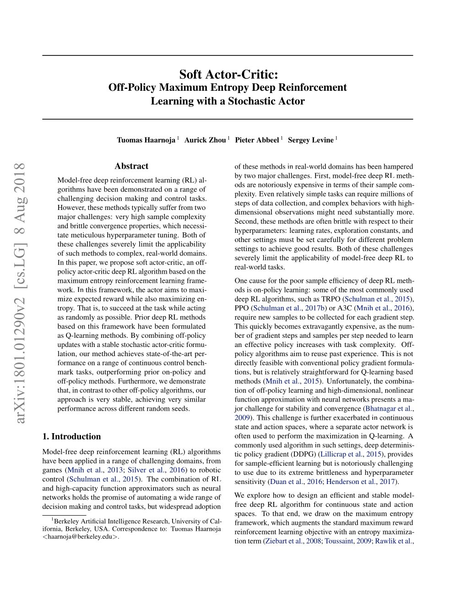

*Rendered source page for visual verification.*

Soft Actor-Critic:
                                                                Off-Policy Maximum Entropy Deep Reinforcement
                                                                         Learning with a Stochastic Actor

                                                                   Tuomas Haarnoja 1 Aurick Zhou 1 Pieter Abbeel 1 Sergey Levine 1

arXiv:1801.01290v2 [cs.LG] 8 Aug 2018
                                                                  Abstract                                    of these methods in real-world domains has been hampered
                                                                                                              by two major challenges. First, model-free deep RL meth-
                                             Model-free deep reinforcement learning (RL) al-
                                                                                                              ods are notoriously expensive in terms of their sample com-
                                             gorithms have been demonstrated on a range of
                                                                                                              plexity. Even relatively simple tasks can require millions of
                                             challenging decision making and control tasks.
                                                                                                              steps of data collection, and complex behaviors with high-
                                             However, these methods typically suffer from two
                                                                                                              dimensional observations might need substantially more.
                                             major challenges: very high sample complexity
                                                                                                              Second, these methods are often brittle with respect to their
                                             and brittle convergence properties, which necessi-
                                                                                                              hyperparameters: learning rates, exploration constants, and
                                             tate meticulous hyperparameter tuning. Both of
                                                                                                              other settings must be set carefully for different problem
                                             these challenges severely limit the applicability
                                                                                                              settings to achieve good results. Both of these challenges
                                             of such methods to complex, real-world domains.
                                                                                                              severely limit the applicability of model-free deep RL to
                                             In this paper, we propose soft actor-critic, an off-
                                                                                                              real-world tasks.
                                             policy actor-critic deep RL algorithm based on the
                                             maximum entropy reinforcement learning frame-                    One cause for the poor sample efficiency of deep RL meth-
                                             work. In this framework, the actor aims to maxi-                 ods is on-policy learning: some of the most commonly used
                                             mize expected reward while also maximizing en-                   deep RL algorithms, such as TRPO (Schulman et al., 2015),
                                             tropy. That is, to succeed at the task while acting              PPO (Schulman et al., 2017b) or A3C (Mnih et al., 2016),
                                             as randomly as possible. Prior deep RL methods                   require new samples to be collected for each gradient step.
                                             based on this framework have been formulated                     This quickly becomes extravagantly expensive, as the num-
                                             as Q-learning methods. By combining off-policy                   ber of gradient steps and samples per step needed to learn
                                             updates with a stable stochastic actor-critic formu-             an effective policy increases with task complexity. Off-
                                             lation, our method achieves state-of-the-art per-                policy algorithms aim to reuse past experience. This is not
                                             formance on a range of continuous control bench-                 directly feasible with conventional policy gradient formula-
                                             mark tasks, outperforming prior on-policy and                    tions, but is relatively straightforward for Q-learning based
                                             off-policy methods. Furthermore, we demonstrate                  methods (Mnih et al., 2015). Unfortunately, the combina-
                                             that, in contrast to other off-policy algorithms, our            tion of off-policy learning and high-dimensional, nonlinear
                                             approach is very stable, achieving very similar                  function approximation with neural networks presents a ma-
                                             performance across different random seeds.                       jor challenge for stability and convergence (Bhatnagar et al.,
                                                                                                              2009). This challenge is further exacerbated in continuous
                                                                                                              state and action spaces, where a separate actor network is
                                        1. Introduction                                                       often used to perform the maximization in Q-learning. A
                                                                                                              commonly used algorithm in such settings, deep determinis-
                                        Model-free deep reinforcement learning (RL) algorithms                tic policy gradient (DDPG) (Lillicrap et al., 2015), provides
                                        have been applied in a range of challenging domains, from             for sample-efficient learning but is notoriously challenging
                                        games (Mnih et al., 2013; Silver et al., 2016) to robotic             to use due to its extreme brittleness and hyperparameter
                                        control (Schulman et al., 2015). The combination of RL                sensitivity (Duan et al., 2016; Henderson et al., 2017).
                                        and high-capacity function approximators such as neural
                                        networks holds the promise of automating a wide range of              We explore how to design an efficient and stable model-
                                        decision making and control tasks, but widespread adoption            free deep RL algorithm for continuous state and action
                                                                                                              spaces. To that end, we draw on the maximum entropy
                                            1
                                              Berkeley Artificial Intelligence Research, University of Cal-   framework, which augments the standard maximum reward
                                        ifornia, Berkeley, USA. Correspondence to: Tuomas Haarnoja            reinforcement learning objective with an entropy maximiza-
                                        <haarnoja@berkeley.edu>.
                                                                                                              tion term (Ziebart et al., 2008; Toussaint, 2009; Rawlik et al.,

---

<!-- source-page: 2 -->
## Source page 2

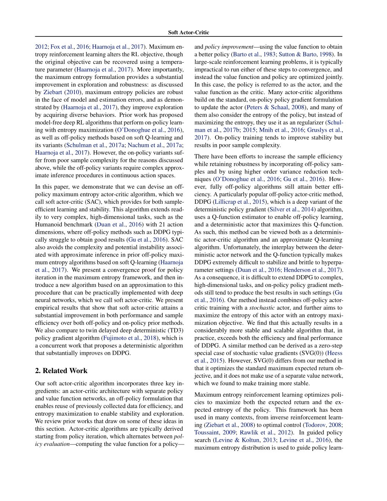

*Rendered source page for visual verification.*

Soft Actor-Critic

2012; Fox et al., 2016; Haarnoja et al., 2017). Maximum en-      and policy improvement—using the value function to obtain
tropy reinforcement learning alters the RL objective, though     a better policy (Barto et al., 1983; Sutton & Barto, 1998). In
the original objective can be recovered using a tempera-         large-scale reinforcement learning problems, it is typically
ture parameter (Haarnoja et al., 2017). More importantly,        impractical to run either of these steps to convergence, and
the maximum entropy formulation provides a substantial           instead the value function and policy are optimized jointly.
improvement in exploration and robustness: as discussed          In this case, the policy is referred to as the actor, and the
by Ziebart (2010), maximum entropy policies are robust           value function as the critic. Many actor-critic algorithms
in the face of model and estimation errors, and as demon-        build on the standard, on-policy policy gradient formulation
strated by (Haarnoja et al., 2017), they improve exploration     to update the actor (Peters & Schaal, 2008), and many of
by acquiring diverse behaviors. Prior work has proposed          them also consider the entropy of the policy, but instead of
model-free deep RL algorithms that perform on-policy learn-      maximizing the entropy, they use it as an regularizer (Schul-
ing with entropy maximization (O’Donoghue et al., 2016),         man et al., 2017b; 2015; Mnih et al., 2016; Gruslys et al.,
as well as off-policy methods based on soft Q-learning and       2017). On-policy training tends to improve stability but
its variants (Schulman et al., 2017a; Nachum et al., 2017a;      results in poor sample complexity.
Haarnoja et al., 2017). However, the on-policy variants suf-
                                                                 There have been efforts to increase the sample efficiency
fer from poor sample complexity for the reasons discussed
                                                                 while retaining robustness by incorporating off-policy sam-
above, while the off-policy variants require complex approx-
                                                                 ples and by using higher order variance reduction tech-
imate inference procedures in continuous action spaces.
                                                                 niques (O’Donoghue et al., 2016; Gu et al., 2016). How-
In this paper, we demonstrate that we can devise an off-         ever, fully off-policy algorithms still attain better effi-
policy maximum entropy actor-critic algorithm, which we          ciency. A particularly popular off-policy actor-critic method,
call soft actor-critic (SAC), which provides for both sample-    DDPG (Lillicrap et al., 2015), which is a deep variant of the
efficient learning and stability. This algorithm extends read-   deterministic policy gradient (Silver et al., 2014) algorithm,
ily to very complex, high-dimensional tasks, such as the         uses a Q-function estimator to enable off-policy learning,
Humanoid benchmark (Duan et al., 2016) with 21 action            and a deterministic actor that maximizes this Q-function.
dimensions, where off-policy methods such as DDPG typi-          As such, this method can be viewed both as a determinis-
cally struggle to obtain good results (Gu et al., 2016). SAC     tic actor-critic algorithm and an approximate Q-learning
also avoids the complexity and potential instability associ-     algorithm. Unfortunately, the interplay between the deter-
ated with approximate inference in prior off-policy maxi-        ministic actor network and the Q-function typically makes
mum entropy algorithms based on soft Q-learning (Haarnoja        DDPG extremely difficult to stabilize and brittle to hyperpa-
et al., 2017). We present a convergence proof for policy         rameter settings (Duan et al., 2016; Henderson et al., 2017).
iteration in the maximum entropy framework, and then in-         As a consequence, it is difficult to extend DDPG to complex,
troduce a new algorithm based on an approximation to this        high-dimensional tasks, and on-policy policy gradient meth-
procedure that can be practically implemented with deep          ods still tend to produce the best results in such settings (Gu
neural networks, which we call soft actor-critic. We present     et al., 2016). Our method instead combines off-policy actor-
empirical results that show that soft actor-critic attains a     critic training with a stochastic actor, and further aims to
substantial improvement in both performance and sample           maximize the entropy of this actor with an entropy maxi-
efficiency over both off-policy and on-policy prior methods.     mization objective. We find that this actually results in a
We also compare to twin delayed deep deterministic (TD3)         considerably more stable and scalable algorithm that, in
policy gradient algorithm (Fujimoto et al., 2018), which is      practice, exceeds both the efficiency and final performance
a concurrent work that proposes a deterministic algorithm        of DDPG. A similar method can be derived as a zero-step
that substantially improves on DDPG.                             special case of stochastic value gradients (SVG(0)) (Heess
                                                                 et al., 2015). However, SVG(0) differs from our method in
2. Related Work                                                  that it optimizes the standard maximum expected return ob-
                                                                 jective, and it does not make use of a separate value network,
Our soft actor-critic algorithm incorporates three key in-       which we found to make training more stable.
gredients: an actor-critic architecture with separate policy
                                                                 Maximum entropy reinforcement learning optimizes poli-
and value function networks, an off-policy formulation that
                                                                 cies to maximize both the expected return and the ex-
enables reuse of previously collected data for efficiency, and
                                                                 pected entropy of the policy. This framework has been
entropy maximization to enable stability and exploration.
                                                                 used in many contexts, from inverse reinforcement learn-
We review prior works that draw on some of these ideas in
                                                                 ing (Ziebart et al., 2008) to optimal control (Todorov, 2008;
this section. Actor-critic algorithms are typically derived
                                                                 Toussaint, 2009; Rawlik et al., 2012). In guided policy
starting from policy iteration, which alternates between pol-
                                                                 search (Levine & Koltun, 2013; Levine et al., 2016), the
icy evaluation—computing the value function for a policy—
                                                                 maximum entropy distribution is used to guide policy learn-

---

<!-- source-page: 3 -->
## Source page 3

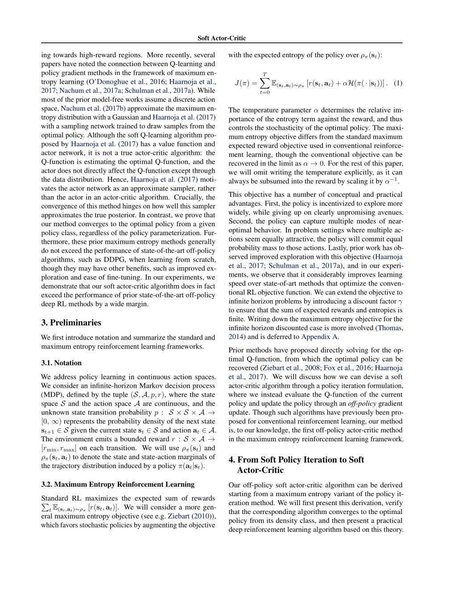

*Rendered source page for visual verification.*

Soft Actor-Critic

ing towards high-reward regions. More recently, several           with the expected entropy of the policy over ρπ (st ):
papers have noted the connection between Q-learning and
policy gradient methods in the framework of maximum en-                      T
                                                                             X
tropy learning (O’Donoghue et al., 2016; Haarnoja et al.,           J(π) =         E(st ,at )∼ρπ [r(st , at ) + αH(π( · |st ))] . (1)
2017; Nachum et al., 2017a; Schulman et al., 2017a). While                   t=0
most of the prior model-free works assume a discrete action
space, Nachum et al. (2017b) approximate the maximum en-          The temperature parameter α determines the relative im-
tropy distribution with a Gaussian and Haarnoja et al. (2017)     portance of the entropy term against the reward, and thus
with a sampling network trained to draw samples from the          controls the stochasticity of the optimal policy. The maxi-
optimal policy. Although the soft Q-learning algorithm pro-       mum entropy objective differs from the standard maximum
posed by Haarnoja et al. (2017) has a value function and          expected reward objective used in conventional reinforce-
actor network, it is not a true actor-critic algorithm: the       ment learning, though the conventional objective can be
Q-function is estimating the optimal Q-function, and the          recovered in the limit as α → 0. For the rest of this paper,
actor does not directly affect the Q-function except through      we will omit writing the temperature explicitly, as it can
the data distribution. Hence, Haarnoja et al. (2017) moti-        always be subsumed into the reward by scaling it by α−1 .
vates the actor network as an approximate sampler, rather
than the actor in an actor-critic algorithm. Crucially, the       This objective has a number of conceptual and practical
convergence of this method hinges on how well this sampler        advantages. First, the policy is incentivized to explore more
approximates the true posterior. In contrast, we prove that       widely, while giving up on clearly unpromising avenues.
our method converges to the optimal policy from a given           Second, the policy can capture multiple modes of near-
policy class, regardless of the policy parameterization. Fur-     optimal behavior. In problem settings where multiple ac-
thermore, these prior maximum entropy methods generally           tions seem equally attractive, the policy will commit equal
do not exceed the performance of state-of-the-art off-policy      probability mass to those actions. Lastly, prior work has ob-
algorithms, such as DDPG, when learning from scratch,             served improved exploration with this objective (Haarnoja
though they may have other benefits, such as improved ex-         et al., 2017; Schulman et al., 2017a), and in our experi-
ploration and ease of fine-tuning. In our experiments, we         ments, we observe that it considerably improves learning
demonstrate that our soft actor-critic algorithm does in fact     speed over state-of-art methods that optimize the conven-
exceed the performance of prior state-of-the-art off-policy       tional RL objective function. We can extend the objective to
deep RL methods by a wide margin.                                 infinite horizon problems by introducing a discount factor γ
                                                                  to ensure that the sum of expected rewards and entropies is
                                                                  finite. Writing down the maximum entropy objective for the
3. Preliminaries
                                                                  infinite horizon discounted case is more involved (Thomas,
We first introduce notation and summarize the standard and        2014) and is deferred to Appendix A.
maximum entropy reinforcement learning frameworks.
                                                                  Prior methods have proposed directly solving for the op-
                                                                  timal Q-function, from which the optimal policy can be
3.1. Notation
                                                                  recovered (Ziebart et al., 2008; Fox et al., 2016; Haarnoja
We address policy learning in continuous action spaces.           et al., 2017). We will discuss how we can devise a soft
We consider an infinite-horizon Markov decision process           actor-critic algorithm through a policy iteration formulation,
(MDP), defined by the tuple (S, A, p, r), where the state         where we instead evaluate the Q-function of the current
space S and the action space A are continuous, and the            policy and update the policy through an off-policy gradient
unknown state transition probability p : S × S × A →              update. Though such algorithms have previously been pro-
[0, ∞) represents the probability density of the next state       posed for conventional reinforcement learning, our method
st+1 ∈ S given the current state st ∈ S and action at ∈ A.        is, to our knowledge, the first off-policy actor-critic method
The environment emits a bounded reward r : S × A →                in the maximum entropy reinforcement learning framework.
[rmin , rmax ] on each transition. We will use ρπ (st ) and
ρπ (st , at ) to denote the state and state-action marginals of   4. From Soft Policy Iteration to Soft
the trajectory distribution induced by a policy π(at |st ).
                                                                     Actor-Critic
3.2. Maximum Entropy Reinforcement Learning                       Our off-policy soft actor-critic algorithm can be derived
                                                                  starting from a maximum entropy variant of the policy it-
Standard     RL maximizes the expected sum of rewards
P                                                                 eration method. We will first present this derivation, verify
   t E(s  ,a  )∼ρπ [r(st , at )]. We will consider a more gen-
        t   t
                                                                  that the corresponding algorithm converges to the optimal
eral maximum entropy objective (see e.g. Ziebart (2010)),
                                                                  policy from its density class, and then present a practical
which favors stochastic policies by augmenting the objective
                                                                  deep reinforcement learning algorithm based on this theory.

---

<!-- source-page: 4 -->
## Source page 4

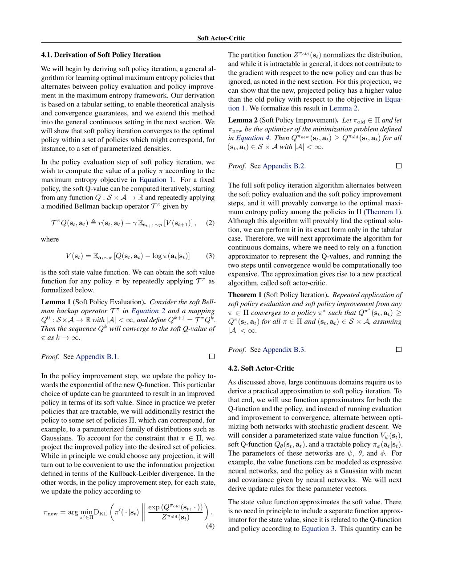

*Rendered source page for visual verification.*

Soft Actor-Critic

4.1. Derivation of Soft Policy Iteration                                The partition function Z πold (st ) normalizes the distribution,
                                                                        and while it is intractable in general, it does not contribute to
We will begin by deriving soft policy iteration, a general al-
                                                                        the gradient with respect to the new policy and can thus be
gorithm for learning optimal maximum entropy policies that
                                                                        ignored, as noted in the next section. For this projection, we
alternates between policy evaluation and policy improve-
                                                                        can show that the new, projected policy has a higher value
ment in the maximum entropy framework. Our derivation
                                                                        than the old policy with respect to the objective in Equa-
is based on a tabular setting, to enable theoretical analysis
                                                                        tion 1. We formalize this result in Lemma 2.
and convergence guarantees, and we extend this method
into the general continuous setting in the next section. We             Lemma 2 (Soft Policy Improvement). Let πold ∈ Π and let
will show that soft policy iteration converges to the optimal           πnew be the optimizer of the minimization problem defined
policy within a set of policies which might correspond, for             in Equation 4. Then Qπnew (st , at ) ≥ Qπold (st , at ) for all
instance, to a set of parameterized densities.                          (st , at ) ∈ S × A with |A| < ∞.

In the policy evaluation step of soft policy iteration, we
                                                                        Proof. See Appendix B.2.
wish to compute the value of a policy π according to the
maximum entropy objective in Equation 1. For a fixed
policy, the soft Q-value can be computed iteratively, starting          The full soft policy iteration algorithm alternates between
from any function Q : S × A → R and repeatedly applying                 the soft policy evaluation and the soft policy improvement
a modified Bellman backup operator T π given by                         steps, and it will provably converge to the optimal maxi-
                                                                        mum entropy policy among the policies in Π (Theorem 1).
   T π Q(st , at ) , r(st , at ) + γ Est+1 ∼p [V (st+1 )] ,      (2)    Although this algorithm will provably find the optimal solu-
                                                                        tion, we can perform it in its exact form only in the tabular
where                                                                   case. Therefore, we will next approximate the algorithm for
                                                                        continuous domains, where we need to rely on a function
         V (st ) = Eat ∼π [Q(st , at ) − log π(at |st )]         (3)    approximator to represent the Q-values, and running the
                                                                        two steps until convergence would be computationally too
is the soft state value function. We can obtain the soft value          expensive. The approximation gives rise to a new practical
function for any policy π by repeatedly applying T π as                 algorithm, called soft actor-critic.
formalized below.
                                                                        Theorem 1 (Soft Policy Iteration). Repeated application of
Lemma 1 (Soft Policy Evaluation). Consider the soft Bell-               soft policy evaluation and soft policy improvement from any
man backup operator T π in Equation 2 and a mapping                                                                       ∗
                                                                        π ∈ Π converges to a policy π ∗ such that Qπ (st , at ) ≥
Q0 : S ×A → R with |A| < ∞, and define Qk+1 = T π Qk .                  Qπ (st , at ) for all π ∈ Π and (st , at ) ∈ S × A, assuming
Then the sequence Qk will converge to the soft Q-value of               |A| < ∞.
π as k → ∞.
                                                                        Proof. See Appendix B.3.
Proof. See Appendix B.1.
                                                                        4.2. Soft Actor-Critic
In the policy improvement step, we update the policy to-
wards the exponential of the new Q-function. This particular            As discussed above, large continuous domains require us to
choice of update can be guaranteed to result in an improved             derive a practical approximation to soft policy iteration. To
policy in terms of its soft value. Since in practice we prefer          that end, we will use function approximators for both the
policies that are tractable, we will additionally restrict the          Q-function and the policy, and instead of running evaluation
policy to some set of policies Π, which can correspond, for             and improvement to convergence, alternate between opti-
example, to a parameterized family of distributions such as             mizing both networks with stochastic gradient descent. We
Gaussians. To account for the constraint that π ∈ Π, we                 will consider a parameterized state value function Vψ (st ),
project the improved policy into the desired set of policies.           soft Q-function Qθ (st , at ), and a tractable policy πφ (at |st ).
While in principle we could choose any projection, it will              The parameters of these networks are ψ, θ, and φ. For
turn out to be convenient to use the information projection             example, the value functions can be modeled as expressive
defined in terms of the Kullback-Leibler divergence. In the             neural networks, and the policy as a Gaussian with mean
other words, in the policy improvement step, for each state,            and covariance given by neural networks. We will next
we update the policy according to                                       derive update rules for these parameter vectors.
                                                                        The state value function approximates the soft value. There
                                       exp (Qπold (st , · ))
> [Extraction warning] One or more lines using an invalid PDF font map were omitted. Use the rendered source page and canonical LaTeX registry.
                             0                                          is no need in principle to include a separate function approx-
 πnew = arg min     DKL π ( · |st )                            .
              π 0 ∈Π                        Z πold (st )                imator for the state value, since it is related to the Q-function
                                                             (4)        and policy according to Equation 3. This quantity can be

---

<!-- source-page: 5 -->
## Source page 5

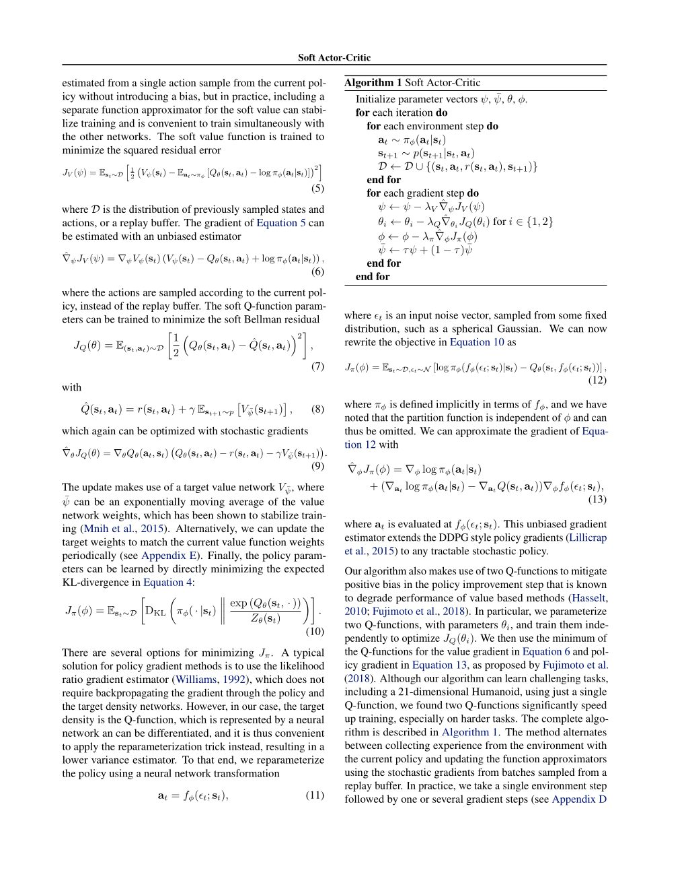

*Rendered source page for visual verification.*

Soft Actor-Critic

estimated from a single action sample from the current pol-                           Algorithm 1 Soft Actor-Critic
icy without introducing a bias, but in practice, including a                            Initialize parameter vectors ψ, ψ̄, θ, φ.
separate function approximator for the soft value can stabi-                            for each iteration do
lize training and is convenient to train simultaneously with                               for each environment step do
the other networks. The soft value function is trained to                                     at ∼ πφ (at |st )
minimize the squared residual error                                                           st+1 ∼ p(st+1 |st , at )
                  h
                      1
> [Extraction warning] One or more lines using an invalid PDF font map were omitted. Use the rendered source page and canonical LaTeX registry.
JV (ψ) = Est ∼D       2   Vψ (st ) − Eat ∼πφ [Qθ (st , at ) − log πφ (at |st )]
                                                                                           end for
                                                                               (5)         for each gradient step do
                                                                                              ψ ← ψ − λV ∇   ˆ ψ JV (ψ)
where D is the distribution of previously sampled states and
actions, or a replay buffer. The gradient of Equation 5 can                                   θi ← θi − λQ ∇  ˆ θ JQ (θi ) for i ∈ {1, 2}
                                                                                                                 i

be estimated with an unbiased estimator                                                                     ˆ
                                                                                              φ ← φ − λπ ∇φ Jπ (φ)
                                                                                              ψ̄ ← τ ψ + (1 − τ )ψ̄
ˆ ψ JV (ψ) = ∇ψ Vψ (st ) (Vψ (st ) − Qθ (st , at ) + log πφ (at |st )) ,
∇
                                                                                           end for
                                                                               (6)      end for
where the actions are sampled according to the current pol-
icy, instead of the replay buffer. The soft Q-function param-
> [Extraction warning] One or more lines using an invalid PDF font map were omitted. Use the rendered source page and canonical LaTeX registry.
                           1                                                          rewrite the objective in Equation 10 as
   JQ (θ) = E(st ,at )∼D       Qθ (st , at ) − Q̂(st , at )     ,
                           2
> [Extraction warning] One or more lines using an invalid PDF font map were omitted. Use the rendered source page and canonical LaTeX registry.
                                                                                                                                                              (12)
with
> [Extraction warning] One or more lines using an invalid PDF font map were omitted. Use the rendered source page and canonical LaTeX registry.
     Q̂(st , at ) = r(st , at ) + γ Est+1 ∼p Vψ̄ (st+1 ) ,                     (8)    where πφ is defined implicitly in terms of fφ , and we have
                                                                                      noted that the partition function is independent of φ and can
which again can be optimized with stochastic gradients                                thus be omitted. We can approximate the gradient of Equa-
ˆ θ JQ (θ) = ∇θ Qθ (at , st ) Qθ (st , at ) − r(st , at ) − γVψ̄ (st+1 ) .
> [Extraction warning] One or more lines using an invalid PDF font map were omitted. Use the rendered source page and canonical LaTeX registry.
∇
                                                                               (9)    ˆ φ Jπ (φ) = ∇φ log πφ (at |st )
                                                                                      ∇
> [Extraction warning] One or more lines using an invalid PDF font map were omitted. Use the rendered source page and canonical LaTeX registry.
ψ̄ can be an exponentially moving average of the value                                                                                             (13)
network weights, which has been shown to stabilize train-
> [Extraction warning] One or more lines using an invalid PDF font map were omitted. Use the rendered source page and canonical LaTeX registry.
target weights to match the current value function weights                            estimator extends the DDPG style policy gradients (Lillicrap
periodically (see Appendix E). Finally, the policy param-                             et al., 2015) to any tractable stochastic policy.
eters can be learned by directly minimizing the expected                              Our algorithm also makes use of two Q-functions to mitigate
KL-divergence in Equation 4:                                                          positive bias in the policy improvement step that is known
> [Extraction warning] One or more lines using an invalid PDF font map were omitted. Use the rendered source page and canonical LaTeX registry.
                                      exp (Qθ (st , · ))
> [Extraction warning] One or more lines using an invalid PDF font map were omitted. Use the rendered source page and canonical LaTeX registry.
 Jπ (φ) = Est ∼D DKL πφ ( · |st )                           .                         2010; Fujimoto et al., 2018). In particular, we parameterize
                                          Zθ (st )
                                                                                      two Q-functions, with parameters θi , and train them inde-
                                                         (10)
                                                                                      pendently to optimize JQ (θi ). We then use the minimum of
There are several options for minimizing Jπ . A typical                               the Q-functions for the value gradient in Equation 6 and pol-
solution for policy gradient methods is to use the likelihood                         icy gradient in Equation 13, as proposed by Fujimoto et al.
ratio gradient estimator (Williams, 1992), which does not                             (2018). Although our algorithm can learn challenging tasks,
require backpropagating the gradient through the policy and                           including a 21-dimensional Humanoid, using just a single
the target density networks. However, in our case, the target                         Q-function, we found two Q-functions significantly speed
density is the Q-function, which is represented by a neural                           up training, especially on harder tasks. The complete algo-
network an can be differentiated, and it is thus convenient                           rithm is described in Algorithm 1. The method alternates
to apply the reparameterization trick instead, resulting in a                         between collecting experience from the environment with
lower variance estimator. To that end, we reparameterize                              the current policy and updating the function approximators
the policy using a neural network transformation                                      using the stochastic gradients from batches sampled from a
                                                                                      replay buffer. In practice, we take a single environment step
> [Extraction warning] One or more lines using an invalid PDF font map were omitted. Use the rendered source page and canonical LaTeX registry.

---

<!-- source-page: 6 -->
## Source page 6

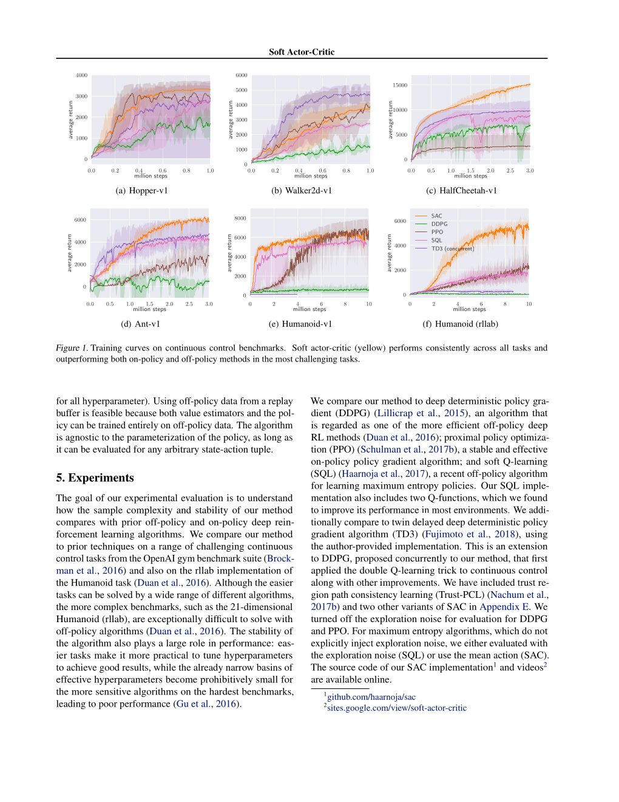

*Rendered source page for visual verification.*

Soft Actor-Critic
                                                 Hopper-v1                                                              Walker2d-v1                                                                HalfCheetah-v1
                     4000                                                                            6000
                                                                                                                                                                            15000
                                                                                                     5000
                     3000

    average return                                                                  average return                                                           average return
                                                                                                     4000
                                                                                                                                                                            10000
                     2000                                                                            3000

                                                                                                     2000                                                                     5000
                     1000
                                                                                                     1000
                        0                                                                                                                                                        0
                                                                                                        0
                            0.0     0.2          0.4         0.6     0.8    1.0                             0.0   0.2    0.4      0.6          0.8   1.0                             0.0    0.5   1.0       1.5       2.0       2.5   3.0
                                                 million steps                                                           million steps                                                               million steps

                                        (a) Hopper-v1                                                             (b) Walker2d-v1                                                          (c) HalfCheetah-v1
                                                   Ant-v1                                                               Humanoid-v1                                                               Humanoid (rllab)

                                                                                                     8000                                                                                    SAC
                     6000                                                                                                                                                     6000
                                                                                                                                                                                             DDPG
                                                                                                                                                                                             PPO

  average return                                                                  average return                                                           average return
                                                                                                     6000                                                                                    SQL
                     4000
                                                                                                                                                                              4000
                                                                                                                                                                                             TD3 (concurrent)
                                                                                                     4000
                     2000
                                                                                                                                                                              2000
                                                                                                     2000
                        0
                                                                                                        0                                                                        0
                            0.0   0.5      1.0         1.5     2.0    2.5   3.0                             0     2      4         6           8     10                              0        2         4         6         8         10
                                             million steps                                                              million steps                                                               million steps

                                          (d) Ant-v1                                                              (e) Humanoid-v1                                                          (f) Humanoid (rllab)

Figure 1. Training curves on continuous control benchmarks. Soft actor-critic (yellow) performs consistently across all tasks and
outperforming both on-policy and off-policy methods in the most challenging tasks.

for all hyperparameter). Using off-policy data from a replay                                                                   We compare our method to deep deterministic policy gra-
buffer is feasible because both value estimators and the pol-                                                                  dient (DDPG) (Lillicrap et al., 2015), an algorithm that
icy can be trained entirely on off-policy data. The algorithm                                                                  is regarded as one of the more efficient off-policy deep
is agnostic to the parameterization of the policy, as long as                                                                  RL methods (Duan et al., 2016); proximal policy optimiza-
it can be evaluated for any arbitrary state-action tuple.                                                                      tion (PPO) (Schulman et al., 2017b), a stable and effective
                                                                                                                               on-policy policy gradient algorithm; and soft Q-learning
5. Experiments                                                                                                                 (SQL) (Haarnoja et al., 2017), a recent off-policy algorithm
                                                                                                                               for learning maximum entropy policies. Our SQL imple-
The goal of our experimental evaluation is to understand                                                                       mentation also includes two Q-functions, which we found
how the sample complexity and stability of our method                                                                          to improve its performance in most environments. We addi-
compares with prior off-policy and on-policy deep rein-                                                                        tionally compare to twin delayed deep deterministic policy
forcement learning algorithms. We compare our method                                                                           gradient algorithm (TD3) (Fujimoto et al., 2018), using
to prior techniques on a range of challenging continuous                                                                       the author-provided implementation. This is an extension
control tasks from the OpenAI gym benchmark suite (Brock-                                                                      to DDPG, proposed concurrently to our method, that first
man et al., 2016) and also on the rllab implementation of                                                                      applied the double Q-learning trick to continuous control
the Humanoid task (Duan et al., 2016). Although the easier                                                                     along with other improvements. We have included trust re-
tasks can be solved by a wide range of different algorithms,                                                                   gion path consistency learning (Trust-PCL) (Nachum et al.,
the more complex benchmarks, such as the 21-dimensional                                                                        2017b) and two other variants of SAC in Appendix E. We
Humanoid (rllab), are exceptionally difficult to solve with                                                                    turned off the exploration noise for evaluation for DDPG
off-policy algorithms (Duan et al., 2016). The stability of                                                                    and PPO. For maximum entropy algorithms, which do not
the algorithm also plays a large role in performance: eas-                                                                     explicitly inject exploration noise, we either evaluated with
ier tasks make it more practical to tune hyperparameters                                                                       the exploration noise (SQL) or use the mean action (SAC).
to achieve good results, while the already narrow basins of                                                                    The source code of our SAC implementation1 and videos2
effective hyperparameters become prohibitively small for                                                                       are available online.
the more sensitive algorithms on the hardest benchmarks,                                                                               1
                                                                                                                                           github.com/haarnoja/sac
leading to poor performance (Gu et al., 2016).                                                                                         2
                                                                                                                                           sites.google.com/view/soft-actor-critic

---

<!-- source-page: 7 -->
## Source page 7

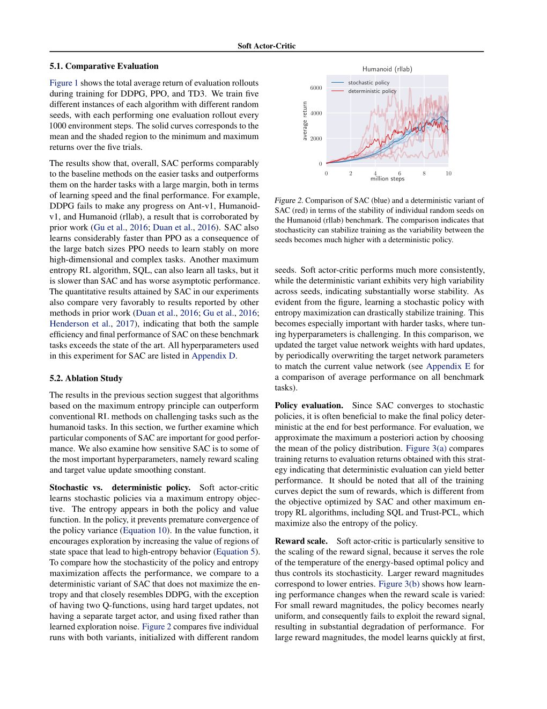

*Rendered source page for visual verification.*

Soft Actor-Critic

5.1. Comparative Evaluation                                                                                 Humanoid (rllab)
Figure 1 shows the total average return of evaluation rollouts                              6000
                                                                                                       stochastic policy
                                                                                                       deterministic policy
during training for DDPG, PPO, and TD3. We train five
different instances of each algorithm with different random

                                                                           average return
seeds, with each performing one evaluation rollout every                                    4000

1000 environment steps. The solid curves corresponds to the
mean and the shaded region to the minimum and maximum                                       2000
returns over the five trials.
The results show that, overall, SAC performs comparably                                        0
to the baseline methods on the easier tasks and outperforms                                        0   2         4
                                                                                                                million steps
                                                                                                                              6   8   10

them on the harder tasks with a large margin, both in terms
of learning speed and the final performance. For example,
                                                                 Figure 2. Comparison of SAC (blue) and a deterministic variant of
DDPG fails to make any progress on Ant-v1, Humanoid-             SAC (red) in terms of the stability of individual random seeds on
v1, and Humanoid (rllab), a result that is corroborated by       the Humanoid (rllab) benchmark. The comparison indicates that
prior work (Gu et al., 2016; Duan et al., 2016). SAC also        stochasticity can stabilize training as the variability between the
learns considerably faster than PPO as a consequence of          seeds becomes much higher with a deterministic policy.
the large batch sizes PPO needs to learn stably on more
high-dimensional and complex tasks. Another maximum
entropy RL algorithm, SQL, can also learn all tasks, but it      seeds. Soft actor-critic performs much more consistently,
is slower than SAC and has worse asymptotic performance.         while the deterministic variant exhibits very high variability
The quantitative results attained by SAC in our experiments      across seeds, indicating substantially worse stability. As
also compare very favorably to results reported by other         evident from the figure, learning a stochastic policy with
methods in prior work (Duan et al., 2016; Gu et al., 2016;       entropy maximization can drastically stabilize training. This
Henderson et al., 2017), indicating that both the sample         becomes especially important with harder tasks, where tun-
efficiency and final performance of SAC on these benchmark       ing hyperparameters is challenging. In this comparison, we
tasks exceeds the state of the art. All hyperparameters used     updated the target value network weights with hard updates,
in this experiment for SAC are listed in Appendix D.             by periodically overwriting the target network parameters
                                                                 to match the current value network (see Appendix E for
5.2. Ablation Study                                              a comparison of average performance on all benchmark
                                                                 tasks).
The results in the previous section suggest that algorithms
based on the maximum entropy principle can outperform            Policy evaluation. Since SAC converges to stochastic
conventional RL methods on challenging tasks such as the         policies, it is often beneficial to make the final policy deter-
humanoid tasks. In this section, we further examine which        ministic at the end for best performance. For evaluation, we
particular components of SAC are important for good perfor-      approximate the maximum a posteriori action by choosing
mance. We also examine how sensitive SAC is to some of           the mean of the policy distribution. Figure 3(a) compares
the most important hyperparameters, namely reward scaling        training returns to evaluation returns obtained with this strat-
and target value update smoothing constant.                      egy indicating that deterministic evaluation can yield better
                                                                 performance. It should be noted that all of the training
Stochastic vs. deterministic policy. Soft actor-critic           curves depict the sum of rewards, which is different from
learns stochastic policies via a maximum entropy objec-          the objective optimized by SAC and other maximum en-
tive. The entropy appears in both the policy and value           tropy RL algorithms, including SQL and Trust-PCL, which
function. In the policy, it prevents premature convergence of    maximize also the entropy of the policy.
the policy variance (Equation 10). In the value function, it
encourages exploration by increasing the value of regions of     Reward scale. Soft actor-critic is particularly sensitive to
state space that lead to high-entropy behavior (Equation 5).     the scaling of the reward signal, because it serves the role
To compare how the stochasticity of the policy and entropy       of the temperature of the energy-based optimal policy and
maximization affects the performance, we compare to a            thus controls its stochasticity. Larger reward magnitudes
deterministic variant of SAC that does not maximize the en-      correspond to lower entries. Figure 3(b) shows how learn-
tropy and that closely resembles DDPG, with the exception        ing performance changes when the reward scale is varied:
of having two Q-functions, using hard target updates, not        For small reward magnitudes, the policy becomes nearly
having a separate target actor, and using fixed rather than      uniform, and consequently fails to exploit the reward signal,
learned exploration noise. Figure 2 compares five individual     resulting in substantial degradation of performance. For
runs with both variants, initialized with different random       large reward magnitudes, the model learns quickly at first,

---

<!-- source-page: 8 -->
## Source page 8

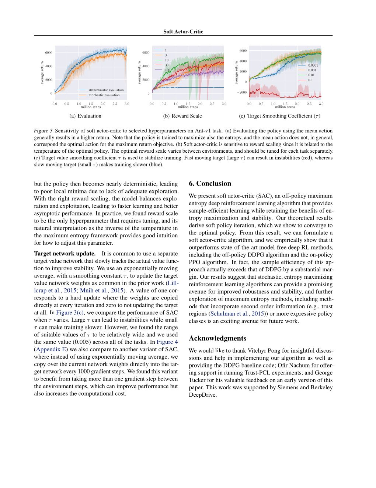

*Rendered source page for visual verification.*

Soft Actor-Critic
                                                Ant-v1                                                                         Ant-v1                                                               Ant-v1
                                                                                                                   1                                                       6000
                    6000                                                                            6000
                                                                                                                   3
                                                                                                                   10                                                      4000

   average return                                                                  average return                                                         average return
                    4000                                                                            4000           30                                                                                              0.0001
                                                                                                                   100                                                     2000                                    0.001
                                                                                                                                                                                                                   0.01
                    2000                                                                            2000                                                                                                           0.1
                                                                                                                                                                              0

                                                  deterministic evaluation
                       0                                                                               0                                                          −2000
                                                  stochastic evaluation

                           0.0   0.5      1.0    1.5      2.0     2.5        3.0                           0.0   0.5     1.0    1.5     2.0   2.5   3.0                           0.0   0.5   1.0    1.5     2.0   2.5      3.0
                                            million steps                                                                  million steps                                                        million steps

                                       (a) Evaluation                                                             (b) Reward Scale                                         (c) Target Smoothing Coefficient (τ )

Figure 3. Sensitivity of soft actor-critic to selected hyperparameters on Ant-v1 task. (a) Evaluating the policy using the mean action
generally results in a higher return. Note that the policy is trained to maximize also the entropy, and the mean action does not, in general,
correspond the optimal action for the maximum return objective. (b) Soft actor-critic is sensitive to reward scaling since it is related to the
temperature of the optimal policy. The optimal reward scale varies between environments, and should be tuned for each task separately.
(c) Target value smoothing coefficient τ is used to stabilize training. Fast moving target (large τ ) can result in instabilities (red), whereas
slow moving target (small τ ) makes training slower (blue).

but the policy then becomes nearly deterministic, leading                                                                         6. Conclusion
to poor local minima due to lack of adequate exploration.
With the right reward scaling, the model balances explo-                                                                          We present soft actor-critic (SAC), an off-policy maximum
ration and exploitation, leading to faster learning and better                                                                    entropy deep reinforcement learning algorithm that provides
asymptotic performance. In practice, we found reward scale                                                                        sample-efficient learning while retaining the benefits of en-
to be the only hyperparameter that requires tuning, and its                                                                       tropy maximization and stability. Our theoretical results
natural interpretation as the inverse of the temperature in                                                                       derive soft policy iteration, which we show to converge to
the maximum entropy framework provides good intuition                                                                             the optimal policy. From this result, we can formulate a
for how to adjust this parameter.                                                                                                 soft actor-critic algorithm, and we empirically show that it
                                                                                                                                  outperforms state-of-the-art model-free deep RL methods,
Target network update. It is common to use a separate                                                                             including the off-policy DDPG algorithm and the on-policy
target value network that slowly tracks the actual value func-                                                                    PPO algorithm. In fact, the sample efficiency of this ap-
tion to improve stability. We use an exponentially moving                                                                         proach actually exceeds that of DDPG by a substantial mar-
average, with a smoothing constant τ , to update the target                                                                       gin. Our results suggest that stochastic, entropy maximizing
value network weights as common in the prior work (Lill-                                                                          reinforcement learning algorithms can provide a promising
icrap et al., 2015; Mnih et al., 2015). A value of one cor-                                                                       avenue for improved robustness and stability, and further
responds to a hard update where the weights are copied                                                                            exploration of maximum entropy methods, including meth-
directly at every iteration and zero to not updating the target                                                                   ods that incorporate second order information (e.g., trust
at all. In Figure 3(c), we compare the performance of SAC                                                                         regions (Schulman et al., 2015)) or more expressive policy
when τ varies. Large τ can lead to instabilities while small                                                                      classes is an exciting avenue for future work.
τ can make training slower. However, we found the range
of suitable values of τ to be relatively wide and we used
the same value (0.005) across all of the tasks. In Figure 4
                                                                                                                                  Acknowledgments
(Appendix E) we also compare to another variant of SAC,                                                                           We would like to thank Vitchyr Pong for insightful discus-
where instead of using exponentially moving average, we                                                                           sions and help in implementing our algorithm as well as
copy over the current network weights directly into the tar-                                                                      providing the DDPG baseline code; Ofir Nachum for offer-
get network every 1000 gradient steps. We found this variant                                                                      ing support in running Trust-PCL experiments; and George
to benefit from taking more than one gradient step between                                                                        Tucker for his valuable feedback on an early version of this
the environment steps, which can improve performance but                                                                          paper. This work was supported by Siemens and Berkeley
also increases the computational cost.                                                                                            DeepDrive.

---

<!-- source-page: 9 -->
## Source page 9

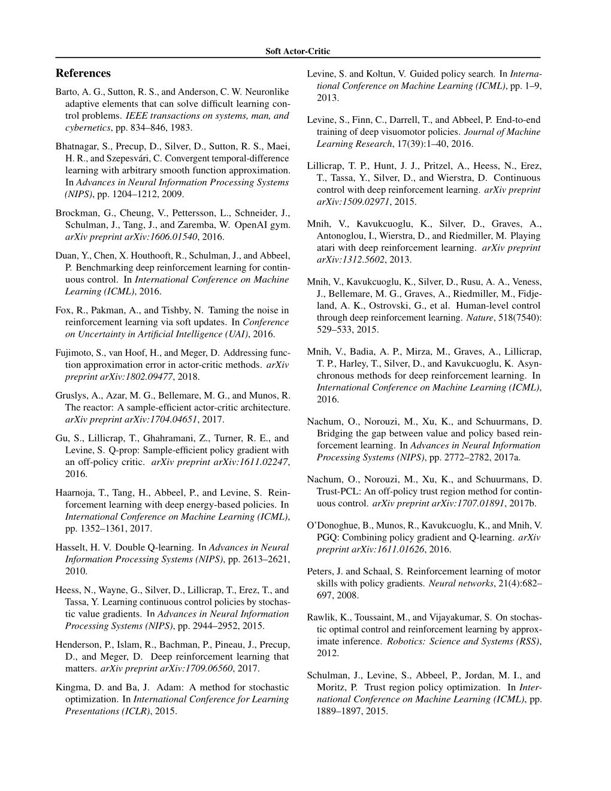

*Rendered source page for visual verification.*

Soft Actor-Critic

References                                                       Levine, S. and Koltun, V. Guided policy search. In Interna-
                                                                   tional Conference on Machine Learning (ICML), pp. 1–9,
Barto, A. G., Sutton, R. S., and Anderson, C. W. Neuronlike
                                                                   2013.
  adaptive elements that can solve difficult learning con-
  trol problems. IEEE transactions on systems, man, and          Levine, S., Finn, C., Darrell, T., and Abbeel, P. End-to-end
  cybernetics, pp. 834–846, 1983.                                  training of deep visuomotor policies. Journal of Machine
Bhatnagar, S., Precup, D., Silver, D., Sutton, R. S., Maei,        Learning Research, 17(39):1–40, 2016.
  H. R., and Szepesvári, C. Convergent temporal-difference
  learning with arbitrary smooth function approximation.         Lillicrap, T. P., Hunt, J. J., Pritzel, A., Heess, N., Erez,
  In Advances in Neural Information Processing Systems             T., Tassa, Y., Silver, D., and Wierstra, D. Continuous
 (NIPS), pp. 1204–1212, 2009.                                      control with deep reinforcement learning. arXiv preprint
                                                                   arXiv:1509.02971, 2015.
Brockman, G., Cheung, V., Pettersson, L., Schneider, J.,
  Schulman, J., Tang, J., and Zaremba, W. OpenAI gym.            Mnih, V., Kavukcuoglu, K., Silver, D., Graves, A.,
  arXiv preprint arXiv:1606.01540, 2016.                          Antonoglou, I., Wierstra, D., and Riedmiller, M. Playing
                                                                  atari with deep reinforcement learning. arXiv preprint
Duan, Y., Chen, X. Houthooft, R., Schulman, J., and Abbeel,       arXiv:1312.5602, 2013.
  P. Benchmarking deep reinforcement learning for contin-
  uous control. In International Conference on Machine           Mnih, V., Kavukcuoglu, K., Silver, D., Rusu, A. A., Veness,
  Learning (ICML), 2016.                                          J., Bellemare, M. G., Graves, A., Riedmiller, M., Fidje-
Fox, R., Pakman, A., and Tishby, N. Taming the noise in           land, A. K., Ostrovski, G., et al. Human-level control
  reinforcement learning via soft updates. In Conference          through deep reinforcement learning. Nature, 518(7540):
  on Uncertainty in Artificial Intelligence (UAI), 2016.          529–533, 2015.

Fujimoto, S., van Hoof, H., and Meger, D. Addressing func-       Mnih, V., Badia, A. P., Mirza, M., Graves, A., Lillicrap,
  tion approximation error in actor-critic methods. arXiv         T. P., Harley, T., Silver, D., and Kavukcuoglu, K. Asyn-
  preprint arXiv:1802.09477, 2018.                                chronous methods for deep reinforcement learning. In
                                                                  International Conference on Machine Learning (ICML),
Gruslys, A., Azar, M. G., Bellemare, M. G., and Munos, R.         2016.
  The reactor: A sample-efficient actor-critic architecture.
  arXiv preprint arXiv:1704.04651, 2017.                         Nachum, O., Norouzi, M., Xu, K., and Schuurmans, D.
Gu, S., Lillicrap, T., Ghahramani, Z., Turner, R. E., and          Bridging the gap between value and policy based rein-
  Levine, S. Q-prop: Sample-efficient policy gradient with         forcement learning. In Advances in Neural Information
  an off-policy critic. arXiv preprint arXiv:1611.02247,           Processing Systems (NIPS), pp. 2772–2782, 2017a.
  2016.
                                                                 Nachum, O., Norouzi, M., Xu, K., and Schuurmans, D.
Haarnoja, T., Tang, H., Abbeel, P., and Levine, S. Rein-           Trust-PCL: An off-policy trust region method for contin-
  forcement learning with deep energy-based policies. In           uous control. arXiv preprint arXiv:1707.01891, 2017b.
  International Conference on Machine Learning (ICML),
  pp. 1352–1361, 2017.                                           O’Donoghue, B., Munos, R., Kavukcuoglu, K., and Mnih, V.
                                                                   PGQ: Combining policy gradient and Q-learning. arXiv
Hasselt, H. V. Double Q-learning. In Advances in Neural            preprint arXiv:1611.01626, 2016.
  Information Processing Systems (NIPS), pp. 2613–2621,
  2010.                                                          Peters, J. and Schaal, S. Reinforcement learning of motor
                                                                   skills with policy gradients. Neural networks, 21(4):682–
Heess, N., Wayne, G., Silver, D., Lillicrap, T., Erez, T., and
                                                                   697, 2008.
  Tassa, Y. Learning continuous control policies by stochas-
  tic value gradients. In Advances in Neural Information         Rawlik, K., Toussaint, M., and Vijayakumar, S. On stochas-
  Processing Systems (NIPS), pp. 2944–2952, 2015.                  tic optimal control and reinforcement learning by approx-
Henderson, P., Islam, R., Bachman, P., Pineau, J., Precup,         imate inference. Robotics: Science and Systems (RSS),
  D., and Meger, D. Deep reinforcement learning that               2012.
  matters. arXiv preprint arXiv:1709.06560, 2017.
                                                                 Schulman, J., Levine, S., Abbeel, P., Jordan, M. I., and
Kingma, D. and Ba, J. Adam: A method for stochastic                Moritz, P. Trust region policy optimization. In Inter-
  optimization. In International Conference for Learning           national Conference on Machine Learning (ICML), pp.
  Presentations (ICLR), 2015.                                      1889–1897, 2015.

---

<!-- source-page: 10 -->
## Source page 10

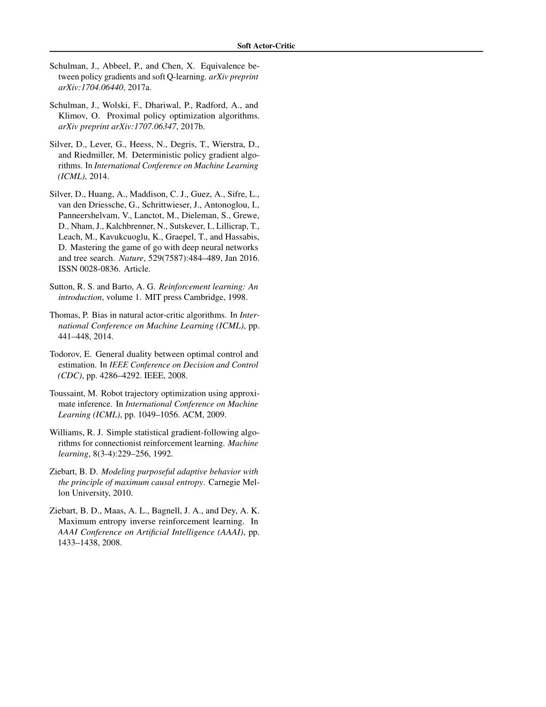

*Rendered source page for visual verification.*

Soft Actor-Critic

Schulman, J., Abbeel, P., and Chen, X. Equivalence be-
  tween policy gradients and soft Q-learning. arXiv preprint
  arXiv:1704.06440, 2017a.
Schulman, J., Wolski, F., Dhariwal, P., Radford, A., and
  Klimov, O. Proximal policy optimization algorithms.
  arXiv preprint arXiv:1707.06347, 2017b.

Silver, D., Lever, G., Heess, N., Degris, T., Wierstra, D.,
   and Riedmiller, M. Deterministic policy gradient algo-
   rithms. In International Conference on Machine Learning
  (ICML), 2014.
Silver, D., Huang, A., Maddison, C. J., Guez, A., Sifre, L.,
  van den Driessche, G., Schrittwieser, J., Antonoglou, I.,
   Panneershelvam, V., Lanctot, M., Dieleman, S., Grewe,
   D., Nham, J., Kalchbrenner, N., Sutskever, I., Lillicrap, T.,
   Leach, M., Kavukcuoglu, K., Graepel, T., and Hassabis,
   D. Mastering the game of go with deep neural networks
   and tree search. Nature, 529(7587):484–489, Jan 2016.
   ISSN 0028-0836. Article.
Sutton, R. S. and Barto, A. G. Reinforcement learning: An
  introduction, volume 1. MIT press Cambridge, 1998.
Thomas, P. Bias in natural actor-critic algorithms. In Inter-
  national Conference on Machine Learning (ICML), pp.
  441–448, 2014.
Todorov, E. General duality between optimal control and
  estimation. In IEEE Conference on Decision and Control
  (CDC), pp. 4286–4292. IEEE, 2008.

Toussaint, M. Robot trajectory optimization using approxi-
  mate inference. In International Conference on Machine
  Learning (ICML), pp. 1049–1056. ACM, 2009.
Williams, R. J. Simple statistical gradient-following algo-
 rithms for connectionist reinforcement learning. Machine
 learning, 8(3-4):229–256, 1992.

Ziebart, B. D. Modeling purposeful adaptive behavior with
  the principle of maximum causal entropy. Carnegie Mel-
  lon University, 2010.
Ziebart, B. D., Maas, A. L., Bagnell, J. A., and Dey, A. K.
  Maximum entropy inverse reinforcement learning. In
  AAAI Conference on Artificial Intelligence (AAAI), pp.
  1433–1438, 2008.

---

<!-- source-page: 11 -->
## Source page 11

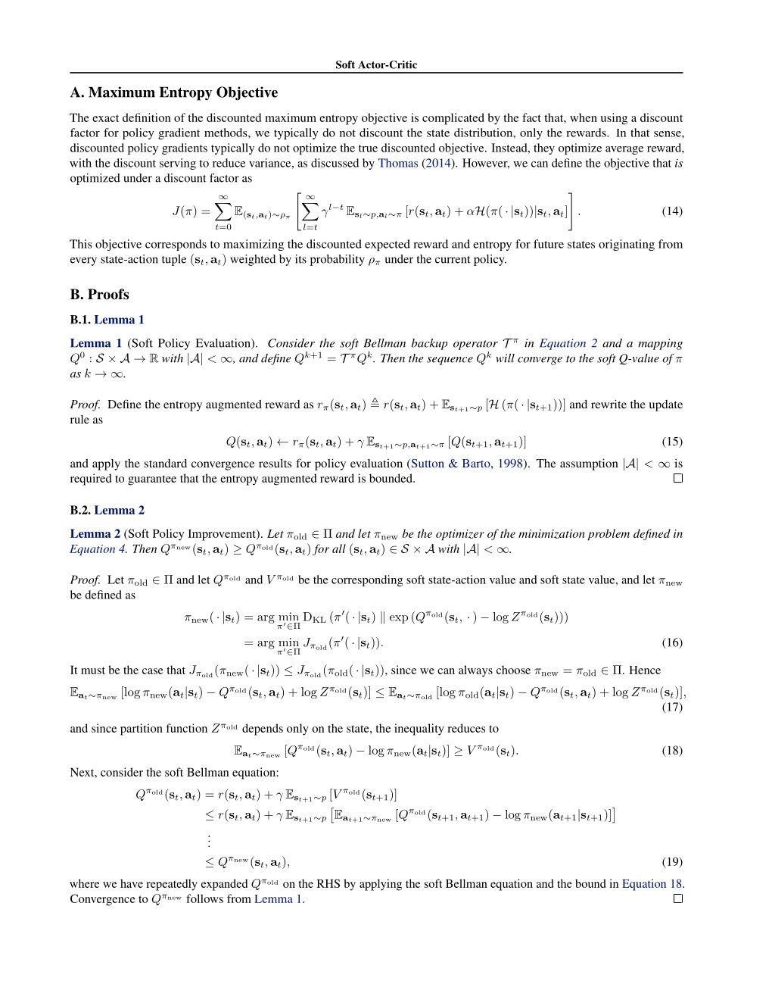

*Rendered source page for visual verification.*

Soft Actor-Critic

A. Maximum Entropy Objective
The exact definition of the discounted maximum entropy objective is complicated by the fact that, when using a discount
factor for policy gradient methods, we typically do not discount the state distribution, only the rewards. In that sense,
discounted policy gradients typically do not optimize the true discounted objective. Instead, they optimize average reward,
with the discount serving to reduce variance, as discussed by Thomas (2014). However, we can define the objective that is
optimized under a discount factor as
                              ∞
                                               "∞                                                        #
                             X                  X
                                                     l−t
                     J(π) =      E(st ,at )∼ρπ     γ Esl ∼p,al ∼π [r(st , at ) + αH(π( · |st ))|st , at ] .            (14)
                                t=0                   l=t

This objective corresponds to maximizing the discounted expected reward and entropy for future states originating from
every state-action tuple (st , at ) weighted by its probability ρπ under the current policy.

B. Proofs
B.1. Lemma 1
Lemma 1 (Soft Policy Evaluation). Consider the soft Bellman backup operator T π in Equation 2 and a mapping
Q0 : S × A → R with |A| < ∞, and define Qk+1 = T π Qk . Then the sequence Qk will converge to the soft Q-value of π
as k → ∞.

Proof. Define the entropy augmented reward as rπ (st , at ) , r(st , at ) + Est+1 ∼p [H (π( · |st+1 ))] and rewrite the update
rule as
                                   Q(st , at ) ← rπ (st , at ) + γ Est+1 ∼p,at+1 ∼π [Q(st+1 , at+1 )]                                 (15)
and apply the standard convergence results for policy evaluation (Sutton & Barto, 1998). The assumption |A| < ∞ is
required to guarantee that the entropy augmented reward is bounded.

B.2. Lemma 2
Lemma 2 (Soft Policy Improvement). Let πold ∈ Π and let πnew be the optimizer of the minimization problem defined in
Equation 4. Then Qπnew (st , at ) ≥ Qπold (st , at ) for all (st , at ) ∈ S × A with |A| < ∞.

Proof. Let πold ∈ Π and let Qπold and V πold be the corresponding soft state-action value and soft state value, and let πnew
be defined as
                         πnew ( · |st ) = arg min
                                              0
                                                  DKL (π 0 ( · |st ) k exp (Qπold (st , · ) − log Z πold (st )))
                                               π ∈Π
                                        = arg min
                                              0
                                                  Jπold (π 0 ( · |st )).                                                              (16)
                                               π ∈Π

It must be the case that Jπold (πnew ( · |st )) ≤ Jπold (πold ( · |st )), since we can always choose πnew = πold ∈ Π. Hence
Eat ∼πnew [log πnew (at |st ) − Qπold (st , at ) + log Z πold (st )] ≤ Eat ∼πold [log πold (at |st ) − Qπold (st , at ) + log Z πold (st )],
                                                                                                                                      (17)
and since partition function Z πold depends only on the state, the inequality reduces to
                                      Eat ∼πnew [Qπold (st , at ) − log πnew (at |st )] ≥ V πold (st ).                               (18)
Next, consider the soft Bellman equation:
              Qπold (st , at ) = r(st , at ) + γ Est+1 ∼p [V πold (st+1 )]
                               ≤ r(st , at ) + γ Est+1 ∼p Eat+1 ∼πnew [Qπold (st+1 , at+1 ) − log πnew (at+1 |st+1 )]
> [Extraction warning] One or more lines using an invalid PDF font map were omitted. Use the rendered source page and canonical LaTeX registry.

                               ..
                                .
                              ≤ Qπnew (st , at ),                                                                                     (19)
                                            πold
where we have repeatedly expanded Q   on the RHS by applying the soft Bellman equation and the bound in Equation 18.
Convergence to Qπnew follows from Lemma 1.

---

<!-- source-page: 12 -->
## Source page 12

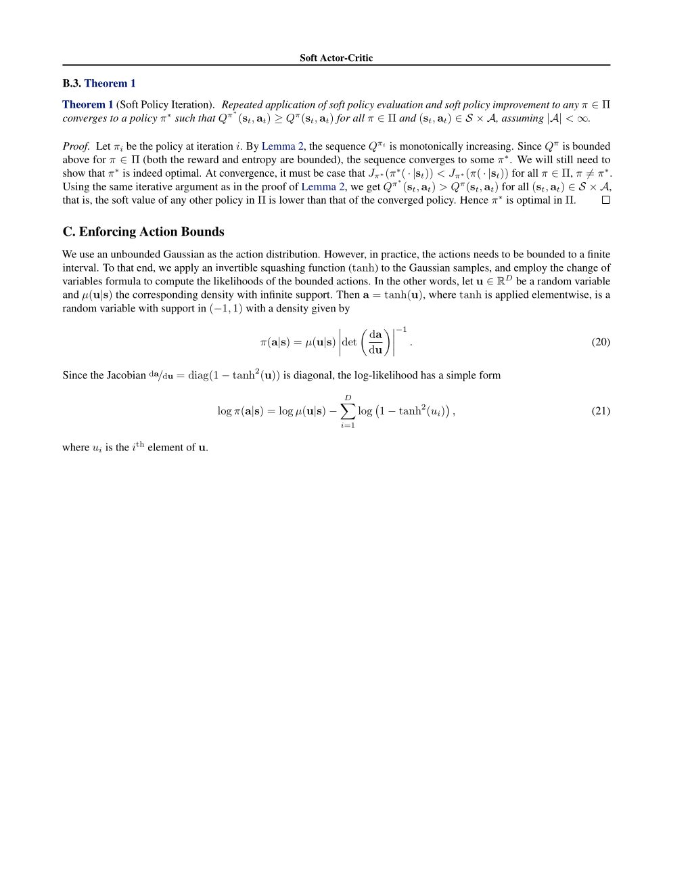

*Rendered source page for visual verification.*

Soft Actor-Critic

B.3. Theorem 1
Theorem 1 (Soft Policy Iteration). Repeated application of soft policy evaluation and soft policy improvement to any π ∈ Π
                                      ∗
converges to a policy π ∗ such that Qπ (st , at ) ≥ Qπ (st , at ) for all π ∈ Π and (st , at ) ∈ S × A, assuming |A| < ∞.

Proof. Let πi be the policy at iteration i. By Lemma 2, the sequence Qπi is monotonically increasing. Since Qπ is bounded
above for π ∈ Π (both the reward and entropy are bounded), the sequence converges to some π ∗ . We will still need to
show that π ∗ is indeed optimal. At convergence, it must be case that Jπ∗ (π ∗ ( · |st )) < Jπ∗ (π( · |st )) for all π ∈ Π, π 6= π ∗ .
                                                                               ∗
Using the same iterative argument as in the proof of Lemma 2, we get Qπ (st , at ) > Qπ (st , at ) for all (st , at ) ∈ S × A,
that is, the soft value of any other policy in Π is lower than that of the converged policy. Hence π ∗ is optimal in Π.

C. Enforcing Action Bounds
We use an unbounded Gaussian as the action distribution. However, in practice, the actions needs to be bounded to a finite
interval. To that end, we apply an invertible squashing function (tanh) to the Gaussian samples, and employ the change of
variables formula to compute the likelihoods of the bounded actions. In the other words, let u ∈ RD be a random variable
and µ(u|s) the corresponding density with infinite support. Then a = tanh(u), where tanh is applied elementwise, is a
random variable with support in (−1, 1) with a density given by
> [Extraction warning] One or more lines using an invalid PDF font map were omitted. Use the rendered source page and canonical LaTeX registry.
                                                                             da
                                                π(a|s) = µ(u|s) det                      .                                      (20)
                                                                             du

Since the Jacobian da/du = diag(1 − tanh2 (u)) is diagonal, the log-likelihood has a simple form
                                                                   D
                                                                   X
                                                                         log 1 − tanh2 (ui ) ,
> [Extraction warning] One or more lines using an invalid PDF font map were omitted. Use the rendered source page and canonical LaTeX registry.
                                     log π(a|s) = log µ(u|s) −                                                                  (21)
                                                                   i=1

where ui is the ith element of u.

---

<!-- source-page: 13 -->
## Source page 13

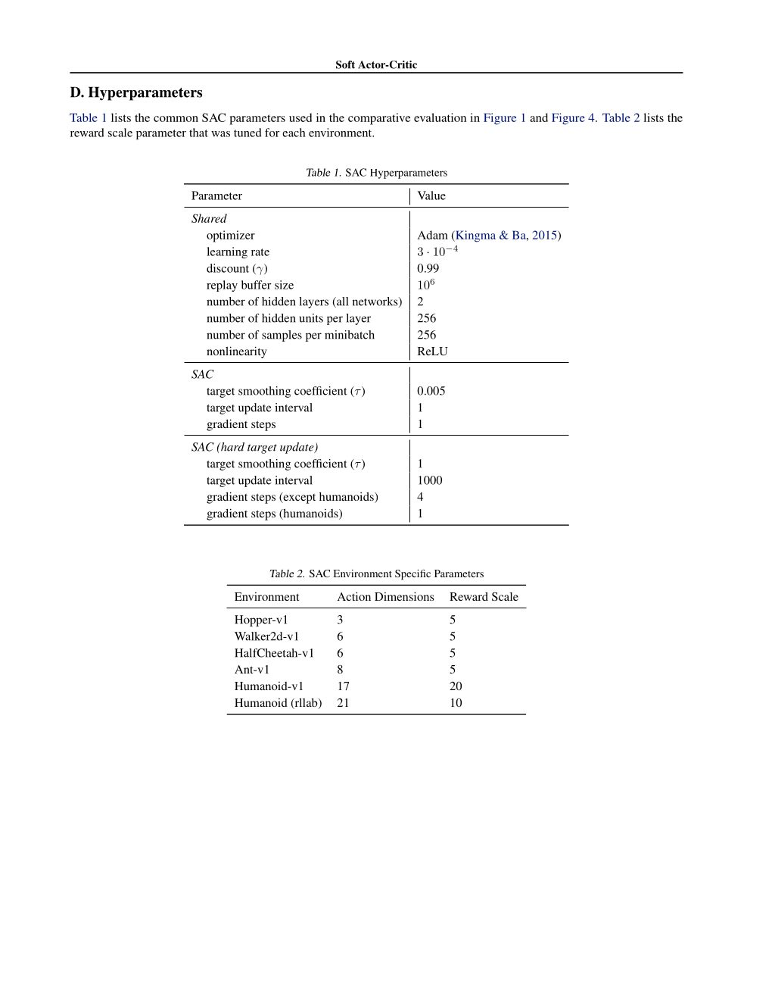

*Rendered source page for visual verification.*

Soft Actor-Critic

D. Hyperparameters
Table 1 lists the common SAC parameters used in the comparative evaluation in Figure 1 and Figure 4. Table 2 lists the
reward scale parameter that was tuned for each environment.

                                             Table 1. SAC Hyperparameters

                       Parameter                                        Value
                       Shared
                         optimizer                                      Adam (Kingma & Ba, 2015)
                         learning rate                                  3 · 10−4
                         discount (γ)                                   0.99
                         replay buffer size                             106
                         number of hidden layers (all networks)         2
                         number of hidden units per layer               256
                         number of samples per minibatch                256
                         nonlinearity                                   ReLU
                       SAC
                         target smoothing coefficient (τ )              0.005
                         target update interval                         1
                         gradient steps                                 1
                       SAC (hard target update)
                         target smoothing coefficient (τ )              1
                         target update interval                         1000
                         gradient steps (except humanoids)              4
                         gradient steps (humanoids)                     1

                                      Table 2. SAC Environment Specific Parameters

                               Environment          Action Dimensions           Reward Scale
                               Hopper-v1            3                           5
                               Walker2d-v1          6                           5
                               HalfCheetah-v1       6                           5
                               Ant-v1               8                           5
                               Humanoid-v1          17                          20
                               Humanoid (rllab)     21                          10

---

<!-- source-page: 14 -->
## Source page 14

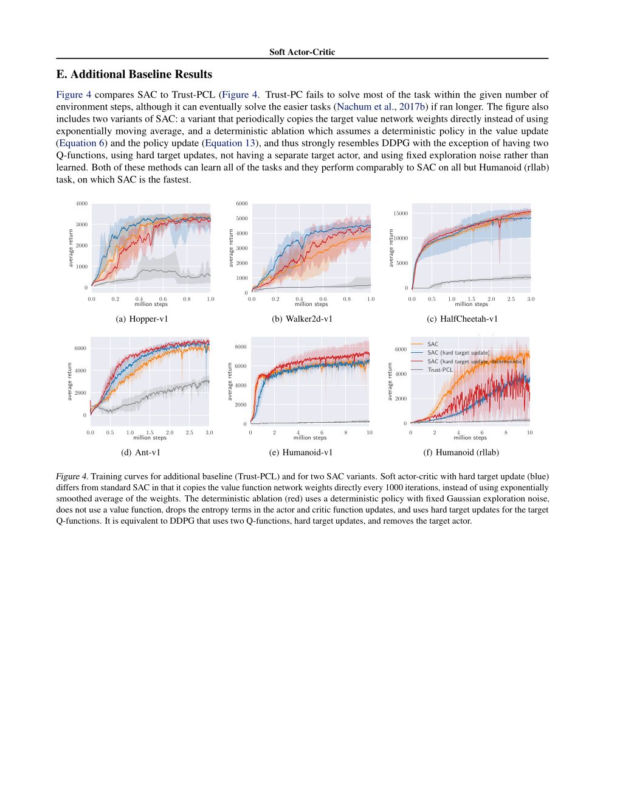

*Rendered source page for visual verification.*

Soft Actor-Critic

E. Additional Baseline Results
Figure 4 compares SAC to Trust-PCL (Figure 4. Trust-PC fails to solve most of the task within the given number of
environment steps, although it can eventually solve the easier tasks (Nachum et al., 2017b) if ran longer. The figure also
includes two variants of SAC: a variant that periodically copies the target value network weights directly instead of using
exponentially moving average, and a deterministic ablation which assumes a deterministic policy in the value update
(Equation 6) and the policy update (Equation 13), and thus strongly resembles DDPG with the exception of having two
Q-functions, using hard target updates, not having a separate target actor, and using fixed exploration noise rather than
learned. Both of these methods can learn all of the tasks and they perform comparably to SAC on all but Humanoid (rllab)
task, on which SAC is the fastest.
                                                  Hopper-v1                                                              Walker2d-v1                                                           HalfCheetah-v1
                      4000                                                                            6000
                                                                                                                                                                       15000
                                                                                                      5000
                      3000

     average return                                                                  average return                                                     average return
                                                                                                      4000
                                                                                                                                                                       10000
                      2000                                                                            3000

                                                                                                      2000                                                               5000
                      1000
                                                                                                      1000
                         0                                                                                                                                                  0
                                                                                                         0
                             0.0     0.2          0.4         0.6     0.8    1.0                             0.0   0.2    0.4      0.6    0.8   1.0                             0.0    0.5     1.0       1.5       2.0       2.5   3.0
                                                  million steps                                                           million steps                                                          million steps

                                         (a) Hopper-v1                                                             (b) Walker2d-v1                                                    (c) HalfCheetah-v1
                                                    Ant-v1                                                               Humanoid-v1                                                          Humanoid (rllab)

                                                                                                      8000                                                                             SAC
                      6000                                                                                                                                               6000
                                                                                                                                                                                       SAC (hard target update)
                                                                                                                                                                                       SAC (hard target update, deterministic)

   average return                                                                  average return                                                     average return
                                                                                                      6000
                      4000                                                                                                                                                             Trust-PCL
                                                                                                                                                                         4000
                                                                                                      4000
                      2000
                                                                                                                                                                         2000
                                                                                                      2000
                         0
                                                                                                         0                                                                  0
                             0.0   0.5      1.0         1.5     2.0    2.5   3.0                             0     2      4         6     8     10                              0        2           4         6         8         10
                                              million steps                                                              million steps                                                           million steps

                                           (d) Ant-v1                                                              (e) Humanoid-v1                                                    (f) Humanoid (rllab)

Figure 4. Training curves for additional baseline (Trust-PCL) and for two SAC variants. Soft actor-critic with hard target update (blue)
differs from standard SAC in that it copies the value function network weights directly every 1000 iterations, instead of using exponentially
smoothed average of the weights. The deterministic ablation (red) uses a deterministic policy with fixed Gaussian exploration noise,
does not use a value function, drops the entropy terms in the actor and critic function updates, and uses hard target updates for the target
Q-functions. It is equivalent to DDPG that uses two Q-functions, hard target updates, and removes the target actor.
