# Reinforcement Learning with Action Chunking

> Source: [`2507.07969v4.pdf`](../../2507.07969v4.pdf). This Markdown preserves extracted source text page by page. Rendered pages remain the visual authority for figures, tables, equations, and ambiguous reading order.

## Generated section index

- Abstract
- 1 Introduction
- 2 Related Work
- 3 Background
- 4 Q-Chunking
- 4.1 Q-learning on a temporally extended action space
- 4.2 Behavior constraints for temporally coherent exploration
- 4.3 Practical implementations
- 5 Experimental Results
- 5.1 Environments and Datasets
- 5.2 Comparisons
- 5.3 How well does our method compare to prior offline-to-online RL methods?
- 5.4 Why does action chunking help exploration?
- 5.5 How does action chunk length, critic ensemble size, and UTD ratio affect performance?
- 6 Discussions
- Acknowledgments
- References
- 4353. PMLR, 2018.
- 2023. URL https://openreview.net/forum?id=-Y34L45JR6z.
- 1. Qθ (s, a1 , · · · ah ) : S × Ah 7→ R — the value function that takes in a state and a sequence
- 3. fξ (s, m, u) : S × RAh × [0, 1] 7→ RAh — the flow-matching behavior policy parameterized
- 1 X ′
- 10 for RLPD, RLPD-AC, QC-RLPD, and SUPE-GT
- 2 for QC-FQL, FQL, FQL-n, QC-BFN, BFN, BFN-n
- 0.01 since it works the best.
- 0.1 as it works the best.
- 9 subplots where each visualizes 1000 time steps). In Figure 9, we show another 9000 time steps but
- 4 actions). For online training, we are doing one gradient update per environment step, and it makes

## Canonical LaTeX formula registry

> Formula source: arXiv `2507.07969v4` TeX package. These expressions are canonical; PDF-extracted glyph text below is non-canonical searchable context.

**Formula F0001** · `appendix.tex`

$$
\begin{aligned}
Q^\pi(s_t, a_t, a_{t+1}, \cdots, a_{t+n-1}) 
    &= \mathbb{E}_{s_{t'} \sim T(\cdot | s_{t'}, a_{t'})} \left[\sum_{t'=t}^{t+n-1}\left[\gamma^{t'-t}r(s_{t'}, a_{t'})\right] + V^\pi(s_{t+n})\right] \\
    &= \mathbb{E}_{s_{t+n}, r_{t+1}, r_{t+2}, \cdots, r_{t+n-1}}\left[\sum_{t'=t}^{t+n-1}\left[\gamma^{t'-t}r_{t'}\right] + V^\pi(s_{t+n})\right] \\
    & = \mathbb{E}_{s_{t+n}, r_{t+1}, r_{t+2}, \cdots, r_{t+n-1}}\left[\sum_{t'=t}^{t+n-1}\left[\gamma^{t'-t}r_{t'}\right] + \hat{V}(s_{t+n})\right] \\
    & = \mathbb{E}\left[\hat{V}_{\mathrm{n\text{-}step}}\right].
\end{aligned}
$$

**Formula F0002** · `appendix.tex`

$$
\begin{aligned}
a_1 & \cdots & a_h
\end{aligned}
$$

**Formula F0003** · `appendix.tex`

$$
L(\theta_k, w) = \left(Q_{\theta_k}(s_t, a_t, \cdots, a_{t+h-1}) - R^h_t - \frac{\gamma^h}{K}\sum_{k'=1}^{K} Q_{\bar \theta_{k'}}(s_{t+h}, a_{t+h}, \cdots, a_{t+2h-1})\right)^2,
$$

**Formula F0004** · `appendix.tex`

$$
\begin{aligned}
a_{t+h} & \cdots & a_{t+2h-1}
\end{aligned}
$$

**Formula F0005** · `appendix.tex`

$$
L(\psi, w) = -Q_\theta(s_t, \mu_\psi(s_t, z_t)) + \alpha \left\|\mu_\psi(s_t, z_t) - \begin{bmatrix} a^\xi_t & \cdots & a^\xi_{t+h-1} \end{bmatrix}\right\|_2^2,
$$

**Formula F0006** · `appendix.tex`

$$
\begin{aligned}
a^\xi_t & \cdots & a^\xi_{t+h-1}
\end{aligned}
$$

**Formula F0007** · `appendix.tex`

$$
L(\xi, w) = \|f_\xi(s_t, u\begin{bmatrix} a_t & \cdots & a_{t+h-1} \end{bmatrix} + (1-u)z_t, u) - (\begin{bmatrix} a_t & \cdots & a_{t+h-1} \end{bmatrix} - z_t)\|_2^2,
$$

**Formula F0008** · `appendix.tex`

$$
\begin{aligned}
L(\theta_k, w) &= \left(Q_{\theta_k}(s_t, a_t) - r_t - \frac{\gamma}{K}\sum_{k'=1}^{K} Q_{\bar \theta_{k'}}(s_{t+1}, \mu_\psi(s_{t+1}, z_t^{k'}))\right)^2, z^{k'}_t \sim \mathcal{N}(0, I_A), \\
    L(\psi, w) &= -Q_\theta(s_t, \mu_\psi(s_t, z_t)) + \alpha \left\|\mu_\psi(s_t, z_t) - a^\xi_t\right\|_2^2, \\
    & a_t^\xi \leftarrow \mathtt{FlowODE\_Euler}(s_t, z_t, f_\xi, T), z_t \sim\mathcal{N}(0, I_A), \\
    L(\xi, w) &= \|f_\xi(s_t, ua_t + (1-u)z_t, u) - (a_t - z_t)\|_2^2, z_t \sim \mathcal{N}(0, I_A), u \sim U([0, 1]).
\end{aligned}
$$

**Formula F0009** · `appendix.tex`

$$
\begin{aligned}
L(\theta_k, w) &= \left(Q_{\theta_k}(s_t, a_t) - \sum_{t'=0}^{h-1}(\gamma^{t'}r_{t+t'}) - \frac{\gamma^h}{K}\sum_{k'=1}^{K} Q_{\bar \theta_{k'}}(s_{t+h}, \mu_\psi(s_{t+h}, z_t^{k'}))\right)^2,
\end{aligned}
$$

**Formula F0010** · `appendix.tex`

$$
\begin{bmatrix}a_t^i & \cdots & a_{t+h-1}^{i}  \end{bmatrix} = \mathtt{FlowODE\_Euler}(s_t, z^i_t, f_\xi, T)
$$

**Formula F0011** · `appendix.tex`

$$
\begin{aligned}
a_t^{i^\star} & \cdots & a_{t+h-1}^{i^\star}
\end{aligned}
$$

**Formula F0012** · `appendix.tex`

$$
i^\star \leftarrow \arg\max_{i \in [N]} Q(s, \begin{bmatrix}a_t^i & \cdots & a_{t+h-1}^{i}  \end{bmatrix}).
$$

**Formula F0013** · `appendix.tex`

$$
L(\theta_k, w) = \left(Q_{\theta_k}(s_t, a_t, \cdots, a_{t+h-1}) - R^h_t - \frac{\gamma^h}{K}\sum_{k'=1}^{K} Q_{\bar \theta_{k'}}(s_{t+h}, a^{i^\star}_{t+h}, \cdots, a^{i^\star}_{t+2h-1})\right)^2
$$

**Formula F0014** · `appendix.tex`

$$
\mathcal{L}(\psi) = \mathbb{E}_{a'_t \sim  \pi_\psi(\cdot | s_t)}\left[-\frac{1}{K}\sum_{k=1}^{K}Q_{\theta_k}(s_t, a'_t) - \alpha \log \pi_\psi(a_t | s_t)\right].
$$

**Formula F0015** · `appendix.tex`

$n$

**Formula F0016** · `appendix.tex`

$s_t, a_t, \cdots, s_{t+n}$

**Formula F0017** · `appendix.tex`

$\pi_\beta(a_t, \cdots, a_{t+n} | s_t)$

**Formula F0018** · `appendix.tex`

$s_{t+k} \sim T(\cdot \mid s_{t+k-1}, a_{t+k-1}), \forall k\in\{1, \cdots, n\}$

**Formula F0019** · `appendix.tex`

$r_t, r_{t+1}, \cdots r_{t+n-1}$

**Formula F0020** · `appendix.tex`

$r_{t+k} = r(s_{t+k}, a_{t+k})$

**Formula F0021** · `appendix.tex`

$V^\pi(s_t)$

**Formula F0022** · `appendix.tex`

$\pi(a_t, \cdots, a_{t+n} | s_t)$

**Formula F0023** · `appendix.tex`

$s_t$

**Formula F0024** · `appendix.tex`

$Q^\pi(s_t, a_t, a_{t+1}, \cdots, a_{t+n-1})$

**Formula F0025** · `appendix.tex`

$\pi$

**Formula F0026** · `appendix.tex`

$a_t, a_{t+1}, \cdots, a_{t+n-1}$

**Formula F0027** · `appendix.tex`

$\hat{V}_{\mathrm{n\text{-}step}} := \sum_{t'=t}^{t+n-1}\left[\gamma^{t'-t}r_{t'}\right] + \hat{V}(s_{t+n})$

**Formula F0028** · `appendix.tex`

$Q^\pi(s_t, a_{t}, \cdots, a_{t+n-1})$

**Formula F0029** · `appendix.tex`

$\hat{V}(s_{t+n})$

**Formula F0030** · `appendix.tex`

$V^\pi(s_{t+n})$

**Formula F0031** · `appendix.tex`

$r_t, r_{t+1}, \cdots, r_{t+h-1}$

**Formula F0032** · `appendix.tex`

$\hat{V}_{\mathrm{n\text{-}step}}$

**Formula F0033** · `appendix.tex`

$Q(s_t, a_t, a_{t+1}, \cdots, a_{t+n-1})$

**Formula F0034** · `appendix.tex`

$\hat{V}_{s} \leftarrow Q(s_t, a_t, a_{t+1}, \cdots, a_{t+n-1})$

**Formula F0035** · `appendix.tex`

$Q$

**Formula F0036** · `appendix.tex`

$Q^\pi(s_{t}, a_{t}, a_{t+1}, \cdots, a_{t+n-1})$

**Formula F0037** · `appendix.tex`

$-1$

**Formula F0038** · `appendix.tex`

$0$

**Formula F0039** · `appendix.tex`

$1$

**Formula F0040** · `appendix.tex`

$\mathcal{D}$

**Formula F0041** · `appendix.tex`

$99$

**Formula F0042** · `appendix.tex`

$3\times3$

**Formula F0043** · `appendix.tex`

$\rightarrow$

**Formula F0044** · `appendix.tex`

$-n_{\mathrm{wrong}}$

**Formula F0045** · `appendix.tex`

$n_{\mathrm{wrong}}$

**Formula F0046** · `appendix.tex`

$A$

**Formula F0047** · `appendix.tex`

$750$

**Formula F0048** · `appendix.tex`

$5$

**Formula F0049** · `appendix.tex`

$500$

**Formula F0050** · `appendix.tex`

$3$

**Formula F0051** · `appendix.tex`

$1000$

**Formula F0052** · `appendix.tex`

$100$

**Formula F0053** · `appendix.tex`

$31\,127$

**Formula F0054** · `appendix.tex`

$7$

**Formula F0055** · `appendix.tex`

$62\,756$

**Formula F0056** · `appendix.tex`

$80\,731$

**Formula F0057** · `appendix.tex`

$x$

**Formula F0058** · `appendix.tex`

$y$

**Formula F0059** · `appendix.tex`

$z$

**Formula F0060** · `appendix.tex`

$f_\xi(\boldsymbol{a}_{t:t+h} | s)$

**Formula F0061** · `appendix.tex`

$Q_\theta(s_t, \boldsymbol{a}_{t:t+h})$

**Formula F0062** · `appendix.tex`

$\mathcal{D} \leftarrow$

**Formula F0063** · `appendix.tex`

$t$

**Formula F0064** · `appendix.tex`

$t \mod h \equiv 0$

**Formula F0065** · `appendix.tex`

$\boldsymbol{a}_{t:t+h}^1 \cdots \boldsymbol{a}_{t:t+h}^N \sim f_\xi(\cdot | s_t)$

**Formula F0066** · `appendix.tex`

$\boldsymbol{a}_{t:t+h}^\star \leftarrow \arg\max_{\boldsymbol{a}_{t:t+h}^i} Q_\theta(s, \boldsymbol{a}_{t:t+h}^i)$

**Formula F0067** · `appendix.tex`

$a^\star_t$

**Formula F0068** · `appendix.tex`

$s_{t+1}, r_t$

**Formula F0069** · `appendix.tex`

$\mathcal{D} \leftarrow \mathcal{D} \cup \{(s_t, a^\star_t, s_{t+1}, r_t)\}$

**Formula F0070** · `appendix.tex`

$f_\xi$

**Formula F0071** · `appendix.tex`

$Q_\theta$

**Formula F0072** · `appendix.tex`

$f_\xi, Q_\theta$

**Formula F0073** · `appendix.tex`

$\mu_\psi(s, \boldsymbol z)$

**Formula F0074** · `appendix.tex`

$t \mod h  \equiv 0$

**Formula F0075** · `appendix.tex`

$\boldsymbol z \sim \mathcal{N}(0, \boldsymbol I_{Ah})$

**Formula F0076** · `appendix.tex`

$\boldsymbol{a}_{t:t+h} \leftarrow \mu_\psi(s_t, \boldsymbol z)$

**Formula F0077** · `appendix.tex`

$a_t$

**Formula F0078** · `appendix.tex`

$\mathcal{D} \leftarrow \mathcal{D} \cup \{(s_t, a_t, s_{t+1}, r_t)\}$

**Formula F0079** · `appendix.tex`

$\mu_{\psi}$

**Formula F0080** · `appendix.tex`

$f_\xi, Q_\theta, \mu_\psi(s, \boldsymbol z)$

**Formula F0081** · `appendix.tex`

$Q_\theta(s, a_1, \cdots a_h): \mathcal{S}\times \mathcal{A}^h \mapsto \mathbb{R}$

**Formula F0082** · `appendix.tex`

$\theta = (\theta_1, \cdots, \theta_K)$

**Formula F0083** · `appendix.tex`

$\mu_\psi(s, z): \mathcal{S}\times \mathbb{R}^{Ah} \mapsto \mathbb{R}^{Ah}$

**Formula F0084** · `appendix.tex`

$f_\xi(s, m, u): \mathcal{S} \times \mathbb{R}^{Ah} \times [0, 1] \mapsto \mathbb{R}^{Ah}$

**Formula F0085** · `appendix.tex`

$\pi_\psi(\cdot|s)$

**Formula F0086** · `appendix.tex`

$z \sim \mathcal{N}(0, I_{Ah})$

**Formula F0087** · `appendix.tex`

$\leftarrow \mu_\psi(s, z)$

**Formula F0088** · `appendix.tex`

$w = (s_t, a_t, a_{t+1}, \cdots, a_{t+h-1}, s_{t+h}, R^h_t) \sim \mathcal{D}$

**Formula F0089** · `appendix.tex`

$R^h_t = \sum_{t'=0}^{h-1}\gamma^{t'}r_{t+t'}$

**Formula F0090** · `appendix.tex`

$\sim \pi_\psi(\cdot | s_{t+h}), k \in \{1, 2, \cdots, K\}$

**Formula F0091** · `appendix.tex`

$z_t \sim \mathcal{N}(0, I_{Ah})$

**Formula F0092** · `appendix.tex`

$f_\xi(s, m, t)$

**Formula F0093** · `appendix.tex`

$z_t$

**Formula F0094** · `appendix.tex`

$\alpha \in \mathbb{R}$

**Formula F0095** · `appendix.tex`

$\alpha$

**Formula F0096** · `appendix.tex`

$u \sim U([0, 1])$

**Formula F0097** · `appendix.tex`

$\{w_1, w_2, \cdots, w_M\}$

**Formula F0098** · `appendix.tex`

$\mathcal{L}(\theta) = \frac{1}{M}\sum_{i=1}^M \sum_{k=1}^K \mathcal{L}(\theta_k, w_i), \mathcal{L}(\psi) = \frac{1}{N}\sum_{i=1}^M  \mathcal{L}(\psi, w_i), \mathcal{L}(\xi) = \frac{1}{N}\sum_{i=1}^M \mathcal{L}(\xi, w_i)$

**Formula F0099** · `appendix.tex`

$h=1$

**Formula F0100** · `appendix.tex`

$w = (s_t, a_t, r_t, s_{t+1})$

**Formula F0101** · `appendix.tex`

$\{w_1, w_2, \cdots, w_N\}$

**Formula F0102** · `appendix.tex`

$\mathcal{L}(\theta) = \frac{1}{N}\sum_{i=1}^N \sum_{k=1}^K \mathcal{L}(\theta_k, w_i), \mathcal{L}(\psi) = \frac{1}{N}\sum_{i=1}^N  \mathcal{L}(\psi, w_i), \mathcal{L}(\xi) = \frac{1}{N}\sum_{i=1}^N \mathcal{L}(\xi, w_i)$

**Formula F0103** · `appendix.tex`

$h$

**Formula F0104** · `appendix.tex`

$z^{k'}_t \sim \mathcal{N}(0, I_A)$

**Formula F0105** · `appendix.tex`

$k' \in \{1, 2, \cdots, K\}$

**Formula F0106** · `appendix.tex`

$\{z_t^1, z^2_t, \cdots, z^N_t\} \sim \mathcal{N}(0, I_{Ah})$

**Formula F0107** · `appendix.tex`

$N$

**Formula F0108** · `appendix.tex`

$a^{i^\star}_{t+h}, \cdots, a^{i^\star}_{t+2h-1} \sim \pi(\cdot | s_{t+h})$

**Formula F0109** · `appendix.tex`

$\mathtt{FlowODE\_Euler}(s_t, z_t, f_\xi, T)$

**Formula F0110** · `appendix.tex`

$f_\xi(s, m, u)$

**Formula F0111** · `appendix.tex`

$T$

**Formula F0112** · `appendix.tex`

$m^0 \leftarrow z_t$

**Formula F0113** · `appendix.tex`

$i \in \{1, \cdots,  T\}$

**Formula F0114** · `appendix.tex`

$m^i \leftarrow f_\xi(s_t, m^{i-1}, (i-1)/T)$

**Formula F0115** · `appendix.tex`

$m^T$

**Formula F0116** · `appendix.tex`

$\underbrace{6}_{\text{hours per single run}} \times \underbrace{15}_{\text{\# of methods}} \times \underbrace{25}_{\text{\# of tasks}} \times \underbrace{4}_{\text{\# of seeds}} = 9\ 000 \text{ GPU hours}$

**Formula F0117** · `appendix.tex`

$\underbrace{10}_{\text{hours per single run}} \times \underbrace{8}_{\text{\# of methods}} \times \underbrace{3}_{\text{\# of tasks}} \times \underbrace{5}_{\text{\# of seeds}} = 1\ 350 \text{ GPU hours}$

**Formula F0118** · `appendix.tex`

$10\ 350$

**Formula F0119** · `appendix.tex`

$M$

**Formula F0120** · `appendix.tex`

$256$

**Formula F0121** · `appendix.tex`

$\gamma$

**Formula F0122** · `appendix.tex`

$0.99$

**Formula F0123** · `appendix.tex`

$3 \times 10^{-4}$

**Formula F0124** · `appendix.tex`

$\tau$

**Formula F0125** · `appendix.tex`

$5 \times 10^{-3}$

**Formula F0126** · `appendix.tex`

$K$

**Formula F0127** · `appendix.tex`

$10$

**Formula F0128** · `appendix.tex`

$10^6$

**Formula F0129** · `appendix.tex`

$1 \times 10^6$

**Formula F0130** · `appendix.tex`

$512$

**Formula F0131** · `appendix.tex`

$4$

**Formula F0132** · `appendix.tex`

$\{2, 4, 8, 16, 32, 64, 128\}$

**Formula F0133** · `appendix.tex`

$\alpha_{\mathrm{default}}$

**Formula F0134** · `appendix.tex`

$\{\alpha_{\mathrm{default}} / 3, \alpha_{\mathrm{default}}, 3\alpha_{\mathrm{default}} \}$

**Formula F0135** · `appendix.tex`

$\{100, 1000, 10000\}$

**Formula F0136** · `appendix.tex`

$K=2$

**Formula F0137** · `appendix.tex`

$K=10$

**Formula F0138** · `appendix.tex`

$\alpha \in \{0.001, 0.01, 0.1\}$

**Formula F0139** · `appendix.tex`

$0.01$

**Formula F0140** · `appendix.tex`

$\{0.001,0.003,0.01,0.03,0.1\}$

**Formula F0141** · `appendix.tex`

$0.003$

**Formula F0142** · `appendix.tex`

$\{0.01,0.03,0.1,0.3,1.0\}$

**Formula F0143** · `appendix.tex`

$0.1$

**Formula F0144** · `appendix.tex`

$N=32, \tau=0.9$

**Formula F0145** · `appendix.tex`

$N=32$

**Formula F0146** · `appendix.tex`

$\tau =0.9$

**Formula F0147** · `appendix.tex`

$\alpha=0.3$

**Formula F0148** · `appendix.tex`

$\alpha=10.0$

**Formula F0149** · `appendix.tex`

$\tau = 0.9$

**Formula F0150** · `appendix.tex`

$9\times10^5$

**Formula F0151** · `appendix.tex`

$h=25$

**Formula F0152** · `appendix.tex`

$h\in\{5, 7, 9\}$

**Formula F0153** · `appendix.tex`

$h=5$

**Formula F0154** · `appendix.tex`

$\approx 4.2$

**Formula F0155** · `appendix.tex`

$\approx 4.1$

**Formula F0156** · `appendix.tex`

$\approx 5.0$

**Formula F0157** · `appendix.tex`

$\approx 4.9$

**Formula F0158** · `appendix.tex`

$\approx 17.2$

**Formula F0159** · `body.tex`

$$
L(\theta) = \left[Q_\theta(s_t, a_t) - \hat{V}\right]^2,
$$

**Formula F0160** · `body.tex`

$$
\hat{V}_{\mathrm{1\text{-}step}} := r_t + \gamma Q_{\bar \theta}(s_{t+1}, a_{t+1}), \quad a_{t+1} \sim \pi_\psi(\cdot| s_{t+1}),
$$

**Formula F0161** · `body.tex`

$$
\hat{V}_{\mathrm{n\text{-}step}} := \sum_{t'=t}^{t+n-1} \left[\gamma^{t'-t}r_{t'}\right] + Q_{\bar \theta}(s_{t+n}, a_{t+n}), \quad a_{t+n} \sim \pi_\psi(\cdot \mid s_{t+n}),
$$

**Formula F0162** · `body.tex`

$$
\begin{aligned}
a_t & \cdots & a_{t+h-1}
\end{aligned}
$$

**Formula F0163** · `body.tex`

$$
\begin{aligned}
&\text{\emph{Q-Chunking Policy: }} \pi_\psi({ \boldsymbol{a}_{t:t+h}} \mid s_t) :=\pi_\psi( { a_t, a_{t+1}, \cdots, a_{t+h-1}} \mid s_t) \\
 &\text{\emph{Q-Chunking Critic: }} Q_\theta(s_t, { \boldsymbol{a}_{t:t+h}}) := Q_\theta(s_t, { a_t, a_{t+1}, \cdots, a_{t+h-1}})
\end{aligned}
$$

**Formula F0164** · `body.tex`

$$
L(\theta) = \mathbb{E}_{s_t, {\boldsymbol{a}_{t:t+h}, s_{t+h}} \sim \mathcal{D}}
    \left[\left(Q_\theta(s_t, {\boldsymbol{a}_{t:t+h}}) - {\sum_{t'=0}^{h-1} \gamma^{t'}r_{t+t'}} - 
    \gamma^{h} Q_{\bar \theta}({s_{t+h}},  { \boldsymbol{a}_{t+h:t+2h}})\right)^2\right]
$$

**Formula F0165** · `body.tex`

$$
\begin{aligned}
Q(s_t, a_t) & \leftarrow r_t + \gamma Q(s_{t+1}, a_{t+1})  & \text{(standard 1-step TD)} \\
    Q(s_t, a_t) &\leftarrow \underbrace{\sum_{t'=t}^{t+h-1} \left[\gamma^{t'-t}r_{t'}\right]}_\text{ biased} + \gamma^hQ(s_{t+h}, a_{t+h}), & \text{($n$-step return, $n=h$)} \\
    Q(s_t, {\boldsymbol{a}_{t:t+h}}) &\leftarrow \underbrace{\sum_{t'=t}^{t+h-1} \left[\gamma^{t'-t}r_{t'}\right]}_\text{ unbiased} + \gamma^h Q(s_{t+h}, {\boldsymbol{a}_{t+h:t+2h}}). & \text{\textbf{{(Q-chunking)}}}
\end{aligned}
$$

**Formula F0166** · `body.tex`

$$
L(\psi) = -\mathbb{E}_{\boldsymbol{a}_{t:t+h} \sim \pi_\psi(\cdot \mid s_t)}\left[Q_\theta(s_t, \boldsymbol{a}_{t:t+h})\right], \text{s.t. }  D(\pi_\psi(\boldsymbol{a}_{t:t+h} \mid s_t), \pi_\beta(\boldsymbol{a}_{t:t+h} \mid s_t)) \leq \varepsilon
$$

**Formula F0167** · `body.tex`

$$
D_{\mathrm{KL}}(\pi_\psi \| f_\xi(\cdot \mid s)) \leq \varepsilon
$$

**Formula F0168** · `body.tex`

$$
\{\boldsymbol{a}^1, \boldsymbol{a}^2, \cdots, \boldsymbol{a}^N\} \sim f_\xi(\cdot \mid s),
$$

**Formula F0169** · `body.tex`

$$
\boldsymbol{a}^\star \leftarrow {\arg\max}_{\boldsymbol a \in \{\boldsymbol a^1, \boldsymbol a^2, \cdots, \boldsymbol a^N\}} Q(s, \boldsymbol{a})
$$

**Formula F0170** · `body.tex`

$$
D_{\mathrm{KL}}(\boldsymbol{a}^\star \| f_\xi(\cdot \mid s)) \leq \log N - \frac{N-1}{N},
$$

**Formula F0171** · `body.tex`

$$
L(\theta) = \mathbb{E}_{\substack{s_t, \boldsymbol{a}_t \sim D \\ \{{\boldsymbol{a}^{i}_{t+h}\}_{i=1}^{N} \sim f_\xi(\cdot|s_{t+h})}}} \left[\left(Q_\theta(s_t, \boldsymbol{a}_t) - \sum_{t'=0}^{h-1} \gamma^{t'}r_{t+t'} - \gamma^{h} Q_{\bar \theta}(s_{t+h}, {\boldsymbol{a}^\star_{t+h}})\right)^2\right]
$$

**Formula F0172** · `body.tex`

$$
W_2 (\pi_\psi, f_\xi(\cdot \mid s)) \leq \varepsilon
$$

**Formula F0173** · `body.tex`

$$
\begin{aligned}
L(\psi) &= \mathbb{E}_{s_t \sim \mathcal{D}, \boldsymbol z^0 \sim \mathcal{N}(0, \boldsymbol{I}_{Ah})}\left[{\alpha\left\|\boldsymbol z^1 - \mu_\psi(s_t, \boldsymbol z^0)\right\|_2^2} - Q(s_t, \mu_\psi(s_t, \boldsymbol z))\right] 
    \\
    & \geq \mathbb{E}_{s_t \sim \mathcal{D}, \boldsymbol z^0 \sim \mathcal{N}(0, \boldsymbol{I}_{Ah})}\left[{\alpha W_2(\pi_\psi(\cdot \mid s_t), f_\xi(\cdot \mid s_t))^2} - Q(s_t, \mu_\psi(s_t, \boldsymbol z))\right],
\end{aligned}
$$

**Formula F0174** · `body.tex`

$$
L(\theta) = \mathbb{E}_{s_t, \boldsymbol a_t, s_{t+h} \sim \mathcal{D}, {\boldsymbol z}}\left[\left(Q_\theta(s_t, \boldsymbol a_t) - \sum_{t'=0}^{h-1}\gamma^{t'} r_{t+t'} - \gamma^h Q_{\bar \theta}(s_{t+h}, { \mu_\psi(s_{t+h}, \boldsymbol z)})\right)^2\right]
$$

**Formula F0175** · `body.tex`

$(\mathcal{S}, \mathcal{A}, \rho, T, r, \gamma)$

**Formula F0176** · `body.tex`

$\mathcal{S}$

**Formula F0177** · `body.tex`

$\mathcal{A}$

**Formula F0178** · `body.tex`

$T(s'|s, a): \mathcal{S} \times \mathcal{A} \mapsto \Delta(\mathcal{S})$

**Formula F0179** · `body.tex`

$r(s, a): \mathcal{S}\times \mathcal{A}\mapsto \mathbb{R}$

**Formula F0180** · `body.tex`

$\rho: \Delta(\mathcal{S})$

**Formula F0181** · `body.tex`

$\gamma \in [0, 1)$

**Formula F0182** · `body.tex`

$\{(s, a, s', r)\}$

**Formula F0183** · `body.tex`

$\mathcal{M}$

**Formula F0184** · `body.tex`

$\pi(a \mid s): \mathcal{S} \mapsto \Delta(\mathcal{A})$

**Formula F0185** · `body.tex`

$\eta(\pi) := \mathbb{E}_{s_{t+1} \sim T(s_t, a_t), a_t \sim \pi(\cdot \mid s_{t})}\left[\sum_{t=0}^{\infty} \gamma^t r(s_t, a_t)\right]$

**Formula F0186** · `body.tex`

$Q_\theta(s, a)$

**Formula F0187** · `body.tex`

$s$

**Formula F0188** · `body.tex`

$a$

**Formula F0189** · `body.tex`

$\hat{V}$

**Formula F0190** · `body.tex`

$Q(s_t, a_t)$

**Formula F0191** · `body.tex`

$\hat{V}_{\mathrm{1\text{-}step}}$

**Formula F0192** · `body.tex`

$s_t, a_t, s_{t+1}, r$

**Formula F0193** · `body.tex`

$\bar \theta$

**Formula F0194** · `body.tex`

$\theta$

**Formula F0195** · `body.tex`

$\pi_\psi$

**Formula F0196** · `body.tex`

$\tilde{H} = 1 / (1-\gamma)$

**Formula F0197** · `body.tex`

$s_{t+1}$

**Formula F0198** · `body.tex`

$s_t, a_t, s_{t+1}, \cdots, a_{t+n-1}, s_{t+n})$

**Formula F0199** · `body.tex`

$r_t = r(s_t, a_t)$

**Formula F0200** · `body.tex`

$\pi(a_t \mid s_t)$

**Formula F0201** · `body.tex`

$\boldsymbol{a}_{t:t+h}$

**Formula F0202** · `body.tex`

$\boldsymbol{a}_t$

**Formula F0203** · `body.tex`

$\in \mathbb{R}^{Ah}$

**Formula F0204** · `body.tex`

$\boldsymbol{s}_{t:t+h}$

**Formula F0205** · `body.tex`

$\boldsymbol{r}_{t:t+h}$

**Formula F0206** · `body.tex`

$\boldsymbol a_{t:t+h}$

**Formula F0207** · `body.tex`

$s_{t+h}$

**Formula F0208** · `body.tex`

${ \boldsymbol{a}_{t+h:t+2h}} \sim \pi_\psi(\cdot \mid s_{t+h})$

**Formula F0209** · `body.tex`

$h \times$

**Formula F0210** · `body.tex`

$\pi_\beta(\boldsymbol{a}_{t:t+h} \mid s_t)$

**Formula F0211** · `body.tex`

$D$

**Formula F0212** · `body.tex`

$\pi_\beta$

**Formula F0213** · `body.tex`

$f(s, \boldsymbol z, u): \mathcal{S} \times \mathbb{R}^{Ah} \times [0, 1] \mapsto \mathbb{R}^{Ah}$

**Formula F0214** · `body.tex`

$f_\xi(\cdot \mid s)$

**Formula F0215** · `body.tex`

$f_\xi \approx \pi_\beta$

**Formula F0216** · `body.tex`

$f_\xi(\cdot \mid s_t)$

**Formula F0217** · `body.tex`

${\boldsymbol{a}^\star_{t+h} := {\arg\max}_{\boldsymbol a \in \{\boldsymbol a_{t+h}^{i}\}} Q(s, \boldsymbol{a})}$

**Formula F0218** · `body.tex`

$W_2$

**Formula F0219** · `body.tex`

$\mu_\psi(s, \boldsymbol z): \mathcal{S} \times \mathbb{R}^{Ah} \mapsto \mathbb{R}^{Ah}$

**Formula F0220** · `body.tex`

$\boldsymbol z^1$

**Formula F0221** · `body.tex`

$u=0$

**Formula F0222** · `body.tex`

$u=1$

**Formula F0223** · `body.tex`

$\mathrm{d}\boldsymbol z^u = f_\xi(s_t, \boldsymbol z^u, u) \mathrm{d}u$

**Formula F0224** · `body.tex`

$\boldsymbol z^0$

**Formula F0225** · `body.tex`

$n>1$

**Formula F0226** · `body.tex`

$\{\boldsymbol{x}^{\mathrm{eef}}_0, \boldsymbol{x}^{\mathrm{eef}}_5, \cdots\}$

**Formula F0227** · `body.tex`

$L_2$

**Formula F0228** · `body.tex`

$h \in \{1, 5, 10, 25, 50\}$

**Formula F0229** · `body.tex`

$h=10$

**Formula F0230** · `body.tex`

$h=50$

**Formula F0231** · `full-table.tex`

$\text{--}\rightarrow\overset{[100,100]}{{\boldsymbol{100}}}$

**Formula F0232** · `full-table.tex`

$\overset{[0,0]}{{\boldsymbol{0}}}\rightarrow\overset{[97,100]}{{\boldsymbol{99}}}$

**Formula F0233** · `full-table.tex`

$\overset{[90,100]}{{\boldsymbol{96}}}\rightarrow\overset{[100,100]}{{\boldsymbol{100}}}$

**Formula F0234** · `full-table.tex`

$\overset{[98,100]}{{\boldsymbol{100}}}\rightarrow\overset{[100,100]}{{\boldsymbol{100}}}$

**Formula F0235** · `full-table.tex`

$\overset{[98,100]}{{\boldsymbol{99}}}\rightarrow\overset{[100,100]}{{\boldsymbol{100}}}$

**Formula F0236** · `full-table.tex`

$\overset{[97,100]}{{\boldsymbol{98}}}\rightarrow\overset{[100,100]}{{\boldsymbol{100}}}$

**Formula F0237** · `full-table.tex`

$\overset{[94,100]}{{\boldsymbol{97}}}\rightarrow\overset{[100,100]}{{\boldsymbol{100}}}$

**Formula F0238** · `full-table.tex`

$\overset{[86,91]}{{\boldsymbol{88}}}\rightarrow\overset{[100,100]}{{\boldsymbol{100}}}$

**Formula F0239** · `full-table.tex`

$\overset{[100,100]}{{\boldsymbol{100}}}\rightarrow\overset{[100,100]}{{\boldsymbol{100}}}$

**Formula F0240** · `full-table.tex`

$\overset{[0,0]}{{\boldsymbol{0}}}\rightarrow\overset{[0,0]}{{\boldsymbol{0}}}$

**Formula F0241** · `full-table.tex`

$\overset{[46,86]}{{\boldsymbol{70}}}\rightarrow\overset{[100,100]}{{\boldsymbol{100}}}$

**Formula F0242** · `full-table.tex`

$\overset{[96,100]}{{\boldsymbol{98}}}\rightarrow\overset{[100,100]}{{\boldsymbol{100}}}$

**Formula F0243** · `full-table.tex`

$\overset{[98,100]}{{\boldsymbol{98}}}\rightarrow\overset{[100,100]}{{\boldsymbol{100}}}$

**Formula F0244** · `full-table.tex`

$\overset{[66,77]}{{\boldsymbol{72}}}\rightarrow\overset{[100,100]}{{\boldsymbol{100}}}$

**Formula F0245** · `full-table.tex`

$\overset{[60,100]}{{\boldsymbol{86}}}\rightarrow\overset{[100,100]}{{\boldsymbol{100}}}$

**Formula F0246** · `full-table.tex`

$\overset{[6,56]}{{\boldsymbol{27}}}\rightarrow\overset{[100,100]}{{\boldsymbol{100}}}$

**Formula F0247** · `full-table.tex`

$\overset{[98,100]}{{\boldsymbol{100}}}\rightarrow\overset{[96,100]}{{\boldsymbol{98}}}$

**Formula F0248** · `full-table.tex`

$\overset{[89,100]}{{\boldsymbol{95}}}\rightarrow\overset{[100,100]}{{\boldsymbol{100}}}$

**Formula F0249** · `full-table.tex`

$\overset{[92,98]}{{\boldsymbol{95}}}\rightarrow\overset{[100,100]}{{\boldsymbol{100}}}$

**Formula F0250** · `full-table.tex`

$\overset{[55,57]}{{\boldsymbol{56}}}\rightarrow\overset{[76,88]}{{\boldsymbol{82}}}$

**Formula F0251** · `full-table.tex`

$\overset{[0,99]}{{\boldsymbol{50}}}\rightarrow\overset{[100,100]}{{\boldsymbol{100}}}$

**Formula F0252** · `full-table.tex`

$\overset{[14,44]}{{\boldsymbol{29}}}\rightarrow\overset{[100,100]}{{\boldsymbol{100}}}$

**Formula F0253** · `full-table.tex`

$\overset{[96,99]}{{\boldsymbol{97}}}\rightarrow\overset{[74,95]}{{\boldsymbol{87}}}$

**Formula F0254** · `full-table.tex`

$\overset{[82,90]}{{\boldsymbol{86}}}\rightarrow\overset{[100,100]}{{\boldsymbol{100}}}$

**Formula F0255** · `full-table.tex`

$\overset{[30,48]}{{\boldsymbol{37}}}\rightarrow\overset{[59,76]}{{\boldsymbol{66}}}$

**Formula F0256** · `full-table.tex`

$\overset{[25,100]}{{\boldsymbol{75}}}\rightarrow\overset{[100,100]}{{\boldsymbol{100}}}$

**Formula F0257** · `full-table.tex`

$\overset{[29,74]}{{\boldsymbol{54}}}\rightarrow\overset{[100,100]}{{\boldsymbol{100}}}$

**Formula F0258** · `full-table.tex`

$\overset{[95,100]}{{\boldsymbol{98}}}\rightarrow\overset{[98,100]}{{\boldsymbol{99}}}$

**Formula F0259** · `full-table.tex`

$\overset{[95,100]}{{\boldsymbol{97}}}\rightarrow\overset{[100,100]}{{\boldsymbol{100}}}$

**Formula F0260** · `full-table.tex`

$\overset{[94,97]}{{\boldsymbol{96}}}\rightarrow\overset{[100,100]}{{\boldsymbol{100}}}$

**Formula F0261** · `full-table.tex`

$\overset{[79,100]}{{\boldsymbol{91}}}\rightarrow\overset{[100,100]}{{\boldsymbol{100}}}$

**Formula F0262** · `full-table.tex`

$\overset{[38,55]}{{\boldsymbol{47}}}\rightarrow\overset{[98,100]}{{\boldsymbol{100}}}$

**Formula F0263** · `full-table.tex`

$\overset{[0,11]}{{\boldsymbol{4}}}\rightarrow\overset{[100,100]}{{\boldsymbol{100}}}$

**Formula F0264** · `full-table.tex`

$\overset{[0,0]}{{\boldsymbol{0}}}\rightarrow\overset{[19,20]}{{\boldsymbol{20}}}$

**Formula F0265** · `full-table.tex`

$\overset{[47,65]}{{\boldsymbol{55}}}\rightarrow\overset{[100,100]}{{\boldsymbol{100}}}$

**Formula F0266** · `full-table.tex`

$\overset{[98,99]}{{\boldsymbol{98}}}\rightarrow\overset{[94,99]}{{\boldsymbol{97}}}$

**Formula F0267** · `full-table.tex`

$\overset{[99,100]}{{\boldsymbol{100}}}\rightarrow\overset{[100,100]}{{\boldsymbol{100}}}$

**Formula F0268** · `full-table.tex`

$\overset{[96,99]}{{\boldsymbol{98}}}\rightarrow\overset{[100,100]}{{\boldsymbol{100}}}$

**Formula F0269** · `full-table.tex`

$\overset{[93,96]}{{\boldsymbol{94}}}\rightarrow\overset{[100,100]}{{\boldsymbol{100}}}$

**Formula F0270** · `full-table.tex`

$\overset{[95,100]}{{\boldsymbol{98}}}\rightarrow\overset{[100,100]}{{\boldsymbol{100}}}$

**Formula F0271** · `full-table.tex`

$\overset{[55,61]}{{\boldsymbol{58}}}\rightarrow\overset{[89,92]}{{\boldsymbol{90}}}$

**Formula F0272** · `full-table.tex`

$\overset{[48,76]}{{\boldsymbol{63}}}\rightarrow\overset{[100,100]}{{\boldsymbol{100}}}$

**Formula F0273** · `full-table.tex`

$\overset{[0,2]}{{\boldsymbol{1}}}\rightarrow\overset{[96,99]}{{\boldsymbol{97}}}$

**Formula F0274** · `full-table.tex`

$\overset{[0,9]}{{\boldsymbol{4}}}\rightarrow\overset{[100,100]}{{\boldsymbol{100}}}$

**Formula F0275** · `full-table.tex`

$\overset{[98,98]}{{\boldsymbol{98}}}\rightarrow\overset{[100,100]}{{\boldsymbol{100}}}$

**Formula F0276** · `full-table.tex`

$\overset{[55,79]}{{\boldsymbol{69}}}\rightarrow\overset{[100,100]}{{\boldsymbol{100}}}$

**Formula F0277** · `full-table.tex`

$\overset{[97,100]}{{\boldsymbol{99}}}\rightarrow\overset{[100,100]}{{\boldsymbol{100}}}$

**Formula F0278** · `full-table.tex`

$\overset{[79,93]}{{\boldsymbol{86}}}\rightarrow\overset{[98,100]}{{\boldsymbol{99}}}$

**Formula F0279** · `full-table.tex`

$\overset{[19,25]}{{\boldsymbol{22}}}\rightarrow\overset{[100,100]}{{\boldsymbol{100}}}$

**Formula F0280** · `full-table.tex`

$\overset{[52,74]}{{\boldsymbol{64}}}\rightarrow\overset{[100,100]}{{\boldsymbol{100}}}$

**Formula F0281** · `full-table.tex`

$\overset{[90,98]}{{\boldsymbol{93}}}\rightarrow\overset{[100,100]}{{\boldsymbol{100}}}$

**Formula F0282** · `full-table.tex`

$\overset{[0,0]}{{\boldsymbol{0}}}\rightarrow\overset{[94,100]}{{\boldsymbol{97}}}$

**Formula F0283** · `full-table.tex`

$\overset{[30,78]}{{\boldsymbol{51}}}\rightarrow\overset{[100,100]}{{\boldsymbol{100}}}$

**Formula F0284** · `full-table.tex`

$\overset{[80,95]}{{\boldsymbol{89}}}\rightarrow\overset{[85,100]}{{\boldsymbol{93}}}$

**Formula F0285** · `full-table.tex`

$\overset{[41,64]}{{\boldsymbol{51}}}\rightarrow\overset{[98,100]}{{\boldsymbol{99}}}$

**Formula F0286** · `full-table.tex`

$\overset{[97,100]}{{\boldsymbol{99}}}\rightarrow\overset{[98,100]}{{\boldsymbol{99}}}$

**Formula F0287** · `full-table.tex`

$\overset{[34,70]}{{\boldsymbol{52}}}\rightarrow\overset{[95,100]}{{\boldsymbol{97}}}$

**Formula F0288** · `full-table.tex`

$\overset{[2,6]}{{\boldsymbol{4}}}\rightarrow\overset{[33,51]}{{\boldsymbol{42}}}$

**Formula F0289** · `full-table.tex`

$\overset{[7,23]}{{\boldsymbol{15}}}\rightarrow\overset{[98,100]}{{\boldsymbol{98}}}$

**Formula F0290** · `full-table.tex`

$\overset{[63,76]}{{\boldsymbol{68}}}\rightarrow\overset{[100,100]}{{\boldsymbol{100}}}$

**Formula F0291** · `full-table.tex`

$\overset{[82,94]}{{\boldsymbol{88}}}\rightarrow\overset{[100,100]}{{\boldsymbol{100}}}$

**Formula F0292** · `full-table.tex`

$\text{--}\rightarrow\overset{[98,100]}{{\boldsymbol{99}}}$

**Formula F0293** · `full-table.tex`

$\text{--}\rightarrow\overset{[98,100]}{{\boldsymbol{100}}}$

**Formula F0294** · `full-table.tex`

$\text{--}\rightarrow\overset{[92,100]}{{\boldsymbol{97}}}$

**Formula F0295** · `full-table.tex`

$\overset{[0,2]}{{\boldsymbol{0}}}\rightarrow\overset{[98,100]}{{\boldsymbol{99}}}$

**Formula F0296** · `full-table.tex`

$\overset{[39,58]}{{\boldsymbol{49}}}\rightarrow\overset{[84,93]}{{\boldsymbol{88}}}$

**Formula F0297** · `full-table.tex`

$\overset{[48,83]}{{\boldsymbol{68}}}\rightarrow\overset{[100,100]}{{\boldsymbol{100}}}$

**Formula F0298** · `full-table.tex`

$\overset{[90,96]}{{\boldsymbol{93}}}\rightarrow\overset{[100,100]}{{\boldsymbol{100}}}$

**Formula F0299** · `full-table.tex`

$\overset{[33,43]}{{\boldsymbol{38}}}\rightarrow\overset{[95,98]}{{\boldsymbol{97}}}$

**Formula F0300** · `full-table.tex`

$\overset{[0,2]}{{\boldsymbol{1}}}\rightarrow\overset{[9,40]}{{\boldsymbol{24}}}$

**Formula F0301** · `full-table.tex`

$\overset{[21,47]}{{\boldsymbol{34}}}\rightarrow\overset{[95,99]}{{\boldsymbol{97}}}$

**Formula F0302** · `full-table.tex`

$\overset{[58,72]}{{\boldsymbol{65}}}\rightarrow\overset{[97,100]}{{\boldsymbol{99}}}$

**Formula F0303** · `full-table.tex`

$\overset{[83,96]}{{\boldsymbol{90}}}\rightarrow\overset{[100,100]}{{\boldsymbol{100}}}$

**Formula F0304** · `full-table.tex`

$\text{--}\rightarrow\overset{[84,95]}{{\boldsymbol{89}}}$

**Formula F0305** · `full-table.tex`

$\text{--}\rightarrow\overset{[84,97]}{{\boldsymbol{92}}}$

**Formula F0306** · `full-table.tex`

$\text{--}\rightarrow\overset{[90,100]}{{\boldsymbol{95}}}$

**Formula F0307** · `full-table.tex`

$\overset{[0,0]}{{\boldsymbol{0}}}\rightarrow\overset{[98,100]}{{\boldsymbol{98}}}$

**Formula F0308** · `full-table.tex`

$\overset{[62,82]}{{\boldsymbol{73}}}\rightarrow\overset{[83,89]}{{\boldsymbol{86}}}$

**Formula F0309** · `full-table.tex`

$\overset{[69,81]}{{\boldsymbol{75}}}\rightarrow\overset{[88,100]}{{\boldsymbol{96}}}$

**Formula F0310** · `full-table.tex`

$\overset{[71,99]}{{\boldsymbol{86}}}\rightarrow\overset{[96,99]}{{\boldsymbol{97}}}$

**Formula F0311** · `full-table.tex`

$\overset{[68,89]}{{\boldsymbol{81}}}\rightarrow\overset{[95,99]}{{\boldsymbol{97}}}$

**Formula F0312** · `full-table.tex`

$\overset{[41,63]}{{\boldsymbol{50}}}\rightarrow\overset{[86,99]}{{\boldsymbol{94}}}$

**Formula F0313** · `full-table.tex`

$\overset{[85,96]}{{\boldsymbol{92}}}\rightarrow\overset{[85,100]}{{\boldsymbol{94}}}$

**Formula F0314** · `full-table.tex`

$\overset{[92,94]}{{\boldsymbol{93}}}\rightarrow\overset{[98,100]}{{\boldsymbol{98}}}$

**Formula F0315** · `full-table.tex`

$\overset{[85,98]}{{\boldsymbol{92}}}\rightarrow\overset{[95,100]}{{\boldsymbol{97}}}$

**Formula F0316** · `full-table.tex`

$\overset{[87,96]}{{\boldsymbol{93}}}\rightarrow\overset{[98,100]}{{\boldsymbol{99}}}$

**Formula F0317** · `full-table.tex`

$\text{--}\rightarrow\overset{[78,86]}{{\boldsymbol{82}}}$

**Formula F0318** · `full-table.tex`

$\text{--}\rightarrow\overset{[60,81]}{{\boldsymbol{74}}}$

**Formula F0319** · `full-table.tex`

$\text{--}\rightarrow\overset{[32,100]}{{\boldsymbol{75}}}$

**Formula F0320** · `full-table.tex`

$\overset{[0,0]}{{\boldsymbol{0}}}\rightarrow\overset{[95,98]}{{\boldsymbol{97}}}$

**Formula F0321** · `full-table.tex`

$\overset{[24,42]}{{\boldsymbol{32}}}\rightarrow\overset{[0,3]}{{\boldsymbol{1}}}$

**Formula F0322** · `full-table.tex`

$\overset{[18,32]}{{\boldsymbol{25}}}\rightarrow\overset{[73,88]}{{\boldsymbol{81}}}$

**Formula F0323** · `full-table.tex`

$\overset{[14,52]}{{\boldsymbol{38}}}\rightarrow\overset{[98,100]}{{\boldsymbol{99}}}$

**Formula F0324** · `full-table.tex`

$\overset{[77,92]}{{\boldsymbol{83}}}\rightarrow\overset{[44,88]}{{\boldsymbol{72}}}$

**Formula F0325** · `full-table.tex`

$\overset{[12,17]}{{\boldsymbol{14}}}\rightarrow\overset{[78,98]}{{\boldsymbol{91}}}$

**Formula F0326** · `full-table.tex`

$\overset{[56,82]}{{\boldsymbol{71}}}\rightarrow\overset{[97,100]}{{\boldsymbol{98}}}$

**Formula F0327** · `full-table.tex`

$\text{--}\rightarrow\overset{[79,85]}{{\boldsymbol{82}}}$

**Formula F0328** · `full-table.tex`

$\overset{[92,94]}{{\boldsymbol{93}}}\rightarrow\overset{[85,96]}{{\boldsymbol{91}}}$

**Formula F0329** · `full-table.tex`

$\overset{[34,50]}{{\boldsymbol{41}}}\rightarrow\overset{[98,100]}{{\boldsymbol{99}}}$

**Formula F0330** · `full-table.tex`

$\overset{[14,70]}{{\boldsymbol{43}}}\rightarrow\overset{[91,100]}{{\boldsymbol{95}}}$

**Formula F0331** · `full-table.tex`

$\text{--}\rightarrow\overset{[93,96]}{{\boldsymbol{94}}}$

**Formula F0332** · `full-table.tex`

$\text{--}\rightarrow\overset{[88,94]}{{\boldsymbol{91}}}$

**Formula F0333** · `full-table.tex`

$\text{--}\rightarrow\overset{[82,99]}{{\boldsymbol{92}}}$

**Formula F0334** · `full-table.tex`

$\overset{[0,0]}{{\boldsymbol{0}}}\rightarrow\overset{[39,39]}{{\boldsymbol{39}}}$

**Formula F0335** · `full-table.tex`

$\overset{[7,16]}{{\boldsymbol{11}}}\rightarrow\overset{[99,99]}{{\boldsymbol{99}}}$

**Formula F0336** · `full-table.tex`

$\overset{[66,71]}{{\boldsymbol{68}}}\rightarrow\overset{[72,75]}{{\boldsymbol{73}}}$

**Formula F0337** · `full-table.tex`

$\overset{[55,60]}{{\boldsymbol{57}}}\rightarrow\overset{[93,98]}{{\boldsymbol{95}}}$

**Formula F0338** · `full-table.tex`

$\overset{[82,87]}{{\boldsymbol{85}}}\rightarrow\overset{[99,100]}{{\boldsymbol{99}}}$

**Formula F0339** · `full-table.tex`

$\overset{[62,74]}{{\boldsymbol{68}}}\rightarrow\overset{[86,96]}{{\boldsymbol{93}}}$

**Formula F0340** · `full-table.tex`

$\overset{[17,21]}{{\boldsymbol{18}}}\rightarrow\overset{[64,76]}{{\boldsymbol{70}}}$

**Formula F0341** · `full-table.tex`

$\overset{[50,64]}{{\boldsymbol{57}}}\rightarrow\overset{[95,99]}{{\boldsymbol{97}}}$

**Formula F0342** · `full-table.tex`

$\text{--}\rightarrow\overset{[95,97]}{{\boldsymbol{96}}}$

**Formula F0343** · `full-table.tex`

$\overset{[80,85]}{{\boldsymbol{83}}}\rightarrow\overset{[96,99]}{{\boldsymbol{98}}}$

**Formula F0344** · `full-table.tex`

$\overset{[81,87]}{{\boldsymbol{84}}}\rightarrow\overset{[99,100]}{{\boldsymbol{99}}}$

**Formula F0345** · `full-table.tex`

$\overset{[79,89]}{{\boldsymbol{84}}}\rightarrow\overset{[98,100]}{{\boldsymbol{99}}}$

**Formula F0346** · `full-table.tex`

$\text{--}\rightarrow\overset{[97,100]}{{\boldsymbol{99}}}$

**Formula F0347** · `full-table.tex`

$\overset{[0,2]}{{\boldsymbol{1}}}\rightarrow\overset{[0,0]}{{\boldsymbol{0}}}$

**Formula F0348** · `full-table.tex`

$\overset{[8,16]}{{\boldsymbol{12}}}\rightarrow\overset{[98,100]}{{\boldsymbol{99}}}$

**Formula F0349** · `full-table.tex`

$\overset{[18,30]}{{\boldsymbol{24}}}\rightarrow\overset{[96,100]}{{\boldsymbol{98}}}$

**Formula F0350** · `full-table.tex`

$\overset{[50,76]}{{\boldsymbol{63}}}\rightarrow\overset{[97,100]}{{\boldsymbol{99}}}$

**Formula F0351** · `full-table.tex`

$\overset{[55,86]}{{\boldsymbol{70}}}\rightarrow\overset{[94,100]}{{\boldsymbol{97}}}$

**Formula F0352** · `full-table.tex`

$\overset{[3,20]}{{\boldsymbol{9}}}\rightarrow\overset{[83,94]}{{\boldsymbol{89}}}$

**Formula F0353** · `full-table.tex`

$\overset{[22,43]}{{\boldsymbol{33}}}\rightarrow\overset{[97,100]}{{\boldsymbol{99}}}$

**Formula F0354** · `full-table.tex`

$\overset{[22,24]}{{\boldsymbol{23}}}\rightarrow\overset{[98,100]}{{\boldsymbol{100}}}$

**Formula F0355** · `full-table.tex`

$\overset{[8,25]}{{\boldsymbol{17}}}\rightarrow\overset{[98,100]}{{\boldsymbol{100}}}$

**Formula F0356** · `full-table.tex`

$\overset{[52,77]}{{\boldsymbol{66}}}\rightarrow\overset{[100,100]}{{\boldsymbol{100}}}$

**Formula F0357** · `full-table.tex`

$\overset{[79,90]}{{\boldsymbol{84}}}\rightarrow\overset{[98,100]}{{\boldsymbol{99}}}$

**Formula F0358** · `full-table.tex`

$\text{--}\rightarrow\overset{[97,100]}{{\boldsymbol{98}}}$

**Formula F0359** · `full-table.tex`

$\text{--}\rightarrow\overset{[57,95]}{{\boldsymbol{77}}}$

**Formula F0360** · `full-table.tex`

$\overset{[0,0]}{{\boldsymbol{0}}}\rightarrow\overset{[4,28]}{{\boldsymbol{16}}}$

**Formula F0361** · `full-table.tex`

$\overset{[10,12]}{{\boldsymbol{11}}}\rightarrow\overset{[55,69]}{{\boldsymbol{63}}}$

**Formula F0362** · `full-table.tex`

$\overset{[24,45]}{{\boldsymbol{36}}}\rightarrow\overset{[90,94]}{{\boldsymbol{92}}}$

**Formula F0363** · `full-table.tex`

$\overset{[70,85]}{{\boldsymbol{79}}}\rightarrow\overset{[85,92]}{{\boldsymbol{88}}}$

**Formula F0364** · `full-table.tex`

$\overset{[4,7]}{{\boldsymbol{5}}}\rightarrow\overset{[4,18]}{{\boldsymbol{12}}}$

**Formula F0365** · `full-table.tex`

$\overset{[4,10]}{{\boldsymbol{8}}}\rightarrow\overset{[94,97]}{{\boldsymbol{96}}}$

**Formula F0366** · `full-table.tex`

$\overset{[6,9]}{{\boldsymbol{8}}}\rightarrow\overset{[56,75]}{{\boldsymbol{65}}}$

**Formula F0367** · `full-table.tex`

$\overset{[11,20]}{{\boldsymbol{15}}}\rightarrow\overset{[98,100]}{{\boldsymbol{100}}}$

**Formula F0368** · `full-table.tex`

$\overset{[31,61]}{{\boldsymbol{43}}}\rightarrow\overset{[100,100]}{{\boldsymbol{100}}}$

**Formula F0369** · `full-table.tex`

$\overset{[73,84]}{{\boldsymbol{79}}}\rightarrow\overset{[100,100]}{{\boldsymbol{100}}}$

**Formula F0370** · `full-table.tex`

$\text{--}\rightarrow\overset{[68,95]}{{\boldsymbol{83}}}$

**Formula F0371** · `full-table.tex`

$\overset{[0,0]}{{\boldsymbol{0}}}\rightarrow\overset{[14,54]}{{\boldsymbol{34}}}$

**Formula F0372** · `full-table.tex`

$\overset{[3,9]}{{\boldsymbol{6}}}\rightarrow\overset{[51,75]}{{\boldsymbol{61}}}$

**Formula F0373** · `full-table.tex`

$\overset{[10,34]}{{\boldsymbol{22}}}\rightarrow\overset{[94,99]}{{\boldsymbol{96}}}$

**Formula F0374** · `full-table.tex`

$\overset{[82,85]}{{\boldsymbol{83}}}\rightarrow\overset{[84,91]}{{\boldsymbol{87}}}$

**Formula F0375** · `full-table.tex`

$\overset{[5,6]}{{\boldsymbol{5}}}\rightarrow\overset{[6,18]}{{\boldsymbol{10}}}$

**Formula F0376** · `full-table.tex`

$\overset{[0,3]}{{\boldsymbol{1}}}\rightarrow\overset{[88,96]}{{\boldsymbol{92}}}$

**Formula F0377** · `full-table.tex`

$\overset{[4,10]}{{\boldsymbol{7}}}\rightarrow\overset{[60,84]}{{\boldsymbol{73}}}$

**Formula F0378** · `full-table.tex`

$\overset{[5,12]}{{\boldsymbol{8}}}\rightarrow\overset{[89,96]}{{\boldsymbol{92}}}$

**Formula F0379** · `full-table.tex`

$\overset{[22,52]}{{\boldsymbol{38}}}\rightarrow\overset{[98,100]}{{\boldsymbol{99}}}$

**Formula F0380** · `full-table.tex`

$\overset{[56,80]}{{\boldsymbol{68}}}\rightarrow\overset{[98,100]}{{\boldsymbol{99}}}$

**Formula F0381** · `full-table.tex`

$\text{--}\rightarrow\overset{[96,98]}{{\boldsymbol{97}}}$

**Formula F0382** · `full-table.tex`

$\text{--}\rightarrow\overset{[0,10]}{{\boldsymbol{5}}}$

**Formula F0383** · `full-table.tex`

$\overset{[0,2]}{{\boldsymbol{1}}}\rightarrow\overset{[0,2]}{{\boldsymbol{1}}}$

**Formula F0384** · `full-table.tex`

$\overset{[2,15]}{{\boldsymbol{9}}}\rightarrow\overset{[0,2]}{{\boldsymbol{1}}}$

**Formula F0385** · `full-table.tex`

$\overset{[14,29]}{{\boldsymbol{22}}}\rightarrow\overset{[28,45]}{{\boldsymbol{38}}}$

**Formula F0386** · `full-table.tex`

$\overset{[0,0]}{{\boldsymbol{0}}}\rightarrow\overset{[0,4]}{{\boldsymbol{2}}}$

**Formula F0387** · `full-table.tex`

$\overset{[0,4]}{{\boldsymbol{1}}}\rightarrow\overset{[0,0]}{{\boldsymbol{0}}}$

**Formula F0388** · `full-table.tex`

$\text{--}\rightarrow\overset{[96,100]}{{\boldsymbol{98}}}$

**Formula F0389** · `full-table.tex`

$\overset{[3,6]}{{\boldsymbol{5}}}\rightarrow\overset{[0,6]}{{\boldsymbol{3}}}$

**Formula F0390** · `full-table.tex`

$\overset{[8,15]}{{\boldsymbol{11}}}\rightarrow\overset{[100,100]}{{\boldsymbol{100}}}$

**Formula F0391** · `full-table.tex`

$\overset{[12,35]}{{\boldsymbol{22}}}\rightarrow\overset{[85,99]}{{\boldsymbol{92}}}$

**Formula F0392** · `full-table.tex`

$\text{--}\rightarrow\overset{[94,98]}{{\boldsymbol{96}}}$

**Formula F0393** · `full-table.tex`

$\text{--}\rightarrow\overset{[84,92]}{{\boldsymbol{88}}}$

**Formula F0394** · `full-table.tex`

$\text{--}\rightarrow\overset{[68,98]}{{\boldsymbol{85}}}$

**Formula F0395** · `full-table.tex`

$\overset{[12,16]}{{\boldsymbol{14}}}\rightarrow\overset{[63,81]}{{\boldsymbol{72}}}$

**Formula F0396** · `full-table.tex`

$\overset{[7,17]}{{\boldsymbol{12}}}\rightarrow\overset{[90,94]}{{\boldsymbol{92}}}$

**Formula F0397** · `full-table.tex`

$\overset{[78,87]}{{\boldsymbol{82}}}\rightarrow\overset{[94,98]}{{\boldsymbol{96}}}$

**Formula F0398** · `full-table.tex`

$\overset{[2,6]}{{\boldsymbol{4}}}\rightarrow\overset{[18,53]}{{\boldsymbol{35}}}$

**Formula F0399** · `full-table.tex`

$\overset{[5,20]}{{\boldsymbol{13}}}\rightarrow\overset{[93,99]}{{\boldsymbol{96}}}$

**Formula F0400** · `full-table.tex`

$\overset{[12,15]}{{\boldsymbol{13}}}\rightarrow\overset{[65,88]}{{\boldsymbol{78}}}$

**Formula F0401** · `full-table.tex`

$\text{--}\rightarrow\overset{[84,91]}{{\boldsymbol{88}}}$

**Formula F0402** · `full-table.tex`

$\overset{[16,18]}{{\boldsymbol{17}}}\rightarrow\overset{[96,100]}{{\boldsymbol{98}}}$

**Formula F0403** · `full-table.tex`

$\overset{[32,46]}{{\boldsymbol{37}}}\rightarrow\overset{[98,100]}{{\boldsymbol{99}}}$

**Formula F0404** · `full-table.tex`

$\overset{[68,80]}{{\boldsymbol{74}}}\rightarrow\overset{[97,100]}{{\boldsymbol{99}}}$

**Formula F0405** · `full-table.tex`

$\text{--}\rightarrow\overset{[98,99]}{{\boldsymbol{99}}}$

**Formula F0406** · `full-table.tex`

$\text{--}\rightarrow\overset{[96,96]}{{\boldsymbol{96}}}$

**Formula F0407** · `full-table.tex`

$\text{--}\rightarrow\overset{[57,76]}{{\boldsymbol{67}}}$

**Formula F0408** · `full-table.tex`

$\overset{[2,3]}{{\boldsymbol{3}}}\rightarrow\overset{[28,32]}{{\boldsymbol{30}}}$

**Formula F0409** · `full-table.tex`

$\overset{[10,12]}{{\boldsymbol{11}}}\rightarrow\overset{[55,62]}{{\boldsymbol{59}}}$

**Formula F0410** · `full-table.tex`

$\overset{[23,34]}{{\boldsymbol{29}}}\rightarrow\overset{[75,76]}{{\boldsymbol{76}}}$

**Formula F0411** · `full-table.tex`

$\overset{[63,73]}{{\boldsymbol{68}}}\rightarrow\overset{[78,81]}{{\boldsymbol{80}}}$

**Formula F0412** · `full-table.tex`

$\overset{[4,7]}{{\boldsymbol{5}}}\rightarrow\overset{[26,32]}{{\boldsymbol{29}}}$

**Formula F0413** · `full-table.tex`

$\overset{[7,13]}{{\boldsymbol{11}}}\rightarrow\overset{[76,77]}{{\boldsymbol{77}}}$

**Formula F0414** · `full-table.tex`

$\overset{[10,13]}{{\boldsymbol{11}}}\rightarrow\overset{[62,69]}{{\boldsymbol{65}}}$

**Formula F0415** · `full-table.tex`

$\text{--}\rightarrow\overset{[96,97]}{{\boldsymbol{96}}}$

**Formula F0416** · `full-table.tex`

$\overset{[10,16]}{{\boldsymbol{12}}}\rightarrow\overset{[77,80]}{{\boldsymbol{79}}}$

**Formula F0417** · `full-table.tex`

$\overset{[32,47]}{{\boldsymbol{39}}}\rightarrow\overset{[100,100]}{{\boldsymbol{100}}}$

**Formula F0418** · `full-table.tex`

$\overset{[64,71]}{{\boldsymbol{67}}}\rightarrow\overset{[96,99]}{{\boldsymbol{98}}}$

**Formula F0419** · `full-table.tex`

$\text{--}\rightarrow\overset{[4,98]}{{\boldsymbol{51}}}$

**Formula F0420** · `full-table.tex`

$\text{--}\rightarrow\overset{[0,0]}{{\boldsymbol{0}}}$

**Formula F0421** · `full-table.tex`

$\overset{[0,0]}{{\boldsymbol{0}}}\rightarrow\overset{[0,2]}{{\boldsymbol{1}}}$

**Formula F0422** · `full-table.tex`

$\overset{[0,3]}{{\boldsymbol{2}}}\rightarrow\overset{[0,48]}{{\boldsymbol{16}}}$

**Formula F0423** · `full-table.tex`

$\overset{[3,8]}{{\boldsymbol{5}}}\rightarrow\overset{[78,96]}{{\boldsymbol{87}}}$

**Formula F0424** · `full-table.tex`

$\overset{[11,23]}{{\boldsymbol{17}}}\rightarrow\overset{[95,98]}{{\boldsymbol{97}}}$

**Formula F0425** · `full-table.tex`

$\overset{[0,0]}{{\boldsymbol{0}}}\rightarrow\overset{[0,6]}{{\boldsymbol{3}}}$

**Formula F0426** · `full-table.tex`

$\overset{[0,4]}{{\boldsymbol{2}}}\rightarrow\overset{[0,3]}{{\boldsymbol{1}}}$

**Formula F0427** · `full-table.tex`

$\text{--}\rightarrow\overset{[20,75]}{{\boldsymbol{45}}}$

**Formula F0428** · `full-table.tex`

$\overset{[13,26]}{{\boldsymbol{19}}}\rightarrow\overset{[100,100]}{{\boldsymbol{100}}}$

**Formula F0429** · `full-table.tex`

$\overset{[8,19]}{{\boldsymbol{13}}}\rightarrow\overset{[100,100]}{{\boldsymbol{100}}}$

**Formula F0430** · `full-table.tex`

$\text{--}\rightarrow\overset{[22,87]}{{\boldsymbol{61}}}$

**Formula F0431** · `full-table.tex`

$\text{--}\rightarrow\overset{[0,3]}{{\boldsymbol{1}}}$

**Formula F0432** · `full-table.tex`

$\overset{[0,2]}{{\boldsymbol{1}}}\rightarrow\overset{[0,26]}{{\boldsymbol{8}}}$

**Formula F0433** · `full-table.tex`

$\text{--}\rightarrow\overset{[3,12]}{{\boldsymbol{8}}}$

**Formula F0434** · `full-table.tex`

$\overset{[0,2]}{{\boldsymbol{1}}}\rightarrow\overset{[84,93]}{{\boldsymbol{89}}}$

**Formula F0435** · `full-table.tex`

$\overset{[0,2]}{{\boldsymbol{1}}}\rightarrow\overset{[82,94]}{{\boldsymbol{89}}}$

**Formula F0436** · `full-table.tex`

$\text{--}\rightarrow\overset{[0,6]}{{\boldsymbol{2}}}$

**Formula F0437** · `full-table.tex`

$\overset{[0,2]}{{\boldsymbol{0}}}\rightarrow\overset{[0,12]}{{\boldsymbol{5}}}$

**Formula F0438** · `full-table.tex`

$\overset{[0,3]}{{\boldsymbol{1}}}\rightarrow\overset{[5,18]}{{\boldsymbol{11}}}$

**Formula F0439** · `full-table.tex`

$\text{--}\rightarrow\overset{[0,2]}{{\boldsymbol{1}}}$

**Formula F0440** · `full-table.tex`

$\overset{[0,0]}{{\boldsymbol{0}}}\rightarrow\overset{[29,70]}{{\boldsymbol{51}}}$

**Formula F0441** · `full-table.tex`

$\overset{[1,14]}{{\boldsymbol{7}}}\rightarrow\overset{[70,78]}{{\boldsymbol{73}}}$

**Formula F0442** · `full-table.tex`

$\text{--}\rightarrow\overset{[29,53]}{{\boldsymbol{43}}}$

**Formula F0443** · `full-table.tex`

$\text{--}\rightarrow\overset{[0,2]}{{\boldsymbol{0}}}$

**Formula F0444** · `full-table.tex`

$\overset{[0,0]}{{\boldsymbol{0}}}\rightarrow\overset{[10,52]}{{\boldsymbol{26}}}$

**Formula F0445** · `full-table.tex`

$\overset{[0,0]}{{\boldsymbol{0}}}\rightarrow\overset{[40,65]}{{\boldsymbol{54}}}$

**Formula F0446** · `full-table.tex`

$\text{--}\rightarrow\overset{[33,46]}{{\boldsymbol{41}}}$

**Formula F0447** · `full-table.tex`

$\text{--}\rightarrow\overset{[2,21]}{{\boldsymbol{11}}}$

**Formula F0448** · `full-table.tex`

$\overset{[0,1]}{{\boldsymbol{0}}}\rightarrow\overset{[0,10]}{{\boldsymbol{3}}}$

**Formula F0449** · `full-table.tex`

$\overset{[1,2]}{{\boldsymbol{1}}}\rightarrow\overset{[16,20]}{{\boldsymbol{18}}}$

**Formula F0450** · `full-table.tex`

$\overset{[3,5]}{{\boldsymbol{4}}}\rightarrow\overset{[21,27]}{{\boldsymbol{23}}}$

**Formula F0451** · `full-table.tex`

$\overset{[0,0]}{{\boldsymbol{0}}}\rightarrow\overset{[0,1]}{{\boldsymbol{1}}}$

**Formula F0452** · `full-table.tex`

$\overset{[0,1]}{{\boldsymbol{0}}}\rightarrow\overset{[0,1]}{{\boldsymbol{0}}}$

**Formula F0453** · `full-table.tex`

$\text{--}\rightarrow\overset{[6,17]}{{\boldsymbol{11}}}$

**Formula F0454** · `full-table.tex`

$\overset{[3,5]}{{\boldsymbol{4}}}\rightarrow\overset{[46,61]}{{\boldsymbol{53}}}$

**Formula F0455** · `full-table.tex`

$\overset{[3,10]}{{\boldsymbol{6}}}\rightarrow\overset{[61,66]}{{\boldsymbol{64}}}$

**Formula F0456** · `full-table.tex`

$\text{--}\rightarrow\overset{[0,4]}{{\boldsymbol{2}}}$

**Formula F0457** · `full-table.tex`

$\text{--}\rightarrow\overset{[3,15]}{{\boldsymbol{7}}}$

**Formula F0458** · `full-table.tex`

$\overset{[2,10]}{{\boldsymbol{7}}}\rightarrow\overset{[97,100]}{{\boldsymbol{98}}}$

**Formula F0459** · `full-table.tex`

$\overset{[0,2]}{{\boldsymbol{1}}}\rightarrow\overset{[2,31]}{{\boldsymbol{14}}}$

**Formula F0460** · `full-table.tex`

$\overset{[5,10]}{{\boldsymbol{7}}}\rightarrow\overset{[52,64]}{{\boldsymbol{56}}}$

**Formula F0461** · `full-table.tex`

$\overset{[0,3]}{{\boldsymbol{1}}}\rightarrow\overset{[0,0]}{{\boldsymbol{0}}}$

**Formula F0462** · `full-table.tex`

$\overset{[23,33]}{{\boldsymbol{28}}}\rightarrow\overset{[95,99]}{{\boldsymbol{97}}}$

**Formula F0463** · `full-table.tex`

$\text{--}\rightarrow\overset{[12,59]}{{\boldsymbol{37}}}$

**Formula F0464** · `full-table.tex`

$\overset{[0,11]}{{\boldsymbol{4}}}\rightarrow\overset{[94,98]}{{\boldsymbol{96}}}$

**Formula F0465** · `full-table.tex`

$\overset{[3,10]}{{\boldsymbol{6}}}\rightarrow\overset{[96,100]}{{\boldsymbol{98}}}$

**Formula F0466** · `full-table.tex`

$\overset{[6,27]}{{\boldsymbol{16}}}\rightarrow\overset{[98,100]}{{\boldsymbol{99}}}$

**Formula F0467** · `full-table.tex`

$\text{--}\rightarrow\overset{[18,40]}{{\boldsymbol{26}}}$

**Formula F0468** · `full-table.tex`

$\overset{[0,0]}{{\boldsymbol{0}}}\rightarrow\overset{[0,8]}{{\boldsymbol{3}}}$

**Formula F0469** · `full-table.tex`

$\overset{[0,3]}{{\boldsymbol{2}}}\rightarrow\overset{[39,59]}{{\boldsymbol{49}}}$

**Formula F0470** · `full-table.tex`

$\text{--}\rightarrow\overset{[11,24]}{{\boldsymbol{17}}}$

**Formula F0471** · `full-table.tex`

$\overset{[0,0]}{{\boldsymbol{0}}}\rightarrow\overset{[96,99]}{{\boldsymbol{97}}}$

**Formula F0472** · `full-table.tex`

$\text{--}\rightarrow\overset{[1,5]}{{\boldsymbol{3}}}$

**Formula F0473** · `full-table.tex`

$\overset{[0,0]}{{\boldsymbol{0}}}\rightarrow\overset{[0,2]}{{\boldsymbol{0}}}$

**Formula F0474** · `full-table.tex`

$\overset{[4,7]}{{\boldsymbol{5}}}\rightarrow\overset{[2,6]}{{\boldsymbol{4}}}$

**Formula F0475** · `full-table.tex`

$\overset{[0,0]}{{\boldsymbol{0}}}\rightarrow\overset{[91,96]}{{\boldsymbol{94}}}$

**Formula F0476** · `full-table.tex`

$\overset{[0,8]}{{\boldsymbol{3}}}\rightarrow\overset{[74,82]}{{\boldsymbol{78}}}$

**Formula F0477** · `full-table.tex`

$\text{--}\rightarrow\overset{[1,6]}{{\boldsymbol{4}}}$

**Formula F0478** · `full-table.tex`

$\overset{[0,3]}{{\boldsymbol{1}}}\rightarrow\overset{[18,46]}{{\boldsymbol{32}}}$

**Formula F0479** · `full-table.tex`

$\text{--}\rightarrow\overset{[0,5]}{{\boldsymbol{2}}}$

**Formula F0480** · `full-table.tex`

$\overset{[0,0]}{{\boldsymbol{0}}}\rightarrow\overset{[91,97]}{{\boldsymbol{94}}}$

**Formula F0481** · `full-table.tex`

$\overset{[0,2]}{{\boldsymbol{1}}}\rightarrow\overset{[82,95]}{{\boldsymbol{88}}}$

**Formula F0482** · `full-table.tex`

$\text{--}\rightarrow\overset{[0,1]}{{\boldsymbol{0}}}$

**Formula F0483** · `full-table.tex`

$\text{--}\rightarrow\overset{[3,11]}{{\boldsymbol{7}}}$

**Formula F0484** · `full-table.tex`

$\overset{[0,2]}{{\boldsymbol{1}}}\rightarrow\overset{[20,20]}{{\boldsymbol{20}}}$

**Formula F0485** · `full-table.tex`

$\overset{[1,2]}{{\boldsymbol{1}}}\rightarrow\overset{[12,13]}{{\boldsymbol{12}}}$

**Formula F0486** · `full-table.tex`

$\overset{[0,1]}{{\boldsymbol{0}}}\rightarrow\overset{[0,0]}{{\boldsymbol{0}}}$

**Formula F0487** · `full-table.tex`

$\overset{[6,8]}{{\boldsymbol{7}}}\rightarrow\overset{[36,37]}{{\boldsymbol{36}}}$

**Formula F0488** · `full-table.tex`

$\text{--}\rightarrow\overset{[7,16]}{{\boldsymbol{11}}}$

**Formula F0489** · `full-table.tex`

$\overset{[0,2]}{{\boldsymbol{1}}}\rightarrow\overset{[19,20]}{{\boldsymbol{19}}}$

**Formula F0490** · `full-table.tex`

$\overset{[1,2]}{{\boldsymbol{1}}}\rightarrow\overset{[76,77]}{{\boldsymbol{77}}}$

**Formula F0491** · `full-table.tex`

$\overset{[2,7]}{{\boldsymbol{4}}}\rightarrow\overset{[72,75]}{{\boldsymbol{74}}}$

**Formula F0492** · `full-table.tex`

$\text{--}\rightarrow\overset{[65,68]}{{\boldsymbol{67}}}$

**Formula F0493** · `full-table.tex`

$\text{--}\rightarrow\overset{[59,64]}{{\boldsymbol{61}}}$

**Formula F0494** · `full-table.tex`

$\text{--}\rightarrow\overset{[51,54]}{{\boldsymbol{52}}}$

**Formula F0495** · `full-table.tex`

$\overset{[0,0]}{{\boldsymbol{0}}}\rightarrow\overset{[12,12]}{{\boldsymbol{12}}}$

**Formula F0496** · `full-table.tex`

$\overset{[13,15]}{{\boldsymbol{14}}}\rightarrow\overset{[49,50]}{{\boldsymbol{50}}}$

**Formula F0497** · `full-table.tex`

$\overset{[35,37]}{{\boldsymbol{36}}}\rightarrow\overset{[45,48]}{{\boldsymbol{47}}}$

**Formula F0498** · `full-table.tex`

$\overset{[36,38]}{{\boldsymbol{37}}}\rightarrow\overset{[57,60]}{{\boldsymbol{58}}}$

**Formula F0499** · `full-table.tex`

$\overset{[50,52]}{{\boldsymbol{51}}}\rightarrow\overset{[62,63]}{{\boldsymbol{63}}}$

**Formula F0500** · `full-table.tex`

$\overset{[32,35]}{{\boldsymbol{34}}}\rightarrow\overset{[43,46]}{{\boldsymbol{44}}}$

**Formula F0501** · `full-table.tex`

$\overset{[25,28]}{{\boldsymbol{27}}}\rightarrow\overset{[56,58]}{{\boldsymbol{57}}}$

**Formula F0502** · `full-table.tex`

$\overset{[24,26]}{{\boldsymbol{25}}}\rightarrow\overset{[48,52]}{{\boldsymbol{50}}}$

**Formula F0503** · `full-table.tex`

$\text{--}\rightarrow\overset{[61,65]}{{\boldsymbol{63}}}$

**Formula F0504** · `full-table.tex`

$\overset{[38,40]}{{\boldsymbol{39}}}\rightarrow\overset{[59,59]}{{\boldsymbol{59}}}$

**Formula F0505** · `full-table.tex`

$\overset{[35,41]}{{\boldsymbol{38}}}\rightarrow\overset{[84,88]}{{\boldsymbol{86}}}$

**Formula F0506** · `full-table.tex`

$\overset{[50,53]}{{\boldsymbol{52}}}\rightarrow\overset{[86,87]}{{\boldsymbol{86}}}$

**Formula F0507** · `summary-table.tex`

$\text{--}\rightarrow{{\boldsymbol{100}}}$

**Formula F0508** · `summary-table.tex`

$\text{--}\rightarrow{{\boldsymbol{94}}}$

**Formula F0509** · `summary-table.tex`

$\text{--}\rightarrow{{\boldsymbol{99}}}$

**Formula F0510** · `summary-table.tex`

$\text{--}\rightarrow{{\boldsymbol{41}}}$

**Formula F0511** · `summary-table.tex`

$\text{--}\rightarrow{{\boldsymbol{0}}}$

**Formula F0512** · `summary-table.tex`

$\text{--}\rightarrow{{\boldsymbol{67}}}$

**Formula F0513** · `summary-table.tex`

$\text{--}\rightarrow{{\boldsymbol{91}}}$

**Formula F0514** · `summary-table.tex`

$\text{--}\rightarrow{{\boldsymbol{96}}}$

**Formula F0515** · `summary-table.tex`

$\text{--}\rightarrow{{\boldsymbol{11}}}$

**Formula F0516** · `summary-table.tex`

$\text{--}\rightarrow{{\boldsymbol{7}}}$

**Formula F0517** · `summary-table.tex`

$\text{--}\rightarrow{{\boldsymbol{61}}}$

**Formula F0518** · `summary-table.tex`

$\text{--}\rightarrow{{\boldsymbol{92}}}$

**Formula F0519** · `summary-table.tex`

$\text{--}\rightarrow{{\boldsymbol{52}}}$

**Formula F0520** · `summary-table.tex`

${{\boldsymbol{0}}}\rightarrow{{\boldsymbol{20}}}$

**Formula F0521** · `summary-table.tex`

${{\boldsymbol{0}}}\rightarrow{{\boldsymbol{39}}}$

**Formula F0522** · `summary-table.tex`

${{\boldsymbol{0}}}\rightarrow{{\boldsymbol{0}}}$

**Formula F0523** · `summary-table.tex`

${{\boldsymbol{0}}}\rightarrow{{\boldsymbol{12}}}$

**Formula F0524** · `summary-table.tex`

${{\boldsymbol{55}}}\rightarrow{{\boldsymbol{100}}}$

**Formula F0525** · `summary-table.tex`

${{\boldsymbol{11}}}\rightarrow{{\boldsymbol{99}}}$

**Formula F0526** · `summary-table.tex`

${{\boldsymbol{3}}}\rightarrow{{\boldsymbol{30}}}$

**Formula F0527** · `summary-table.tex`

${{\boldsymbol{1}}}\rightarrow{{\boldsymbol{20}}}$

**Formula F0528** · `summary-table.tex`

${{\boldsymbol{14}}}\rightarrow{{\boldsymbol{50}}}$

**Formula F0529** · `summary-table.tex`

${{\boldsymbol{98}}}\rightarrow{{\boldsymbol{97}}}$

**Formula F0530** · `summary-table.tex`

${{\boldsymbol{68}}}\rightarrow{{\boldsymbol{74}}}$

**Formula F0531** · `summary-table.tex`

${{\boldsymbol{11}}}\rightarrow{{\boldsymbol{59}}}$

**Formula F0532** · `summary-table.tex`

${{\boldsymbol{0}}}\rightarrow{{\boldsymbol{3}}}$

**Formula F0533** · `summary-table.tex`

${{\boldsymbol{36}}}\rightarrow{{\boldsymbol{47}}}$

**Formula F0534** · `summary-table.tex`

${{\boldsymbol{100}}}\rightarrow{{\boldsymbol{100}}}$

**Formula F0535** · `summary-table.tex`

${{\boldsymbol{58}}}\rightarrow{{\boldsymbol{95}}}$

**Formula F0536** · `summary-table.tex`

${{\boldsymbol{29}}}\rightarrow{{\boldsymbol{76}}}$

**Formula F0537** · `summary-table.tex`

${{\boldsymbol{1}}}\rightarrow{{\boldsymbol{18}}}$

**Formula F0538** · `summary-table.tex`

${{\boldsymbol{37}}}\rightarrow{{\boldsymbol{58}}}$

**Formula F0539** · `summary-table.tex`

${{\boldsymbol{98}}}\rightarrow{{\boldsymbol{100}}}$

**Formula F0540** · `summary-table.tex`

${{\boldsymbol{85}}}\rightarrow{{\boldsymbol{99}}}$

**Formula F0541** · `summary-table.tex`

${{\boldsymbol{68}}}\rightarrow{{\boldsymbol{79}}}$

**Formula F0542** · `summary-table.tex`

${{\boldsymbol{4}}}\rightarrow{{\boldsymbol{23}}}$

**Formula F0543** · `summary-table.tex`

${{\boldsymbol{1}}}\rightarrow{{\boldsymbol{12}}}$

**Formula F0544** · `summary-table.tex`

${{\boldsymbol{51}}}\rightarrow{{\boldsymbol{63}}}$

**Formula F0545** · `summary-table.tex`

${{\boldsymbol{94}}}\rightarrow{{\boldsymbol{100}}}$

**Formula F0546** · `summary-table.tex`

${{\boldsymbol{68}}}\rightarrow{{\boldsymbol{92}}}$

**Formula F0547** · `summary-table.tex`

${{\boldsymbol{5}}}\rightarrow{{\boldsymbol{29}}}$

**Formula F0548** · `summary-table.tex`

${{\boldsymbol{34}}}\rightarrow{{\boldsymbol{44}}}$

**Formula F0549** · `summary-table.tex`

${{\boldsymbol{18}}}\rightarrow{{\boldsymbol{70}}}$

**Formula F0550** · `summary-table.tex`

${{\boldsymbol{11}}}\rightarrow{{\boldsymbol{77}}}$

**Formula F0551** · `summary-table.tex`

${{\boldsymbol{0}}}\rightarrow{{\boldsymbol{1}}}$

**Formula F0552** · `summary-table.tex`

${{\boldsymbol{7}}}\rightarrow{{\boldsymbol{36}}}$

**Formula F0553** · `summary-table.tex`

${{\boldsymbol{27}}}\rightarrow{{\boldsymbol{57}}}$

**Formula F0554** · `summary-table.tex`

${{\boldsymbol{58}}}\rightarrow{{\boldsymbol{90}}}$

**Formula F0555** · `summary-table.tex`

${{\boldsymbol{57}}}\rightarrow{{\boldsymbol{97}}}$

**Formula F0556** · `summary-table.tex`

${{\boldsymbol{11}}}\rightarrow{{\boldsymbol{65}}}$

**Formula F0557** · `summary-table.tex`

${{\boldsymbol{25}}}\rightarrow{{\boldsymbol{50}}}$

**Formula F0558** · `summary-table.tex`

${{\boldsymbol{83}}}\rightarrow{{\boldsymbol{98}}}$

**Formula F0559** · `summary-table.tex`

${{\boldsymbol{12}}}\rightarrow{{\boldsymbol{78}}}$

**Formula F0560** · `summary-table.tex`

${{\boldsymbol{1}}}\rightarrow{{\boldsymbol{19}}}$

**Formula F0561** · `summary-table.tex`

${{\boldsymbol{39}}}\rightarrow{{\boldsymbol{59}}}$

**Formula F0562** · `summary-table.tex`

${{\boldsymbol{63}}}\rightarrow{{\boldsymbol{100}}}$

**Formula F0563** · `summary-table.tex`

${{\boldsymbol{84}}}\rightarrow{{\boldsymbol{99}}}$

**Formula F0564** · `summary-table.tex`

${{\boldsymbol{39}}}\rightarrow{{\boldsymbol{100}}}$

**Formula F0565** · `summary-table.tex`

${{\boldsymbol{4}}}\rightarrow{{\boldsymbol{53}}}$

**Formula F0566** · `summary-table.tex`

${{\boldsymbol{1}}}\rightarrow{{\boldsymbol{77}}}$

**Formula F0567** · `summary-table.tex`

${{\boldsymbol{38}}}\rightarrow{{\boldsymbol{86}}}$

**Formula F0568** · `summary-table.tex`

${{\boldsymbol{67}}}\rightarrow{{\boldsymbol{98}}}$

**Formula F0569** · `summary-table.tex`

${{\boldsymbol{6}}}\rightarrow{{\boldsymbol{64}}}$

**Formula F0570** · `summary-table.tex`

${{\boldsymbol{4}}}\rightarrow{{\boldsymbol{73}}}$

**Formula F0571** · `summary-table.tex`

${{\boldsymbol{52}}}\rightarrow{{\boldsymbol{86}}}$

---

<!-- source-page: 1 -->
## Source page 1

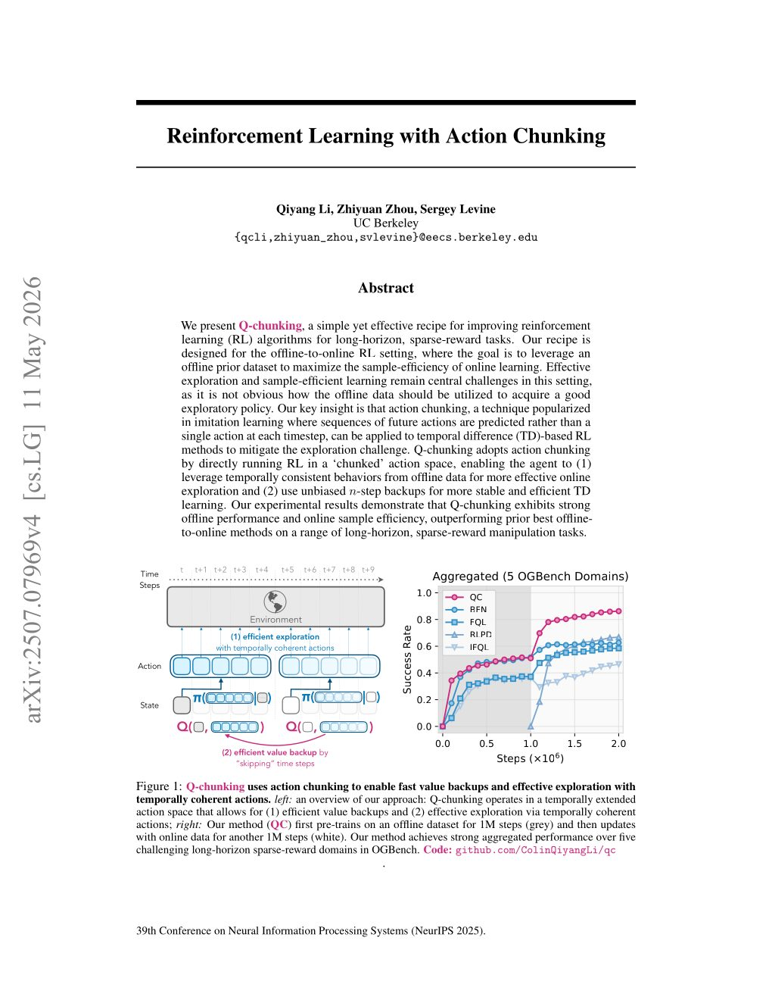

*Rendered source page for visual verification.*

Reinforcement Learning with Action Chunking

                                                                      Qiyang Li, Zhiyuan Zhou, Sergey Levine
                                                                                   UC Berkeley
                                                                {qcli,zhiyuan_zhou,svlevine}@eecs.berkeley.edu

arXiv:2507.07969v4 [cs.LG] 11 May 2026
                                                                                               Abstract

                                                   We present Q-chunking, a simple yet effective recipe for improving reinforcement
                                                   learning (RL) algorithms for long-horizon, sparse-reward tasks. Our recipe is
                                                   designed for the offline-to-online RL setting, where the goal is to leverage an
                                                   offline prior dataset to maximize the sample-efficiency of online learning. Effective
                                                   exploration and sample-efficient learning remain central challenges in this setting,
                                                   as it is not obvious how the offline data should be utilized to acquire a good
                                                   exploratory policy. Our key insight is that action chunking, a technique popularized
                                                   in imitation learning where sequences of future actions are predicted rather than a
                                                   single action at each timestep, can be applied to temporal difference (TD)-based RL
                                                   methods to mitigate the exploration challenge. Q-chunking adopts action chunking
                                                   by directly running RL in a ‘chunked’ action space, enabling the agent to (1)
                                                   leverage temporally consistent behaviors from offline data for more effective online
                                                   exploration and (2) use unbiased n-step backups for more stable and efficient TD
                                                   learning. Our experimental results demonstrate that Q-chunking exhibits strong
                                                   offline performance and online sample efficiency, outperforming prior best offline-
                                                   to-online methods on a range of long-horizon, sparse-reward manipulation tasks.

                                         Time
                                         Steps
                                                   t   t+1 t+2 t+3    t+4    t+5   t+6 t+7 t+8 t+9
                                                                                                                              Aggregated (5 OGBench Domains)
                                                                                                                        1.0         QC
                                                                                                                                    BFN
                                                                     Environment                                        0.8         FQL
                                                                                                                                    RLPD

                                                                                                         Success Rate
                                                                (1) ef cient exploration
                                                            with temporally coherent actions                            0.6         IFQL
                                         Action
                                                                                                                        0.4

                                         State
                                                       π(             | )          π(          | )                      0.2
                                                   Q( ,                 )     Q( ,              )                       0.0
                                                                                                                              0.0    0.5       1.0        1.5   2.0
                                                             (2) ef cient value backup by
                                                                 “skipping” time steps
                                                                                                                                           Steps (×106)
                                            fi

                                         Figure 1: Q-chunking uses action chunking to enable fast value backups and effective exploration with
                                         temporally coherent actions. left: an overview of our approach: Q-chunking operates in a temporally extended
                                         action space that allows for (1) efficient value backups and (2) effective exploration via temporally coherent
                                         actions; right: Our method (QC) first pre-trains on an offline dataset for 1M steps (grey) and then updates
                                         with online data for another 1M steps (white). Our method achieves strong aggregated performance over five
                                         challenging long-horizon sparse-reward domains in OGBench. Code: github.com/ColinQiyangLi/qc
                                                                                                     .

                                         39th Conference on Neural Information Processing Systems (NeurIPS 2025).

---

<!-- source-page: 2 -->
## Source page 2

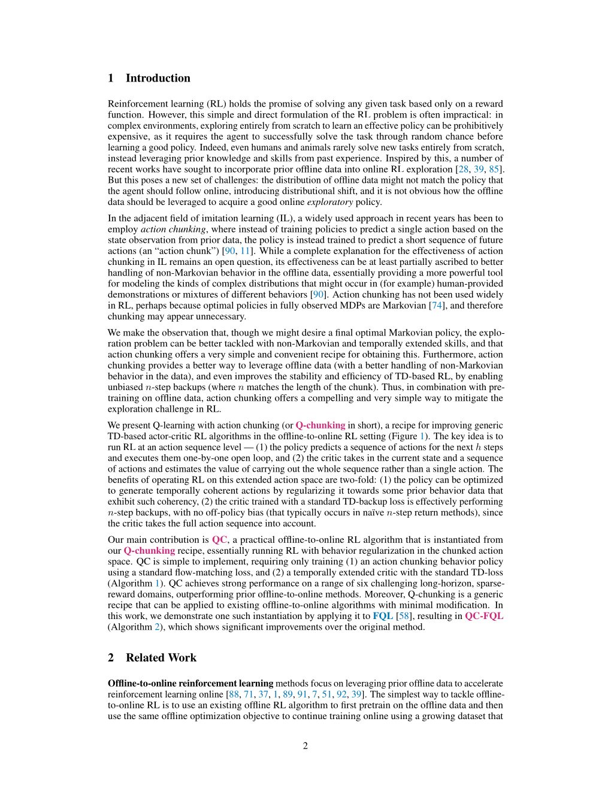

*Rendered source page for visual verification.*

1   Introduction

Reinforcement learning (RL) holds the promise of solving any given task based only on a reward
function. However, this simple and direct formulation of the RL problem is often impractical: in
complex environments, exploring entirely from scratch to learn an effective policy can be prohibitively
expensive, as it requires the agent to successfully solve the task through random chance before
learning a good policy. Indeed, even humans and animals rarely solve new tasks entirely from scratch,
instead leveraging prior knowledge and skills from past experience. Inspired by this, a number of
recent works have sought to incorporate prior offline data into online RL exploration [28, 39, 85].
But this poses a new set of challenges: the distribution of offline data might not match the policy that
the agent should follow online, introducing distributional shift, and it is not obvious how the offline
data should be leveraged to acquire a good online exploratory policy.
In the adjacent field of imitation learning (IL), a widely used approach in recent years has been to
employ action chunking, where instead of training policies to predict a single action based on the
state observation from prior data, the policy is instead trained to predict a short sequence of future
actions (an “action chunk”) [90, 11]. While a complete explanation for the effectiveness of action
chunking in IL remains an open question, its effectiveness can be at least partially ascribed to better
handling of non-Markovian behavior in the offline data, essentially providing a more powerful tool
for modeling the kinds of complex distributions that might occur in (for example) human-provided
demonstrations or mixtures of different behaviors [90]. Action chunking has not been used widely
in RL, perhaps because optimal policies in fully observed MDPs are Markovian [74], and therefore
chunking may appear unnecessary.
We make the observation that, though we might desire a final optimal Markovian policy, the explo-
ration problem can be better tackled with non-Markovian and temporally extended skills, and that
action chunking offers a very simple and convenient recipe for obtaining this. Furthermore, action
chunking provides a better way to leverage offline data (with a better handling of non-Markovian
behavior in the data), and even improves the stability and efficiency of TD-based RL, by enabling
unbiased n-step backups (where n matches the length of the chunk). Thus, in combination with pre-
training on offline data, action chunking offers a compelling and very simple way to mitigate the
exploration challenge in RL.
We present Q-learning with action chunking (or Q-chunking in short), a recipe for improving generic
TD-based actor-critic RL algorithms in the offline-to-online RL setting (Figure 1). The key idea is to
run RL at an action sequence level — (1) the policy predicts a sequence of actions for the next h steps
and executes them one-by-one open loop, and (2) the critic takes in the current state and a sequence
of actions and estimates the value of carrying out the whole sequence rather than a single action. The
benefits of operating RL on this extended action space are two-fold: (1) the policy can be optimized
to generate temporally coherent actions by regularizing it towards some prior behavior data that
exhibit such coherency, (2) the critic trained with a standard TD-backup loss is effectively performing
n-step backups, with no off-policy bias (that typically occurs in naïve n-step return methods), since
the critic takes the full action sequence into account.
Our main contribution is QC, a practical offline-to-online RL algorithm that is instantiated from
our Q-chunking recipe, essentially running RL with behavior regularization in the chunked action
space. QC is simple to implement, requiring only training (1) an action chunking behavior policy
using a standard flow-matching loss, and (2) a temporally extended critic with the standard TD-loss
(Algorithm 1). QC achieves strong performance on a range of six challenging long-horizon, sparse-
reward domains, outperforming prior offline-to-online methods. Moreover, Q-chunking is a generic
recipe that can be applied to existing offline-to-online algorithms with minimal modification. In
this work, we demonstrate one such instantiation by applying it to FQL [58], resulting in QC-FQL
(Algorithm 2), which shows significant improvements over the original method.

2   Related Work

Offline-to-online reinforcement learning methods focus on leveraging prior offline data to accelerate
reinforcement learning online [88, 71, 37, 1, 89, 91, 7, 51, 92, 39]. The simplest way to tackle offline-
to-online RL is to use an existing offline RL algorithm to first pretrain on the offline data and then
use the same offline optimization objective to continue training online using a growing dataset that

                                                   2

---

<!-- source-page: 3 -->
## Source page 3

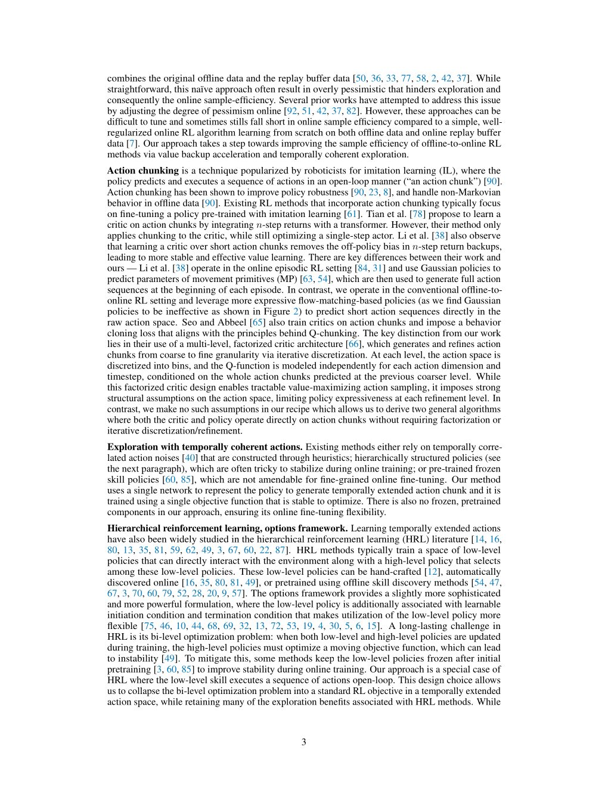

*Rendered source page for visual verification.*

combines the original offline data and the replay buffer data [50, 36, 33, 77, 58, 2, 42, 37]. While
straightforward, this naïve approach often result in overly pessimistic that hinders exploration and
consequently the online sample-efficiency. Several prior works have attempted to address this issue
by adjusting the degree of pessimism online [92, 51, 42, 37, 82]. However, these approaches can be
difficult to tune and sometimes stills fall short in online sample efficiency compared to a simple, well-
regularized online RL algorithm learning from scratch on both offline data and online replay buffer
data [7]. Our approach takes a step towards improving the sample efficiency of offline-to-online RL
methods via value backup acceleration and temporally coherent exploration.
Action chunking is a technique popularized by roboticists for imitation learning (IL), where the
policy predicts and executes a sequence of actions in an open-loop manner (“an action chunk”) [90].
Action chunking has been shown to improve policy robustness [90, 23, 8], and handle non-Markovian
behavior in offline data [90]. Existing RL methods that incorporate action chunking typically focus
on fine-tuning a policy pre-trained with imitation learning [61]. Tian et al. [78] propose to learn a
critic on action chunks by integrating n-step returns with a transformer. However, their method only
applies chunking to the critic, while still optimizing a single-step actor. Li et al. [38] also observe
that learning a critic over short action chunks removes the off-policy bias in n-step return backups,
leading to more stable and effective value learning. There are key differences between their work and
ours — Li et al. [38] operate in the online episodic RL setting [84, 31] and use Gaussian policies to
predict parameters of movement primitives (MP) [63, 54], which are then used to generate full action
sequences at the beginning of each episode. In contrast, we operate in the conventional offline-to-
online RL setting and leverage more expressive flow-matching-based policies (as we find Gaussian
policies to be ineffective as shown in Figure 2) to predict short action sequences directly in the
raw action space. Seo and Abbeel [65] also train critics on action chunks and impose a behavior
cloning loss that aligns with the principles behind Q-chunking. The key distinction from our work
lies in their use of a multi-level, factorized critic architecture [66], which generates and refines action
chunks from coarse to fine granularity via iterative discretization. At each level, the action space is
discretized into bins, and the Q-function is modeled independently for each action dimension and
timestep, conditioned on the whole action chunks predicted at the previous coarser level. While
this factorized critic design enables tractable value-maximizing action sampling, it imposes strong
structural assumptions on the action space, limiting policy expressiveness at each refinement level. In
contrast, we make no such assumptions in our recipe which allows us to derive two general algorithms
where both the critic and policy operate directly on action chunks without requiring factorization or
iterative discretization/refinement.
Exploration with temporally coherent actions. Existing methods either rely on temporally corre-
lated action noises [40] that are constructed through heuristics; hierarchically structured policies (see
the next paragraph), which are often tricky to stabilize during online training; or pre-trained frozen
skill policies [60, 85], which are not amendable for fine-grained online fine-tuning. Our method
uses a single network to represent the policy to generate temporally extended action chunk and it is
trained using a single objective function that is stable to optimize. There is also no frozen, pretrained
components in our approach, ensuring its online fine-tuning flexibility.
Hierarchical reinforcement learning, options framework. Learning temporally extended actions
have also been widely studied in the hierarchical reinforcement learning (HRL) literature [14, 16,
80, 13, 35, 81, 59, 62, 49, 3, 67, 60, 22, 87]. HRL methods typically train a space of low-level
policies that can directly interact with the environment along with a high-level policy that selects
among these low-level policies. These low-level policies can be hand-crafted [12], automatically
discovered online [16, 35, 80, 81, 49], or pretrained using offline skill discovery methods [54, 47,
67, 3, 70, 60, 79, 52, 28, 20, 9, 57]. The options framework provides a slightly more sophisticated
and more powerful formulation, where the low-level policy is additionally associated with learnable
initiation condition and termination condition that makes utilization of the low-level policy more
flexible [75, 46, 10, 44, 68, 69, 32, 13, 72, 53, 19, 4, 30, 5, 6, 15]. A long-lasting challenge in
HRL is its bi-level optimization problem: when both low-level and high-level policies are updated
during training, the high-level policies must optimize a moving objective function, which can lead
to instability [49]. To mitigate this, some methods keep the low-level policies frozen after initial
pretraining [3, 60, 85] to improve stability during online training. Our approach is a special case of
HRL where the low-level skill executes a sequence of actions open-loop. This design choice allows
us to collapse the bi-level optimization problem into a standard RL objective in a temporally extended
action space, while retaining many of the exploration benefits associated with HRL methods. While

                                                    3

---

<!-- source-page: 4 -->
## Source page 4

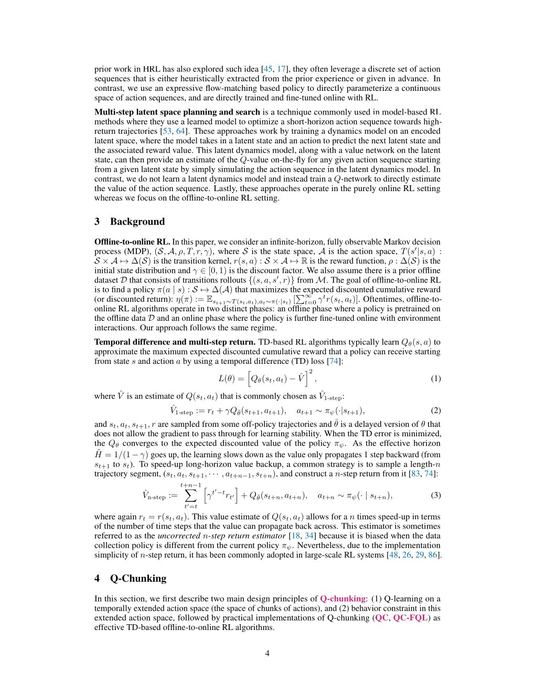

*Rendered source page for visual verification.*

prior work in HRL has also explored such idea [45, 17], they often leverage a discrete set of action
sequences that is either heuristically extracted from the prior experience or given in advance. In
contrast, we use an expressive flow-matching based policy to directly parameterize a continuous
space of action sequences, and are directly trained and fine-tuned online with RL.
Multi-step latent space planning and search is a technique commonly used in model-based RL
methods where they use a learned model to optimize a short-horizon action sequence towards high-
return trajectories [53, 64]. These approaches work by training a dynamics model on an encoded
latent space, where the model takes in a latent state and an action to predict the next latent state and
the associated reward value. This latent dynamics model, along with a value network on the latent
state, can then provide an estimate of the Q-value on-the-fly for any given action sequence starting
from a given latent state by simply simulating the action sequence in the latent dynamics model. In
contrast, we do not learn a latent dynamics model and instead train a Q-network to directly estimate
the value of the action sequence. Lastly, these approaches operate in the purely online RL setting
whereas we focus on the offline-to-online RL setting.

3    Background
Offline-to-online RL. In this paper, we consider an infinite-horizon, fully observable Markov decision
process (MDP), (S, A, ρ, T, r, γ), where S is the state space, A is the action space, T (s′ |s, a) :
S × A 7→ ∆(S) is the transition kernel, r(s, a) : S × A 7→ R is the reward function, ρ : ∆(S) is the
initial state distribution and γ ∈ [0, 1) is the discount factor. We also assume there is a prior offline
dataset D that consists of transitions rollouts {(s, a, s′ , r)} from M. The goal of offline-to-online RL
is to find a policy π(a | s) : S 7→ ∆(A) that maximizes the      Pexpected   discounted cumulative reward
                                                                   ∞
(or discounted return): η(π) := Est+1 ∼T (st ,at ),at ∼π(·|st ) [ t=0 γ t r(st , at )]. Oftentimes, offline-to-
online RL algorithms operate in two distinct phases: an offline phase where a policy is pretrained on
the offline data D and an online phase where the policy is further fine-tuned online with environment
interactions. Our approach follows the same regime.
Temporal difference and multi-step return. TD-based RL algorithms typically learn Qθ (s, a) to
approximate the maximum expected discounted cumulative reward that a policy can receive starting
from state s and action a by using a temporal difference (TD) loss [74]:
                                           h                 i2
                                    L(θ) = Qθ (st , at ) − V̂ ,                               (1)

where V̂ is an estimate of Q(st , at ) that is commonly chosen as V̂1-step :
                        V̂1-step := rt + γQθ̄ (st+1 , at+1 ),   at+1 ∼ πψ (·|st+1 ),                       (2)
and st , at , st+1 , r are sampled from some off-policy trajectories and θ̄ is a delayed version of θ that
does not allow the gradient to pass through for learning stability. When the TD error is minimized,
the Qθ converges to the expected discounted value of the policy πψ . As the effective horizon
H̃ = 1/(1 − γ) goes up, the learning slows down as the value only propagates 1 step backward (from
st+1 to st ). To speed-up long-horizon value backup, a common strategy is to sample a length-n
trajectory segment, (st , at , st+1 , · · · , at+n−1 , st+n ), and construct a n-step return from it [83, 74]:
                             t+n−1 h            i
                              X          ′
                 V̂n-step :=         γ t −t rt′ + Qθ̄ (st+n , at+n ), at+n ∼ πψ (· | st+n ),                (3)
                            t′ =t
where again rt = r(st , at ). This value estimate of Q(st , at ) allows for a n times speed-up in terms
of the number of time steps that the value can propagate back across. This estimator is sometimes
referred to as the uncorrected n-step return estimator [18, 34] because it is biased when the data
collection policy is different from the current policy πψ . Nevertheless, due to the implementation
simplicity of n-step return, it has been commonly adopted in large-scale RL systems [48, 26, 29, 86].

4    Q-Chunking
In this section, we first describe two main design principles of Q-chunking: (1) Q-learning on a
temporally extended action space (the space of chunks of actions), and (2) behavior constraint in this
extended action space, followed by practical implementations of Q-chunking (QC, QC-FQL) as
effective TD-based offline-to-online RL algorithms.

                                                      4

---

<!-- source-page: 5 -->
## Source page 5

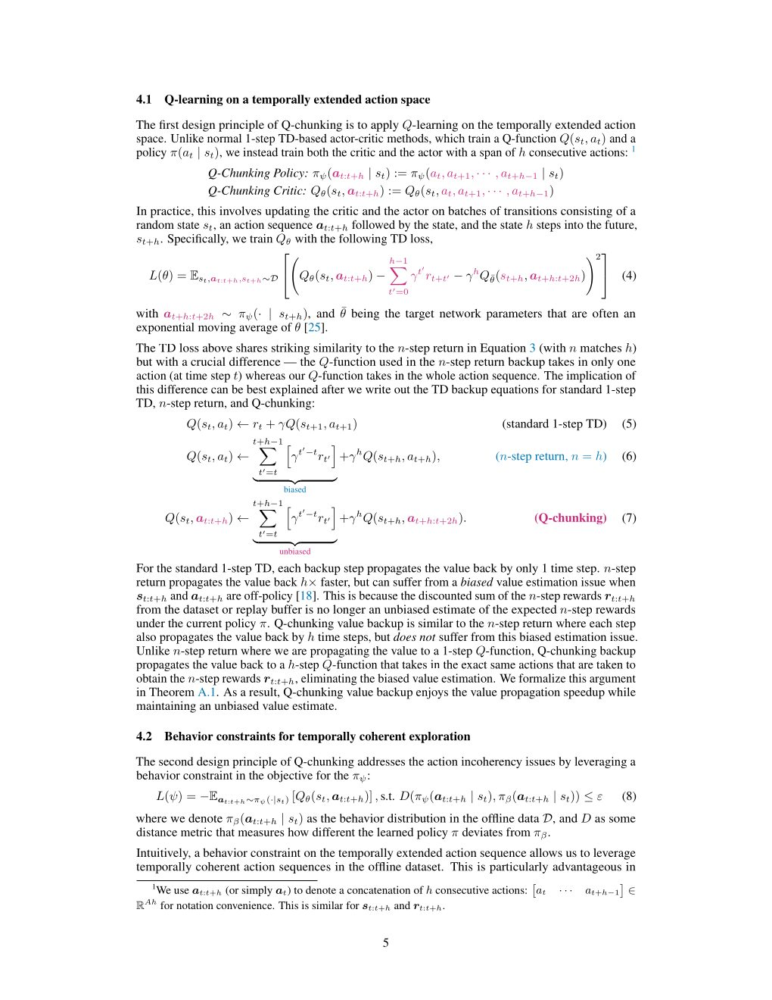

*Rendered source page for visual verification.*

4.1       Q-learning on a temporally extended action space

The first design principle of Q-chunking is to apply Q-learning on the temporally extended action
space. Unlike normal 1-step TD-based actor-critic methods, which train a Q-function Q(st , at ) and a
policy π(at | st ), we instead train both the critic and the actor with a span of h consecutive actions: 1
                  Q-Chunking Policy: πψ (at:t+h | st ) := πψ (at , at+1 , · · · , at+h−1 | st )
                  Q-Chunking Critic: Qθ (st , at:t+h ) := Qθ (st , at , at+1 , · · · , at+h−1 )
In practice, this involves updating the critic and the actor on batches of transitions consisting of a
random state st , an action sequence at:t+h followed by the state, and the state h steps into the future,
st+h . Specifically, we train Qθ with the following TD loss,
                               [
                                                     h−1
                                                                                                !2 ]
                                                     X      ′
   L(θ) = Est ,at:t+h ,st+h ∼D [ Qθ (st , at:t+h ) −     γ t rt+t′ − γ h Qθ̄ (st+h , at+h:t+2h ) ] (4)
                                                                t′ =0

with at+h:t+2h ∼ πψ (· | st+h ), and θ̄ being the target network parameters that are often an
exponential moving average of θ [25].
The TD loss above shares striking similarity to the n-step return in Equation 3 (with n matches h)
but with a crucial difference — the Q-function used in the n-step return backup takes in only one
action (at time step t) whereas our Q-function takes in the whole action sequence. The implication of
this difference can be best explained after we write out the TD backup equations for standard 1-step
TD, n-step return, and Q-chunking:
              Q(st , at ) ← rt + γQ(st+1 , at+1 )                                    (standard 1-step TD)    (5)
                            t+h−1
                             X h ′           i
              Q(st , at ) ←        γ t −t rt′ +γ h Q(st+h , at+h ),                 (n-step return, n = h)   (6)
                                  t′ =t
                              |             {z       }
                                           biased
                              t+h−1
                               X h                    i
                                               ′
          Q(st , at:t+h ) ←                 γ t −t rt′ +γ h Q(st+h , at+h:t+2h ).          (Q-chunking)      (7)
                                  t′ =t
                              |             {z       }
                                          unbiased

For the standard 1-step TD, each backup step propagates the value back by only 1 time step. n-step
return propagates the value back h× faster, but can suffer from a biased value estimation issue when
st:t+h and at:t+h are off-policy [18]. This is because the discounted sum of the n-step rewards rt:t+h
from the dataset or replay buffer is no longer an unbiased estimate of the expected n-step rewards
under the current policy π. Q-chunking value backup is similar to the n-step return where each step
also propagates the value back by h time steps, but does not suffer from this biased estimation issue.
Unlike n-step return where we are propagating the value to a 1-step Q-function, Q-chunking backup
propagates the value back to a h-step Q-function that takes in the exact same actions that are taken to
obtain the n-step rewards rt:t+h , eliminating the biased value estimation. We formalize this argument
in Theorem A.1. As a result, Q-chunking value backup enjoys the value propagation speedup while
maintaining an unbiased value estimate.

4.2       Behavior constraints for temporally coherent exploration

The second design principle of Q-chunking addresses the action incoherency issues by leveraging a
behavior constraint in the objective for the πψ :
      L(ψ) = −Eat:t+h ∼πψ (·|st ) [Qθ (st , at:t+h )] , s.t. D(πψ (at:t+h | st ), πβ (at:t+h | st )) ≤ ε     (8)
where we denote πβ (at:t+h | st ) as the behavior distribution in the offline data D, and D as some
distance metric that measures how different the learned policy π deviates from πβ .
Intuitively, a behavior constraint on the temporally extended action sequence allows us to leverage
temporally coherent action sequences in the offline dataset. This is particularly advantageous in
      1
> [Extraction warning] One or more lines using an invalid PDF font map were omitted. Use the rendered source page and canonical LaTeX registry.
   We use at:t+h (or simply at ) to denote a concatenation of h consecutive actions: at         ···   at+h−1 ∈
RAh for notation convenience. This is similar for st:t+h and rt:t+h .

                                                               5

---

<!-- source-page: 6 -->
## Source page 6

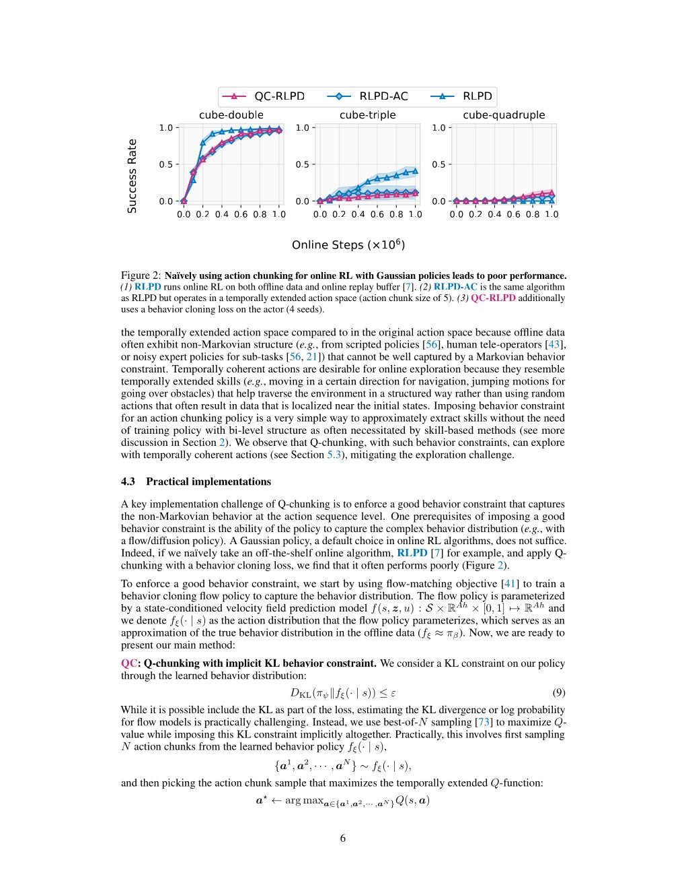

*Rendered source page for visual verification.*

QC-RLPD                   RLPD-AC                   RLPD
                           cube-double                       cube-triple                   cube-quadruple
                 1.0                              1.0                              1.0

Success Rate
                 0.5                              0.5                              0.5

                 0.0                              0.0                              0.0
                       0.0 0.2 0.4 0.6 0.8 1.0          0.0 0.2 0.4 0.6 0.8 1.0          0.0 0.2 0.4 0.6 0.8 1.0

                                                 Online Steps (×106)
Figure 2: Naïvely using action chunking for online RL with Gaussian policies leads to poor performance.
(1) RLPD runs online RL on both offline data and online replay buffer [7]. (2) RLPD-AC is the same algorithm
as RLPD but operates in a temporally extended action space (action chunk size of 5). (3) QC-RLPD additionally
uses a behavior cloning loss on the actor (4 seeds).

 the temporally extended action space compared to in the original action space because offline data
 often exhibit non-Markovian structure (e.g., from scripted policies [56], human tele-operators [43],
 or noisy expert policies for sub-tasks [56, 21]) that cannot be well captured by a Markovian behavior
 constraint. Temporally coherent actions are desirable for online exploration because they resemble
 temporally extended skills (e.g., moving in a certain direction for navigation, jumping motions for
 going over obstacles) that help traverse the environment in a structured way rather than using random
 actions that often result in data that is localized near the initial states. Imposing behavior constraint
 for an action chunking policy is a very simple way to approximately extract skills without the need
 of training policy with bi-level structure as often necessitated by skill-based methods (see more
 discussion in Section 2). We observe that Q-chunking, with such behavior constraints, can explore
 with temporally coherent actions (see Section 5.3), mitigating the exploration challenge.

 4.3           Practical implementations

 A key implementation challenge of Q-chunking is to enforce a good behavior constraint that captures
 the non-Markovian behavior at the action sequence level. One prerequisites of imposing a good
 behavior constraint is the ability of the policy to capture the complex behavior distribution (e.g., with
 a flow/diffusion policy). A Gaussian policy, a default choice in online RL algorithms, does not suffice.
 Indeed, if we naïvely take an off-the-shelf online algorithm, RLPD [7] for example, and apply Q-
 chunking with a behavior cloning loss, we find that it often performs poorly (Figure 2).
 To enforce a good behavior constraint, we start by using flow-matching objective [41] to train a
 behavior cloning flow policy to capture the behavior distribution. The flow policy is parameterized
 by a state-conditioned velocity field prediction model f (s, z, u) : S × RAh × [0, 1] 7→ RAh and
 we denote fξ (· | s) as the action distribution that the flow policy parameterizes, which serves as an
 approximation of the true behavior distribution in the offline data (fξ ≈ πβ ). Now, we are ready to
 present our main method:
 QC: Q-chunking with implicit KL behavior constraint. We consider a KL constraint on our policy
 through the learned behavior distribution:
                                                 DKL (πψ ∥fξ (· | s)) ≤ ε                                     (9)
While it is possible include the KL as part of the loss, estimating the KL divergence or log probability
for flow models is practically challenging. Instead, we use best-of-N sampling [73] to maximize Q-
value while imposing this KL constraint implicitly altogether. Practically, this involves first sampling
N action chunks from the learned behavior policy fξ (· | s),
                                           {a1 , a2 , · · · , aN } ∼ fξ (· | s),
 and then picking the action chunk sample that maximizes the temporally extended Q-function:
                                       a⋆ ← arg maxa∈{a1 ,a2 ,··· ,aN } Q(s, a)

                                                             6

---

<!-- source-page: 7 -->
## Source page 7

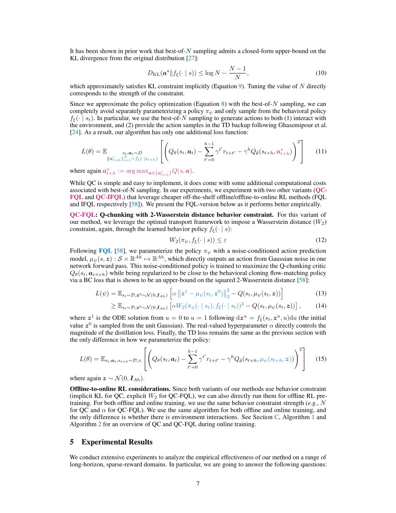

*Rendered source page for visual verification.*

It has been shown in prior work that best-of-N sampling admits a closed-form upper-bound on the
KL divergence from the original distribution [27]:
                                                             N −1
                                  DKL (a⋆ ∥fξ (· | s)) ≤ log N −     ,                         (10)
                                                               N
which approximately satisfies KL constraint implicitly (Equation 9). Tuning the value of N directly
corresponds to the strength of the constraint.
Since we approximate the policy optimization (Equation 8) with the best-of-N sampling, we can
completely avoid separately parameterizing a policy πψ and only sample from the behavioral policy
fξ (· | st ). In particular, we use the best-of-N sampling to generate actions to both (1) interact with
the environment, and (2) provide the action samples in the TD backup following Ghasemipour et al.
[24]. As a result, our algorithm has only one additional loss function:
                                       [
                                                         h−1
                                                                                                !2 ]
                                                         X ′
      L(θ) = E          st ,at ∼D      [ Qθ (st , at ) −     γ t rt+t′ − γ h Qθ̄ (st+h , a⋆t+h ) ]   (11)
               {ait+h }N
                       i=1 ∼fξ (·|st+h )                  t′ =0

where again a⋆t+h := arg maxa∈{ait+h } Q(s, a).
While QC is simple and easy to implement, it does come with some additional computational costs
associated with best-of-N sampling. In our experiments, we experiment with two other variants (QC-
FQL and QC-IFQL) that leverage cheaper off-the-shelf offline/offline-to-online RL methods (FQL
and IFQL respectively [58]). We present the FQL-version below as it performs better empirically.
QC-FQL: Q-chunking with 2-Wasserstein distance behavior constraint. For this variant of
our method, we leverage the optimal transport framework to impose a Wasserstein distance (W2 )
constraint, again, through the learned behavior policy fξ (· | s):
                                           W2 (πψ , fξ (· | s)) ≤ ε                                 (12)
Following FQL [58], we parameterize the policy πψ with a noise-conditioned action prediction
model, µψ (s, z) : S × RAh 7→ RAh , which directly outputs an action from Gaussian noise in one
network forward pass. This noise-conditioned policy is trained to maximize the Q-chunking critic
Qθ (st , at:t+h ) while being regularized to be close to the behavioral cloning flow-matching policy
via a BC loss that is shown to be an upper-bound on the squared 2-Wasserstein distance [58]:
                                         h                         2
                                                                                          i
           L(ψ) = Est ∼D,z0 ∼N (0,IAh ) α z 1 − µψ (st , z 0 ) 2 − Q(st , µψ (st , z))              (13)
                  ≥ Est ∼D,z0 ∼N (0,IAh ) αW2 (πψ (· | st ), fξ (· | st ))2 − Q(st , µψ (st , z)) ,
> [Extraction warning] One or more lines using an invalid PDF font map were omitted. Use the rendered source page and canonical LaTeX registry.
                                                                                                    (14)
where z 1 is the ODE solution from u = 0 to u = 1 following dz u = fξ (st , z u , u)du (the initial
value z 0 is sampled from the unit Gaussian). The real-valued hyperparameter α directly controls the
magnitude of the distillation loss. Finally, the TD loss remains the same as the previous section with
the only difference in how we parameterize the policy:
                              [
                                                 h−1
                                                                                               !2 ]
                                                 X ′
    L(θ) = Est ,at ,st+h ∼D,z [ Qθ (st , at ) −      γ t rt+t′ − γ h Qθ̄ (st+h , µψ (st+h , z)) ] (15)
                                                  t′ =0

where again z ∼ N (0, IAh ).
Offline-to-online RL considerations. Since both variants of our methods use behavior constraint
(implicit KL for QC, explicit W2 for QC-FQL), we can also directly run them for offline RL pre-
training. For both offline and online training, we use the same behavior constraint strength (e.g., N
for QC and α for QC-FQL). We use the same algorithm for both offline and online training, and
the only difference is whether there is environment interactions. See Section C, Algorithm 1 and
Algorithm 2 for an overview of QC and QC-FQL during online training.

5   Experimental Results
We conduct extensive experiments to analyze the empirical effectiveness of our method on a range of
long-horizon, sparse-reward domains. In particular, we are going to answer the following questions:

                                                      7

---

<!-- source-page: 8 -->
## Source page 8

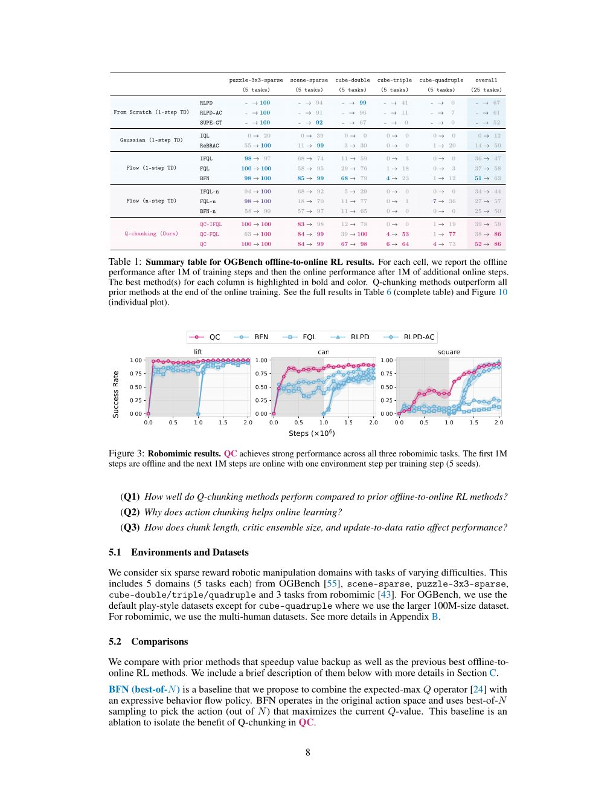

*Rendered source page for visual verification.*

puzzle-3x3-sparse      scene-sparse      cube-double       cube-triple          cube-quadruple        overall
                                                      (5 tasks)            (5 tasks)        (5 tasks)             (5 tasks)          (5 tasks)          (25 tasks)

                                     RLPD               –    → 100          –    → 94         –    → 99            –    → 41             –    →     0     –    → 67
     From Scratch (1-step TD)        RLPD-AC            –    → 100          –    → 91         –    → 96            –    → 11             –    →     7     –    → 61
                                     SUPE-GT            –    → 100          –    → 92         –    → 67            –    →      0         –    →     0     –    → 52

                                     IQL                    0 → 20              0 → 39            0→    0              0→      0             0→     0         0 → 12
           Gaussian (1-step TD)
                                     ReBRAC            55 → 100             11 → 99               3 → 30               0→      0             1 → 20      14 → 50

                                     IFQL              98 → 97              68 → 74          11 → 59                   0→      3             0→     0    36 → 47
               Flow (1-step TD)      FQL              100 → 100             58 → 95          29 → 76                   1 → 18                0→     3    37 → 58
                                     BFN               98 → 100             85 → 99          68 → 79                   4 → 23                1 → 12      51 → 63

                                     IFQL-n            94 → 100             68 → 92               5 → 29               0→      0             0→     0    34 → 44
               Flow (n-step TD)      FQL-n             98 → 100             18 → 70          11 → 77                   0→      1             7 → 36      27 → 57
                                     BFN-n             58 → 90              57 → 97          11 → 65                   0→      0             0→     0    25 → 50

                                     QC-IFQL          100 → 100             83 → 98          12 → 78                   0→      0             1 → 19      39 → 59
               Q-chunking (Ours)     QC-FQL            63 → 100             84 → 99          39 → 100                  4 → 53                1 → 77      38 → 86
                                     QC               100 → 100             84 → 99          67 → 98                   6 → 64                4 → 73      52 → 86

Table 1: Summary table for OGBench offline-to-online RL results. For each cell, we report the offline
performance after 1M of training steps and then the online performance after 1M of additional online steps.
The best method(s) for each column is highlighted in bold and color. Q-chunking methods outperform all
prior methods at the end of the online training. See the full results in Table 6 (complete table) and Figure 10
(individual plot).

                                           QC                BFN                FQL                 RLPD                       RLPD-AC
                                   lift                                               can                                                     square
                1.00                                         1.00                                                 1.00
                0.75                                         0.75                                                 0.75

Success Rate
                0.50                                         0.50                                                 0.50
                0.25                                         0.25                                                 0.25
                0.00                                         0.00                                                 0.00
                       0.0   0.5   1.0       1.5       2.0          0.0    0.5        1.0         1.5       2.0          0.0       0.5            1.0   1.5       2.0
                                                                          Steps (×106)
 Figure 3: Robomimic results. QC achieves strong performance across all three robomimic tasks. The first 1M
 steps are offline and the next 1M steps are online with one environment step per training step (5 seeds).

           (Q1) How well do Q-chunking methods perform compared to prior offline-to-online RL methods?
           (Q2) Why does action chunking helps online learning?
           (Q3) How does chunk length, critic ensemble size, and update-to-data ratio affect performance?

 5.1             Environments and Datasets

We consider six sparse reward robotic manipulation domains with tasks of varying difficulties. This
includes 5 domains (5 tasks each) from OGBench [55], scene-sparse, puzzle-3x3-sparse,
cube-double/triple/quadruple and 3 tasks from robomimic [43]. For OGBench, we use the
default play-style datasets except for cube-quadruple where we use the larger 100M-size dataset.
For robomimic, we use the multi-human datasets. See more details in Appendix B.

 5.2             Comparisons

We compare with prior methods that speedup value backup as well as the previous best offline-to-
online RL methods. We include a brief description of them below with more details in Section C.
 BFN (best-of-N ) is a baseline that we propose to combine the expected-max Q operator [24] with
 an expressive behavior flow policy. BFN operates in the original action space and uses best-of-N
 sampling to pick the action (out of N ) that maximizes the current Q-value. This baseline is an
 ablation to isolate the benefit of Q-chunking in QC.

                                                                                 8

---

<!-- source-page: 9 -->
## Source page 9

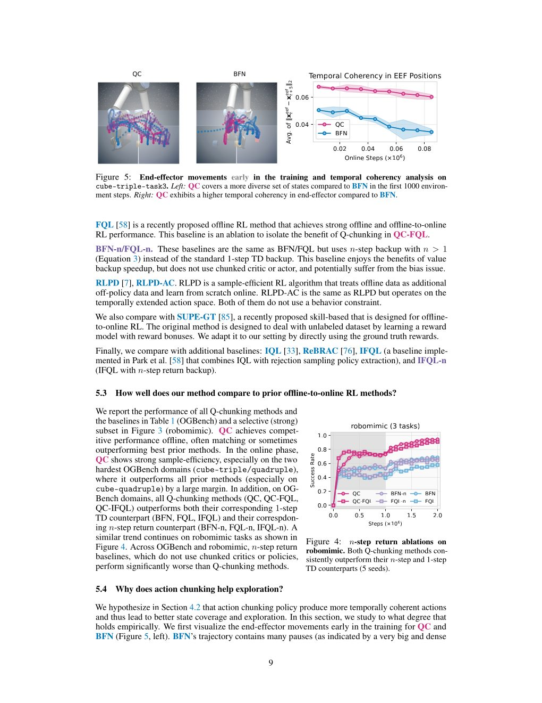

*Rendered source page for visual verification.*

Temporal Coherency in EEF Positions

                                                        Avg. of xeef xeef
                                                                              0.06

                                                                 t    t+5 2
                                                                              0.04                      QC
                                                                                                        BFN
                                                                                                       0.02     0.04     0.06                0.08
                                                                                                           Online Steps (×106)

Figure 5: End-effector movements early in the training and temporal coherency analysis on
cube-triple-task3. Left: QC covers a more diverse set of states compared to BFN in the first 1000 environ-
ment steps. Right: QC exhibits a higher temporal coherency in end-effector compared to BFN.

FQL [58] is a recently proposed offline RL method that achieves strong offline and offline-to-online
RL performance. This baseline is an ablation to isolate the benefit of Q-chunking in QC-FQL.
BFN-n/FQL-n. These baselines are the same as BFN/FQL but uses n-step backup with n > 1
(Equation 3) instead of the standard 1-step TD backup. This baseline enjoys the benefits of value
backup speedup, but does not use chunked critic or actor, and potentially suffer from the bias issue.
RLPD [7], RLPD-AC. RLPD is a sample-efficient RL algorithm that treats offline data as additional
off-policy data and learn from scratch online. RLPD-AC is the same as RLPD but operates on the
temporally extended action space. Both of them do not use a behavior constraint.
We also compare with SUPE-GT [85], a recently proposed skill-based that is designed for offline-
to-online RL. The original method is designed to deal with unlabeled dataset by learning a reward
model with reward bonuses. We adapt it to our setting by directly using the ground truth rewards.
Finally, we compare with additional baselines: IQL [33], ReBRAC [76], IFQL (a baseline imple-
mented in Park et al. [58] that combines IQL with rejection sampling policy extraction), and IFQL-n
(IFQL with n-step return backup).

5.3   How well does our method compare to prior offline-to-online RL methods?

We report the performance of all Q-chunking methods and
the baselines in Table 1 (OGBench) and a selective (strong)
subset in Figure 3 (robomimic). QC achieves compet-
                                                                                                              robomimic (3 tasks)
                                                                                                1.0
itive performance offline, often matching or sometimes
outperforming best prior methods. In the online phase,                                          0.8

                                                                                 Success Rate
QC shows strong sample-efficiency, especially on the two                                        0.6
hardest OGBench domains (cube-triple/quadruple),
where it outperforms all prior methods (especially on                                           0.4
cube-quadruple) by a large margin. In addition, on OG-                                          0.2           QC               BFN-n           BFN
Bench domains, all Q-chunking methods (QC, QC-FQL,                                                            QC-FQL           FQL-n           FQL
QC-IFQL) outperforms both their corresponding 1-step                                            0.0
TD counterpart (BFN, FQL, IFQL) and their correspdon-                                                 0.0      0.5       1.0           1.5          2.0
                                                                                                                     Steps (×106)
ing n-step return counterpart (BFN-n, FQL-n, IFQL-n). A
similar trend continues on robomimic tasks as shown in
                                                                                 Figure 4: n-step return ablations on
Figure 4. Across OGBench and robomimic, n-step return                            robomimic. Both Q-chunking methods con-
baselines, which do not use chunked critics or policies,                         sistently outperform their n-step and 1-step
perform significantly worse than Q-chunking methods.                             TD counterparts (5 seeds).

5.4   Why does action chunking help exploration?

We hypothesize in Section 4.2 that action chunking policy produce more temporally coherent actions
and thus lead to better state coverage and exploration. In this section, we study to what degree that
holds empirically. We first visualize the end-effector movements early in the training for QC and
BFN (Figure 5, left). BFN’s trajectory contains many pauses (as indicated by a very big and dense

                                                    9

---

<!-- source-page: 10 -->
## Source page 10

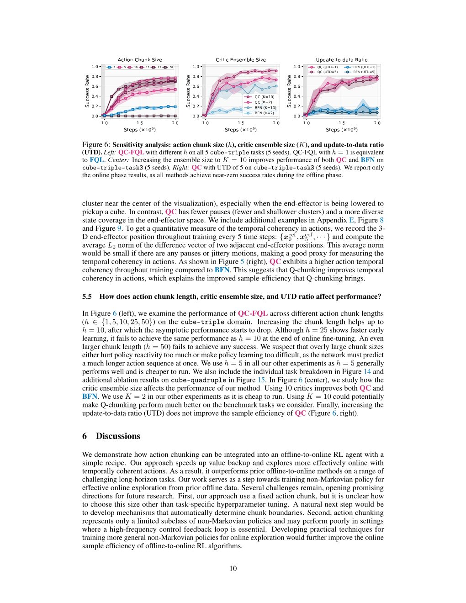

*Rendered source page for visual verification.*

Action Chunk Size                                        Critic Ensemble Size                                     Update-to-data Ratio
               1.0         1     5   10     15   25   50                    1.0                                                      1.0         QC (UTD=1)         BFN (UTD=1)
                                                                                                                                                 QC (UTD=5)         BFN (UTD=5)
               0.8                                                          0.8                                                      0.8

Success Rate                                                 Success Rate                                             Success Rate
               0.6                                                          0.6                                                      0.6
               0.4                                                          0.4                         QC (K=10)                    0.4
                                                                                                        QC (K=2)
               0.2                                                          0.2                         BFN (K=10)                   0.2
                                                                                                        BFN (K=2)
               0.0                                                          0.0                                                      0.0
                     1.0              1.5              2.0                        1.0             1.5           2.0                        1.0                1.5             2.0
                                 Steps (×106)                                              Steps (×106)                                              Steps (×106)
Figure 6: Sensitivity analysis: action chunk size (h), critic ensemble size (K), and update-to-data ratio
(UTD). Left: QC-FQL with different h on all 5 cube-triple tasks (5 seeds). QC-FQL with h = 1 is equivalent
to FQL. Center: Increasing the ensemble size to K = 10 improves performance of both QC and BFN on
cube-triple-task3 (5 seeds). Right: QC with UTD of 5 on cube-triple-task3 (5 seeds). We report only
the online phase results, as all methods achieve near-zero success rates during the offline phase.

cluster near the center of the visualization), especially when the end-effector is being lowered to
pickup a cube. In contrast, QC has fewer pauses (fewer and shallower clusters) and a more diverse
state coverage in the end-effector space. We include additional examples in Appendix E, Figure 8
and Figure 9. To get a quantitative measure of the temporal coherency in actions, we record the 3-
D end-effector position throughout training every 5 time steps: {xeef    eef
                                                                    0 , x5 , · · · } and compute the
average L2 norm of the difference vector of two adjacent end-effector positions. This average norm
would be small if there are any pauses or jittery motions, making a good proxy for measuring the
temporal coherency in actions. As shown in Figure 5 (right), QC exhibits a higher action temporal
coherency throughout training compared to BFN. This suggests that Q-chunking improves temporal
coherency in actions, which explains the improved sample-efficiency that Q-chunking brings.

5.5                  How does action chunk length, critic ensemble size, and UTD ratio affect performance?

In Figure 6 (left), we examine the performance of QC-FQL across different action chunk lengths
(h ∈ {1, 5, 10, 25, 50}) on the cube-triple domain. Increasing the chunk length helps up to
h = 10, after which the asymptotic performance starts to drop. Although h = 25 shows faster early
learning, it fails to achieve the same performance as h = 10 at the end of online fine-tuning. An even
larger chunk length (h = 50) fails to achieve any success. We suspect that overly large chunk sizes
either hurt policy reactivity too much or make policy learning too difficult, as the network must predict
a much longer action sequence at once. We use h = 5 in all our other experiments as h = 5 generally
performs well and is cheaper to run. We also include the individual task breakdown in Figure 14 and
additional ablation results on cube-quadruple in Figure 15. In Figure 6 (center), we study how the
critic ensemble size affects the performance of our method. Using 10 critics improves both QC and
BFN. We use K = 2 in our other experiments as it is cheap to run. Using K = 10 could potentially
make Q-chunking perform much better on the benchmark tasks we consider. Finally, increasing the
update-to-data ratio (UTD) does not improve the sample efficiency of QC (Figure 6, right).

6               Discussions
We demonstrate how action chunking can be integrated into an offline-to-online RL agent with a
simple recipe. Our approach speeds up value backup and explores more effectively online with
temporally coherent actions. As a result, it outperforms prior offline-to-online methods on a range of
challenging long-horizon tasks. Our work serves as a step towards training non-Markovian policy for
effective online exploration from prior offline data. Several challenges remain, opening promising
directions for future research. First, our approach use a fixed action chunk, but it is unclear how
to choose this size other than task-specific hyperparameter tuning. A natural next step would be
to develop mechanisms that automatically determine chunk boundaries. Second, action chunking
represents only a limited subclass of non-Markovian policies and may perform poorly in settings
where a high-frequency control feedback loop is essential. Developing practical techniques for
training more general non-Markovian policies for online exploration would further improve the online
sample efficiency of offline-to-online RL algorithms.

                                                                                             10

---

<!-- source-page: 11 -->
## Source page 11

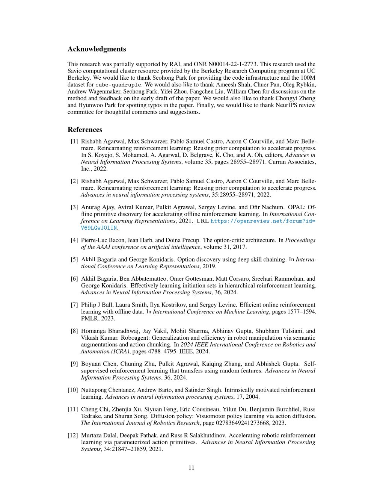

*Rendered source page for visual verification.*

Acknowledgments
This research was partially supported by RAI, and ONR N00014-22-1-2773. This research used the
Savio computational cluster resource provided by the Berkeley Research Computing program at UC
Berkeley. We would like to thank Seohong Park for providing the code infrastructure and the 100M
dataset for cube-quadruple. We would also like to thank Ameesh Shah, Chuer Pan, Oleg Rybkin,
Andrew Wagenmaker, Seohong Park, Yifei Zhou, Fangchen Liu, William Chen for discussions on the
method and feedback on the early draft of the paper. We would also like to thank Chongyi Zheng
and Hyunwoo Park for spotting typos in the paper. Finally, we would like to thank NeurIPS review
committee for thoughtful comments and suggestions.

References
 [1] Rishabh Agarwal, Max Schwarzer, Pablo Samuel Castro, Aaron C Courville, and Marc Belle-
     mare. Reincarnating reinforcement learning: Reusing prior computation to accelerate progress.
     In S. Koyejo, S. Mohamed, A. Agarwal, D. Belgrave, K. Cho, and A. Oh, editors, Advances in
     Neural Information Processing Systems, volume 35, pages 28955–28971. Curran Associates,
     Inc., 2022.
 [2] Rishabh Agarwal, Max Schwarzer, Pablo Samuel Castro, Aaron C Courville, and Marc Belle-
     mare. Reincarnating reinforcement learning: Reusing prior computation to accelerate progress.
     Advances in neural information processing systems, 35:28955–28971, 2022.
 [3] Anurag Ajay, Aviral Kumar, Pulkit Agrawal, Sergey Levine, and Ofir Nachum. OPAL: Of-
     fline primitive discovery for accelerating offline reinforcement learning. In International Con-
     ference on Learning Representations, 2021. URL https://openreview.net/forum?id=
     V69LGwJ0lIN.
 [4] Pierre-Luc Bacon, Jean Harb, and Doina Precup. The option-critic architecture. In Proceedings
     of the AAAI conference on artificial intelligence, volume 31, 2017.
 [5] Akhil Bagaria and George Konidaris. Option discovery using deep skill chaining. In Interna-
     tional Conference on Learning Representations, 2019.
 [6] Akhil Bagaria, Ben Abbatematteo, Omer Gottesman, Matt Corsaro, Sreehari Rammohan, and
     George Konidaris. Effectively learning initiation sets in hierarchical reinforcement learning.
     Advances in Neural Information Processing Systems, 36, 2024.
 [7] Philip J Ball, Laura Smith, Ilya Kostrikov, and Sergey Levine. Efficient online reinforcement
     learning with offline data. In International Conference on Machine Learning, pages 1577–1594.
     PMLR, 2023.
 [8] Homanga Bharadhwaj, Jay Vakil, Mohit Sharma, Abhinav Gupta, Shubham Tulsiani, and
     Vikash Kumar. Roboagent: Generalization and efficiency in robot manipulation via semantic
     augmentations and action chunking. In 2024 IEEE International Conference on Robotics and
     Automation (ICRA), pages 4788–4795. IEEE, 2024.
 [9] Boyuan Chen, Chuning Zhu, Pulkit Agrawal, Kaiqing Zhang, and Abhishek Gupta. Self-
     supervised reinforcement learning that transfers using random features. Advances in Neural
     Information Processing Systems, 36, 2024.
[10] Nuttapong Chentanez, Andrew Barto, and Satinder Singh. Intrinsically motivated reinforcement
     learning. Advances in neural information processing systems, 17, 2004.
[11] Cheng Chi, Zhenjia Xu, Siyuan Feng, Eric Cousineau, Yilun Du, Benjamin Burchfiel, Russ
     Tedrake, and Shuran Song. Diffusion policy: Visuomotor policy learning via action diffusion.
     The International Journal of Robotics Research, page 02783649241273668, 2023.
[12] Murtaza Dalal, Deepak Pathak, and Russ R Salakhutdinov. Accelerating robotic reinforcement
     learning via parameterized action primitives. Advances in Neural Information Processing
     Systems, 34:21847–21859, 2021.

                                                11

---

<!-- source-page: 12 -->
## Source page 12

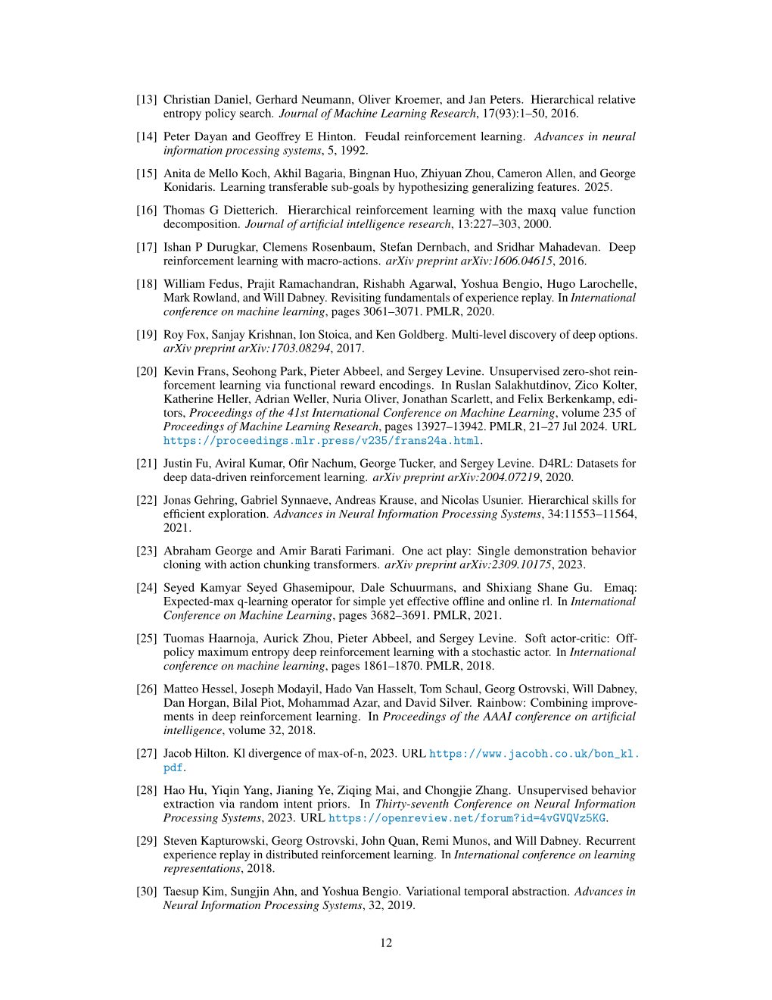

*Rendered source page for visual verification.*

[13] Christian Daniel, Gerhard Neumann, Oliver Kroemer, and Jan Peters. Hierarchical relative
     entropy policy search. Journal of Machine Learning Research, 17(93):1–50, 2016.
[14] Peter Dayan and Geoffrey E Hinton. Feudal reinforcement learning. Advances in neural
     information processing systems, 5, 1992.
[15] Anita de Mello Koch, Akhil Bagaria, Bingnan Huo, Zhiyuan Zhou, Cameron Allen, and George
     Konidaris. Learning transferable sub-goals by hypothesizing generalizing features. 2025.
[16] Thomas G Dietterich. Hierarchical reinforcement learning with the maxq value function
     decomposition. Journal of artificial intelligence research, 13:227–303, 2000.
[17] Ishan P Durugkar, Clemens Rosenbaum, Stefan Dernbach, and Sridhar Mahadevan. Deep
     reinforcement learning with macro-actions. arXiv preprint arXiv:1606.04615, 2016.
[18] William Fedus, Prajit Ramachandran, Rishabh Agarwal, Yoshua Bengio, Hugo Larochelle,
     Mark Rowland, and Will Dabney. Revisiting fundamentals of experience replay. In International
     conference on machine learning, pages 3061–3071. PMLR, 2020.
[19] Roy Fox, Sanjay Krishnan, Ion Stoica, and Ken Goldberg. Multi-level discovery of deep options.
     arXiv preprint arXiv:1703.08294, 2017.
[20] Kevin Frans, Seohong Park, Pieter Abbeel, and Sergey Levine. Unsupervised zero-shot rein-
     forcement learning via functional reward encodings. In Ruslan Salakhutdinov, Zico Kolter,
     Katherine Heller, Adrian Weller, Nuria Oliver, Jonathan Scarlett, and Felix Berkenkamp, edi-
     tors, Proceedings of the 41st International Conference on Machine Learning, volume 235 of
     Proceedings of Machine Learning Research, pages 13927–13942. PMLR, 21–27 Jul 2024. URL
     https://proceedings.mlr.press/v235/frans24a.html.
[21] Justin Fu, Aviral Kumar, Ofir Nachum, George Tucker, and Sergey Levine. D4RL: Datasets for
     deep data-driven reinforcement learning. arXiv preprint arXiv:2004.07219, 2020.
[22] Jonas Gehring, Gabriel Synnaeve, Andreas Krause, and Nicolas Usunier. Hierarchical skills for
     efficient exploration. Advances in Neural Information Processing Systems, 34:11553–11564,
     2021.
[23] Abraham George and Amir Barati Farimani. One act play: Single demonstration behavior
     cloning with action chunking transformers. arXiv preprint arXiv:2309.10175, 2023.
[24] Seyed Kamyar Seyed Ghasemipour, Dale Schuurmans, and Shixiang Shane Gu. Emaq:
     Expected-max q-learning operator for simple yet effective offline and online rl. In International
     Conference on Machine Learning, pages 3682–3691. PMLR, 2021.
[25] Tuomas Haarnoja, Aurick Zhou, Pieter Abbeel, and Sergey Levine. Soft actor-critic: Off-
     policy maximum entropy deep reinforcement learning with a stochastic actor. In International
     conference on machine learning, pages 1861–1870. PMLR, 2018.
[26] Matteo Hessel, Joseph Modayil, Hado Van Hasselt, Tom Schaul, Georg Ostrovski, Will Dabney,
     Dan Horgan, Bilal Piot, Mohammad Azar, and David Silver. Rainbow: Combining improve-
     ments in deep reinforcement learning. In Proceedings of the AAAI conference on artificial
     intelligence, volume 32, 2018.
[27] Jacob Hilton. Kl divergence of max-of-n, 2023. URL https://www.jacobh.co.uk/bon_kl.
     pdf.
[28] Hao Hu, Yiqin Yang, Jianing Ye, Ziqing Mai, and Chongjie Zhang. Unsupervised behavior
     extraction via random intent priors. In Thirty-seventh Conference on Neural Information
     Processing Systems, 2023. URL https://openreview.net/forum?id=4vGVQVz5KG.
[29] Steven Kapturowski, Georg Ostrovski, John Quan, Remi Munos, and Will Dabney. Recurrent
     experience replay in distributed reinforcement learning. In International conference on learning
     representations, 2018.
[30] Taesup Kim, Sungjin Ahn, and Yoshua Bengio. Variational temporal abstraction. Advances in
     Neural Information Processing Systems, 32, 2019.

                                                 12

---

<!-- source-page: 13 -->
## Source page 13

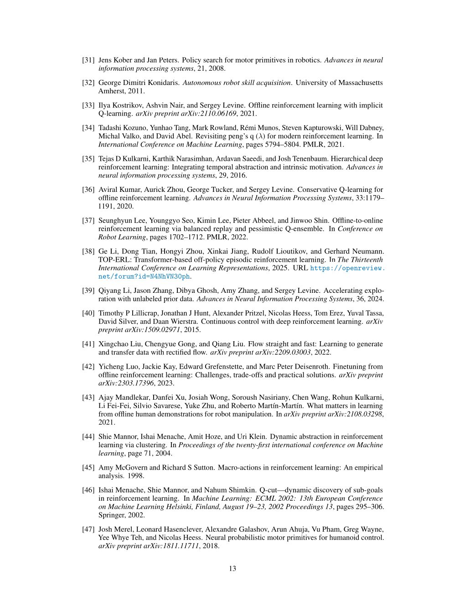

*Rendered source page for visual verification.*

[31] Jens Kober and Jan Peters. Policy search for motor primitives in robotics. Advances in neural
     information processing systems, 21, 2008.
[32] George Dimitri Konidaris. Autonomous robot skill acquisition. University of Massachusetts
     Amherst, 2011.
[33] Ilya Kostrikov, Ashvin Nair, and Sergey Levine. Offline reinforcement learning with implicit
     Q-learning. arXiv preprint arXiv:2110.06169, 2021.
[34] Tadashi Kozuno, Yunhao Tang, Mark Rowland, Rémi Munos, Steven Kapturowski, Will Dabney,
     Michal Valko, and David Abel. Revisiting peng’s q (λ) for modern reinforcement learning. In
     International Conference on Machine Learning, pages 5794–5804. PMLR, 2021.
[35] Tejas D Kulkarni, Karthik Narasimhan, Ardavan Saeedi, and Josh Tenenbaum. Hierarchical deep
     reinforcement learning: Integrating temporal abstraction and intrinsic motivation. Advances in
     neural information processing systems, 29, 2016.
[36] Aviral Kumar, Aurick Zhou, George Tucker, and Sergey Levine. Conservative Q-learning for
     offline reinforcement learning. Advances in Neural Information Processing Systems, 33:1179–
     1191, 2020.
[37] Seunghyun Lee, Younggyo Seo, Kimin Lee, Pieter Abbeel, and Jinwoo Shin. Offline-to-online
     reinforcement learning via balanced replay and pessimistic Q-ensemble. In Conference on
     Robot Learning, pages 1702–1712. PMLR, 2022.
[38] Ge Li, Dong Tian, Hongyi Zhou, Xinkai Jiang, Rudolf Lioutikov, and Gerhard Neumann.
     TOP-ERL: Transformer-based off-policy episodic reinforcement learning. In The Thirteenth
     International Conference on Learning Representations, 2025. URL https://openreview.
     net/forum?id=N4NhVN30ph.
[39] Qiyang Li, Jason Zhang, Dibya Ghosh, Amy Zhang, and Sergey Levine. Accelerating explo-
     ration with unlabeled prior data. Advances in Neural Information Processing Systems, 36, 2024.
[40] Timothy P Lillicrap, Jonathan J Hunt, Alexander Pritzel, Nicolas Heess, Tom Erez, Yuval Tassa,
     David Silver, and Daan Wierstra. Continuous control with deep reinforcement learning. arXiv
     preprint arXiv:1509.02971, 2015.
[41] Xingchao Liu, Chengyue Gong, and Qiang Liu. Flow straight and fast: Learning to generate
     and transfer data with rectified flow. arXiv preprint arXiv:2209.03003, 2022.
[42] Yicheng Luo, Jackie Kay, Edward Grefenstette, and Marc Peter Deisenroth. Finetuning from
     offline reinforcement learning: Challenges, trade-offs and practical solutions. arXiv preprint
     arXiv:2303.17396, 2023.
[43] Ajay Mandlekar, Danfei Xu, Josiah Wong, Soroush Nasiriany, Chen Wang, Rohun Kulkarni,
     Li Fei-Fei, Silvio Savarese, Yuke Zhu, and Roberto Martín-Martín. What matters in learning
     from offline human demonstrations for robot manipulation. In arXiv preprint arXiv:2108.03298,
     2021.
[44] Shie Mannor, Ishai Menache, Amit Hoze, and Uri Klein. Dynamic abstraction in reinforcement
     learning via clustering. In Proceedings of the twenty-first international conference on Machine
     learning, page 71, 2004.
[45] Amy McGovern and Richard S Sutton. Macro-actions in reinforcement learning: An empirical
     analysis. 1998.
[46] Ishai Menache, Shie Mannor, and Nahum Shimkin. Q-cut—dynamic discovery of sub-goals
     in reinforcement learning. In Machine Learning: ECML 2002: 13th European Conference
     on Machine Learning Helsinki, Finland, August 19–23, 2002 Proceedings 13, pages 295–306.
     Springer, 2002.
[47] Josh Merel, Leonard Hasenclever, Alexandre Galashov, Arun Ahuja, Vu Pham, Greg Wayne,
     Yee Whye Teh, and Nicolas Heess. Neural probabilistic motor primitives for humanoid control.
     arXiv preprint arXiv:1811.11711, 2018.

                                                13

---

<!-- source-page: 14 -->
## Source page 14

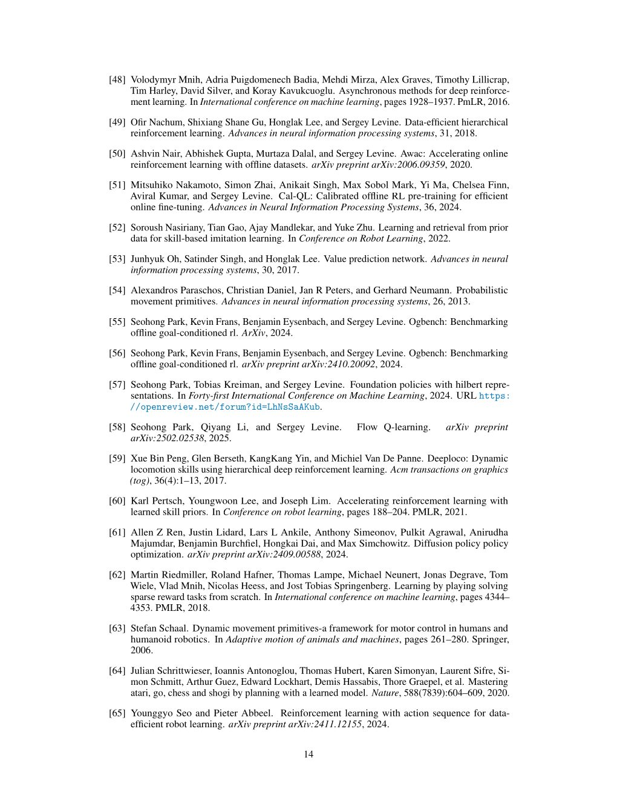

*Rendered source page for visual verification.*

[48] Volodymyr Mnih, Adria Puigdomenech Badia, Mehdi Mirza, Alex Graves, Timothy Lillicrap,
     Tim Harley, David Silver, and Koray Kavukcuoglu. Asynchronous methods for deep reinforce-
     ment learning. In International conference on machine learning, pages 1928–1937. PmLR, 2016.

[49] Ofir Nachum, Shixiang Shane Gu, Honglak Lee, and Sergey Levine. Data-efficient hierarchical
     reinforcement learning. Advances in neural information processing systems, 31, 2018.

[50] Ashvin Nair, Abhishek Gupta, Murtaza Dalal, and Sergey Levine. Awac: Accelerating online
     reinforcement learning with offline datasets. arXiv preprint arXiv:2006.09359, 2020.

[51] Mitsuhiko Nakamoto, Simon Zhai, Anikait Singh, Max Sobol Mark, Yi Ma, Chelsea Finn,
     Aviral Kumar, and Sergey Levine. Cal-QL: Calibrated offline RL pre-training for efficient
     online fine-tuning. Advances in Neural Information Processing Systems, 36, 2024.

[52] Soroush Nasiriany, Tian Gao, Ajay Mandlekar, and Yuke Zhu. Learning and retrieval from prior
     data for skill-based imitation learning. In Conference on Robot Learning, 2022.

[53] Junhyuk Oh, Satinder Singh, and Honglak Lee. Value prediction network. Advances in neural
     information processing systems, 30, 2017.

[54] Alexandros Paraschos, Christian Daniel, Jan R Peters, and Gerhard Neumann. Probabilistic
     movement primitives. Advances in neural information processing systems, 26, 2013.

[55] Seohong Park, Kevin Frans, Benjamin Eysenbach, and Sergey Levine. Ogbench: Benchmarking
     offline goal-conditioned rl. ArXiv, 2024.

[56] Seohong Park, Kevin Frans, Benjamin Eysenbach, and Sergey Levine. Ogbench: Benchmarking
     offline goal-conditioned rl. arXiv preprint arXiv:2410.20092, 2024.

[57] Seohong Park, Tobias Kreiman, and Sergey Levine. Foundation policies with hilbert repre-
     sentations. In Forty-first International Conference on Machine Learning, 2024. URL https:
     //openreview.net/forum?id=LhNsSaAKub.

[58] Seohong Park, Qiyang Li, and Sergey Levine.             Flow Q-learning.      arXiv preprint
     arXiv:2502.02538, 2025.

[59] Xue Bin Peng, Glen Berseth, KangKang Yin, and Michiel Van De Panne. Deeploco: Dynamic
     locomotion skills using hierarchical deep reinforcement learning. Acm transactions on graphics
     (tog), 36(4):1–13, 2017.

[60] Karl Pertsch, Youngwoon Lee, and Joseph Lim. Accelerating reinforcement learning with
     learned skill priors. In Conference on robot learning, pages 188–204. PMLR, 2021.

[61] Allen Z Ren, Justin Lidard, Lars L Ankile, Anthony Simeonov, Pulkit Agrawal, Anirudha
     Majumdar, Benjamin Burchfiel, Hongkai Dai, and Max Simchowitz. Diffusion policy policy
     optimization. arXiv preprint arXiv:2409.00588, 2024.

[62] Martin Riedmiller, Roland Hafner, Thomas Lampe, Michael Neunert, Jonas Degrave, Tom
     Wiele, Vlad Mnih, Nicolas Heess, and Jost Tobias Springenberg. Learning by playing solving
     sparse reward tasks from scratch. In International conference on machine learning, pages 4344–
     4353. PMLR, 2018.

[63] Stefan Schaal. Dynamic movement primitives-a framework for motor control in humans and
     humanoid robotics. In Adaptive motion of animals and machines, pages 261–280. Springer,
     2006.

[64] Julian Schrittwieser, Ioannis Antonoglou, Thomas Hubert, Karen Simonyan, Laurent Sifre, Si-
     mon Schmitt, Arthur Guez, Edward Lockhart, Demis Hassabis, Thore Graepel, et al. Mastering
     atari, go, chess and shogi by planning with a learned model. Nature, 588(7839):604–609, 2020.

[65] Younggyo Seo and Pieter Abbeel. Reinforcement learning with action sequence for data-
     efficient robot learning. arXiv preprint arXiv:2411.12155, 2024.

                                                14

---

<!-- source-page: 15 -->
## Source page 15

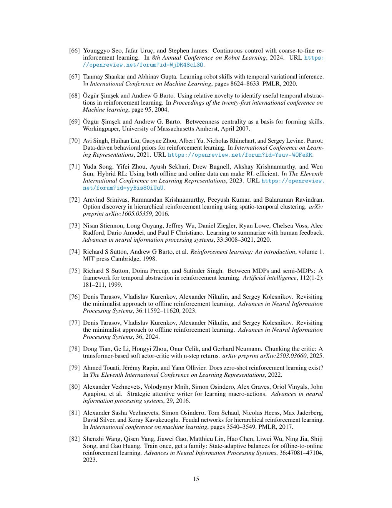

*Rendered source page for visual verification.*

[66] Younggyo Seo, Jafar Uruç, and Stephen James. Continuous control with coarse-to-fine re-
     inforcement learning. In 8th Annual Conference on Robot Learning, 2024. URL https:
     //openreview.net/forum?id=WjDR48cL3O.
[67] Tanmay Shankar and Abhinav Gupta. Learning robot skills with temporal variational inference.
     In International Conference on Machine Learning, pages 8624–8633. PMLR, 2020.
[68] Özgür Şimşek and Andrew G Barto. Using relative novelty to identify useful temporal abstrac-
     tions in reinforcement learning. In Proceedings of the twenty-first international conference on
     Machine learning, page 95, 2004.
[69] Özgür Şimşek and Andrew G. Barto. Betweenness centrality as a basis for forming skills.
     Workingpaper, University of Massachusetts Amherst, April 2007.
[70] Avi Singh, Huihan Liu, Gaoyue Zhou, Albert Yu, Nicholas Rhinehart, and Sergey Levine. Parrot:
     Data-driven behavioral priors for reinforcement learning. In International Conference on Learn-
     ing Representations, 2021. URL https://openreview.net/forum?id=Ysuv-WOFeKR.
[71] Yuda Song, Yifei Zhou, Ayush Sekhari, Drew Bagnell, Akshay Krishnamurthy, and Wen
     Sun. Hybrid RL: Using both offline and online data can make RL efficient. In The Eleventh
     International Conference on Learning Representations, 2023. URL https://openreview.
     net/forum?id=yyBis80iUuU.
[72] Aravind Srinivas, Ramnandan Krishnamurthy, Peeyush Kumar, and Balaraman Ravindran.
     Option discovery in hierarchical reinforcement learning using spatio-temporal clustering. arXiv
     preprint arXiv:1605.05359, 2016.
[73] Nisan Stiennon, Long Ouyang, Jeffrey Wu, Daniel Ziegler, Ryan Lowe, Chelsea Voss, Alec
     Radford, Dario Amodei, and Paul F Christiano. Learning to summarize with human feedback.
     Advances in neural information processing systems, 33:3008–3021, 2020.
[74] Richard S Sutton, Andrew G Barto, et al. Reinforcement learning: An introduction, volume 1.
     MIT press Cambridge, 1998.
[75] Richard S Sutton, Doina Precup, and Satinder Singh. Between MDPs and semi-MDPs: A
     framework for temporal abstraction in reinforcement learning. Artificial intelligence, 112(1-2):
     181–211, 1999.
[76] Denis Tarasov, Vladislav Kurenkov, Alexander Nikulin, and Sergey Kolesnikov. Revisiting
     the minimalist approach to offline reinforcement learning. Advances in Neural Information
     Processing Systems, 36:11592–11620, 2023.
[77] Denis Tarasov, Vladislav Kurenkov, Alexander Nikulin, and Sergey Kolesnikov. Revisiting
     the minimalist approach to offline reinforcement learning. Advances in Neural Information
     Processing Systems, 36, 2024.
[78] Dong Tian, Ge Li, Hongyi Zhou, Onur Celik, and Gerhard Neumann. Chunking the critic: A
     transformer-based soft actor-critic with n-step returns. arXiv preprint arXiv:2503.03660, 2025.
[79] Ahmed Touati, Jérémy Rapin, and Yann Ollivier. Does zero-shot reinforcement learning exist?
     In The Eleventh International Conference on Learning Representations, 2022.
[80] Alexander Vezhnevets, Volodymyr Mnih, Simon Osindero, Alex Graves, Oriol Vinyals, John
     Agapiou, et al. Strategic attentive writer for learning macro-actions. Advances in neural
     information processing systems, 29, 2016.
[81] Alexander Sasha Vezhnevets, Simon Osindero, Tom Schaul, Nicolas Heess, Max Jaderberg,
     David Silver, and Koray Kavukcuoglu. Feudal networks for hierarchical reinforcement learning.
     In International conference on machine learning, pages 3540–3549. PMLR, 2017.
[82] Shenzhi Wang, Qisen Yang, Jiawei Gao, Matthieu Lin, Hao Chen, Liwei Wu, Ning Jia, Shiji
     Song, and Gao Huang. Train once, get a family: State-adaptive balances for offline-to-online
     reinforcement learning. Advances in Neural Information Processing Systems, 36:47081–47104,
     2023.

                                                 15

---

<!-- source-page: 16 -->
## Source page 16

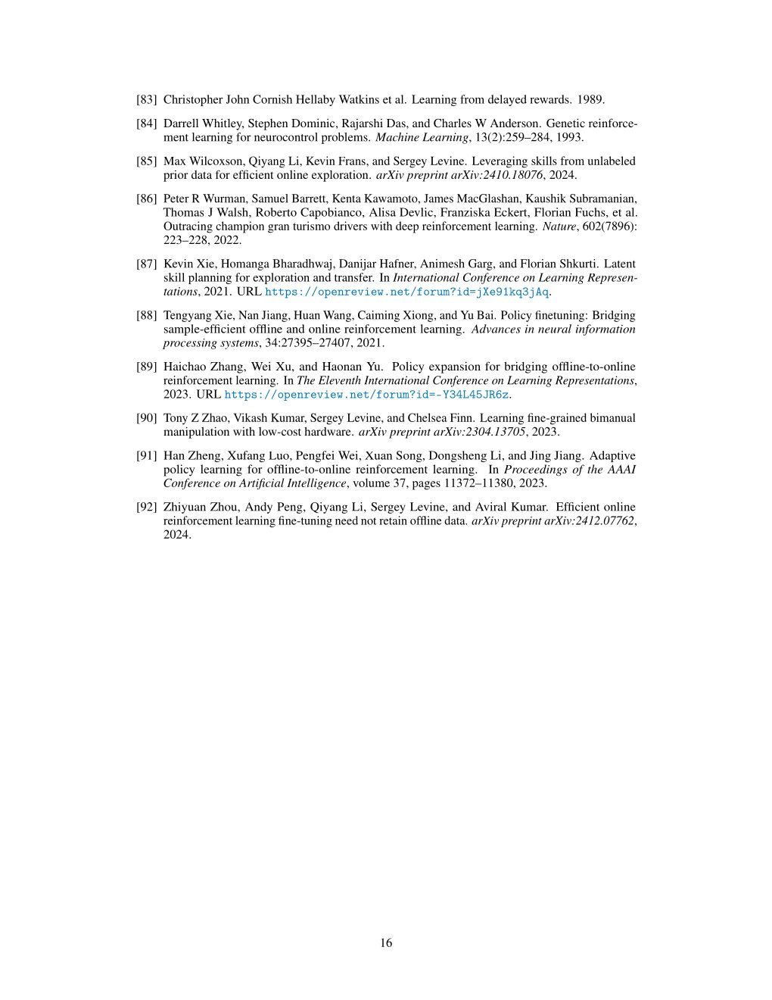

*Rendered source page for visual verification.*

[83] Christopher John Cornish Hellaby Watkins et al. Learning from delayed rewards. 1989.
[84] Darrell Whitley, Stephen Dominic, Rajarshi Das, and Charles W Anderson. Genetic reinforce-
     ment learning for neurocontrol problems. Machine Learning, 13(2):259–284, 1993.
[85] Max Wilcoxson, Qiyang Li, Kevin Frans, and Sergey Levine. Leveraging skills from unlabeled
     prior data for efficient online exploration. arXiv preprint arXiv:2410.18076, 2024.
[86] Peter R Wurman, Samuel Barrett, Kenta Kawamoto, James MacGlashan, Kaushik Subramanian,
     Thomas J Walsh, Roberto Capobianco, Alisa Devlic, Franziska Eckert, Florian Fuchs, et al.
     Outracing champion gran turismo drivers with deep reinforcement learning. Nature, 602(7896):
     223–228, 2022.
[87] Kevin Xie, Homanga Bharadhwaj, Danijar Hafner, Animesh Garg, and Florian Shkurti. Latent
     skill planning for exploration and transfer. In International Conference on Learning Represen-
     tations, 2021. URL https://openreview.net/forum?id=jXe91kq3jAq.
[88] Tengyang Xie, Nan Jiang, Huan Wang, Caiming Xiong, and Yu Bai. Policy finetuning: Bridging
     sample-efficient offline and online reinforcement learning. Advances in neural information
     processing systems, 34:27395–27407, 2021.
[89] Haichao Zhang, Wei Xu, and Haonan Yu. Policy expansion for bridging offline-to-online
     reinforcement learning. In The Eleventh International Conference on Learning Representations,
     2023. URL https://openreview.net/forum?id=-Y34L45JR6z.
[90] Tony Z Zhao, Vikash Kumar, Sergey Levine, and Chelsea Finn. Learning fine-grained bimanual
     manipulation with low-cost hardware. arXiv preprint arXiv:2304.13705, 2023.
[91] Han Zheng, Xufang Luo, Pengfei Wei, Xuan Song, Dongsheng Li, and Jing Jiang. Adaptive
     policy learning for offline-to-online reinforcement learning. In Proceedings of the AAAI
     Conference on Artificial Intelligence, volume 37, pages 11372–11380, 2023.
[92] Zhiyuan Zhou, Andy Peng, Qiyang Li, Sergey Levine, and Aviral Kumar. Efficient online
     reinforcement learning fine-tuning need not retain offline data. arXiv preprint arXiv:2412.07762,
     2024.

                                                 16

---

<!-- source-page: 17 -->
## Source page 17

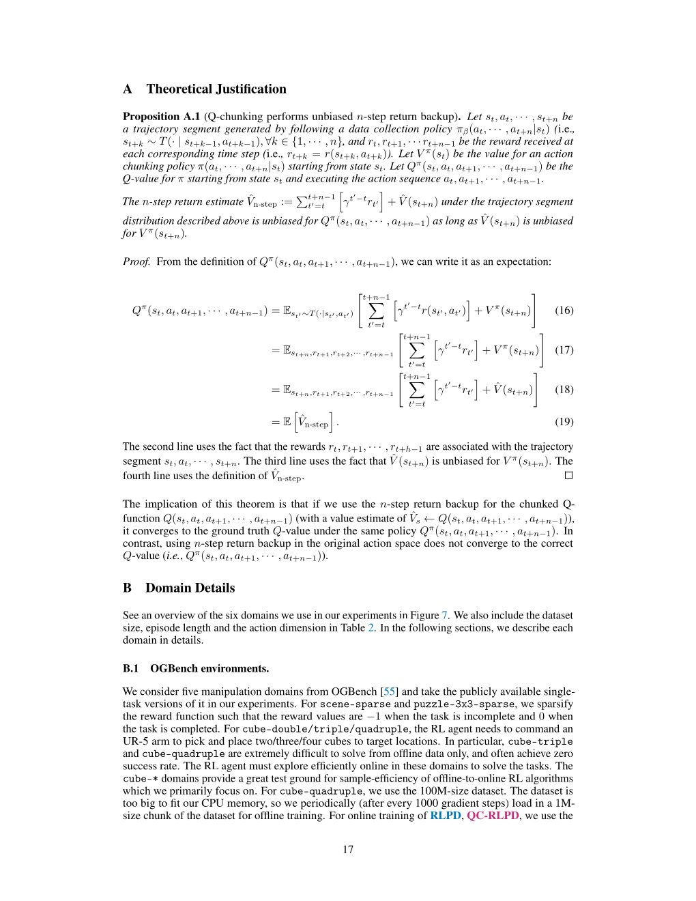

*Rendered source page for visual verification.*

A      Theoretical Justification
Proposition A.1 (Q-chunking performs unbiased n-step return backup). Let st , at , · · · , st+n be
a trajectory segment generated by following a data collection policy πβ (at , · · · , at+n |st ) (i.e.,
st+k ∼ T (· | st+k−1 , at+k−1 ), ∀k ∈ {1, · · · , n}, and rt , rt+1 , · · · rt+n−1 be the reward received at
each corresponding time step (i.e., rt+k = r(st+k , at+k )). Let V π (st ) be the value for an action
chunking policy π(at , · · · , at+n |st ) starting from state st . Let Qπ (st , at , at+1 , · · · , at+n−1 ) be the
Q-value for π starting from state st and executing the action sequence at , at+1 , · · · , at+n−1 .
                                            Pt+n−1 h t′ −t i
The n-step return estimate V̂n-step := t′ =t           γ    rt′ + V̂ (st+n ) under the trajectory segment
distribution described above is unbiased for Qπ (st , at , · · · , at+n−1 ) as long as V̂ (st+n ) is unbiased
for V π (st+n ).

Proof. From the definition of Qπ (st , at , at+1 , · · · , at+n−1 ), we can write it as an expectation:

                                                                 "t+n−1                                  #
                                                                   X h ′                    i
      π                                                                   t −t                  π
    Q (st , at , at+1 , · · · , at+n−1 ) = Est′ ∼T (·|st′ ,at′ )        γ      r(st′ , at′ ) + V (st+n )     (16)
                                                               t′ =t
                                                                       "t+n−1                       #
                                                                         X h ′          i
                                                                                t −t        π
                                      = Est+n ,rt+1 ,rt+2 ,··· ,rt+n−1        γ      rt′ + V (st+n ) (17)
                                                                         t′ =t
                                                                       "t+n−1                         #
                                                                         X h ′          i
                                                                                t −t
                                      = Est+n ,rt+1 ,rt+2 ,··· ,rt+n−1        γ      rt′ + V̂ (st+n )        (18)
                                                                         t′ =t
                                         h        i
                                      = E V̂n-step .                                                         (19)

The second line uses the fact that the rewards rt , rt+1 , · · · , rt+h−1 are associated with the trajectory
segment st , at , · · · , st+n . The third line uses the fact that V̂ (st+n ) is unbiased for V π (st+n ). The
fourth line uses the definition of V̂n-step .

The implication of this theorem is that if we use the n-step return backup for the chunked Q-
function Q(st , at , at+1 , · · · , at+n−1 ) (with a value estimate of V̂s ← Q(st , at , at+1 , · · · , at+n−1 )),
it converges to the ground truth Q-value under the same policy Qπ (st , at , at+1 , · · · , at+n−1 ). In
contrast, using n-step return backup in the original action space does not converge to the correct
Q-value (i.e., Qπ (st , at , at+1 , · · · , at+n−1 )).

B      Domain Details
See an overview of the six domains we use in our experiments in Figure 7. We also include the dataset
size, episode length and the action dimension in Table 2. In the following sections, we describe each
domain in details.

B.1       OGBench environments.

We consider five manipulation domains from OGBench [55] and take the publicly available single-
task versions of it in our experiments. For scene-sparse and puzzle-3x3-sparse, we sparsify
the reward function such that the reward values are −1 when the task is incomplete and 0 when
the task is completed. For cube-double/triple/quadruple, the RL agent needs to command an
UR-5 arm to pick and place two/three/four cubes to target locations. In particular, cube-triple
and cube-quadruple are extremely difficult to solve from offline data only, and often achieve zero
success rate. The RL agent must explore efficiently online in these domains to solve the tasks. The
cube-* domains provide a great test ground for sample-efficiency of offline-to-online RL algorithms
which we primarily focus on. For cube-quadruple, we use the 100M-size dataset. The dataset is
too big to fit our CPU memory, so we periodically (after every 1000 gradient steps) load in a 1M-
size chunk of the dataset for offline training. For online training of RLPD, QC-RLPD, we use the

                                                        17

---

<!-- source-page: 18 -->
## Source page 18

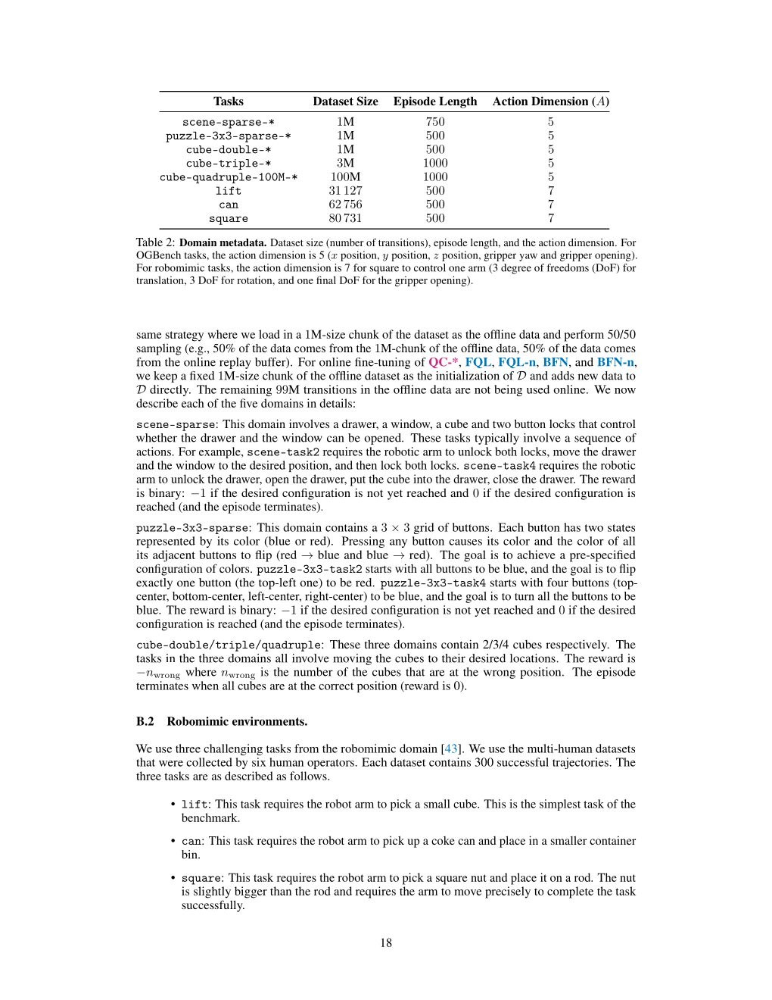

*Rendered source page for visual verification.*

Tasks                 Dataset Size        Episode Length     Action Dimension (A)
         scene-sparse-*                    1M                   750                        5
       puzzle-3x3-sparse-*                 1M                   500                        5
          cube-double-*                    1M                   500                        5
          cube-triple-*                    3M                  1000                        5
      cube-quadruple-100M-*               100M                 1000                        5
              lift                        31 127                500                        7
               can                        62 756                500                        7
             square                       80 731                500                        7
Table 2: Domain metadata. Dataset size (number of transitions), episode length, and the action dimension. For
OGBench tasks, the action dimension is 5 (x position, y position, z position, gripper yaw and gripper opening).
For robomimic tasks, the action dimension is 7 for square to control one arm (3 degree of freedoms (DoF) for
translation, 3 DoF for rotation, and one final DoF for the gripper opening).

same strategy where we load in a 1M-size chunk of the dataset as the offline data and perform 50/50
sampling (e.g., 50% of the data comes from the 1M-chunk of the offline data, 50% of the data comes
from the online replay buffer). For online fine-tuning of QC-*, FQL, FQL-n, BFN, and BFN-n,
we keep a fixed 1M-size chunk of the offline dataset as the initialization of D and adds new data to
D directly. The remaining 99M transitions in the offline data are not being used online. We now
describe each of the five domains in details:
scene-sparse: This domain involves a drawer, a window, a cube and two button locks that control
whether the drawer and the window can be opened. These tasks typically involve a sequence of
actions. For example, scene-task2 requires the robotic arm to unlock both locks, move the drawer
and the window to the desired position, and then lock both locks. scene-task4 requires the robotic
arm to unlock the drawer, open the drawer, put the cube into the drawer, close the drawer. The reward
is binary: −1 if the desired configuration is not yet reached and 0 if the desired configuration is
reached (and the episode terminates).
puzzle-3x3-sparse: This domain contains a 3 × 3 grid of buttons. Each button has two states
represented by its color (blue or red). Pressing any button causes its color and the color of all
its adjacent buttons to flip (red → blue and blue → red). The goal is to achieve a pre-specified
configuration of colors. puzzle-3x3-task2 starts with all buttons to be blue, and the goal is to flip
exactly one button (the top-left one) to be red. puzzle-3x3-task4 starts with four buttons (top-
center, bottom-center, left-center, right-center) to be blue, and the goal is to turn all the buttons to be
blue. The reward is binary: −1 if the desired configuration is not yet reached and 0 if the desired
configuration is reached (and the episode terminates).
cube-double/triple/quadruple: These three domains contain 2/3/4 cubes respectively. The
tasks in the three domains all involve moving the cubes to their desired locations. The reward is
−nwrong where nwrong is the number of the cubes that are at the wrong position. The episode
terminates when all cubes are at the correct position (reward is 0).

B.2    Robomimic environments.

We use three challenging tasks from the robomimic domain [43]. We use the multi-human datasets
that were collected by six human operators. Each dataset contains 300 successful trajectories. The
three tasks are as described as follows.

       • lift: This task requires the robot arm to pick a small cube. This is the simplest task of the
         benchmark.
       • can: This task requires the robot arm to pick up a coke can and place in a smaller container
         bin.
       • square: This task requires the robot arm to pick a square nut and place it on a rod. The nut
         is slightly bigger than the rod and requires the arm to move precisely to complete the task
         successfully.

                                                      18

---

<!-- source-page: 19 -->
## Source page 19

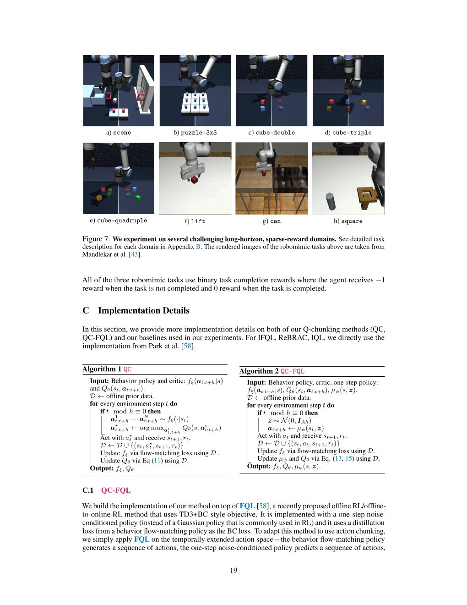

*Rendered source page for visual verification.*

a) scene                   b) puzzle-3x3                  c) cube-double              d) cube-triple

    e) cube-quadruple                     f) lift                        g) can                    h) square

Figure 7: We experiment on several challenging long-horizon, sparse-reward domains. See detailed task
description for each domain in Appendix B. The rendered images of the robomimic tasks above are taken from
Mandlekar et al. [43].

All of the three robomimic tasks use binary task completion rewards where the agent receives −1
reward when the task is not completed and 0 reward when the task is completed.

C      Implementation Details
In this section, we provide more implementation details on both of our Q-chunking methods (QC,
QC-FQL) and our baselines used in our experiments. For IFQL, ReBRAC, IQL, we directly use the
implementation from Park et al. [58].

Algorithm 1 QC                                                    Algorithm 2 QC-FQL
    Input: Behavior policy and critic: fξ (at:t+h |s)               Input: Behavior policy, critic, one-step policy:
    and Qθ (st , at:t+h ).                                          fξ (at:t+h |s), Qθ (st , at:t+h ), µψ (s, z).
    D ← offline prior data.                                         D ← offline prior data.
    for every environment step t do                                 for every environment step t do
        if t mod h ≡ 0 then                                             if t mod h ≡ 0 then
            a1t:t+h · · · aN
                           t:t+h ∼ fξ (·|st )                               z ∼ N (0, IAh )
            a⋆t:t+h ← arg maxai           Qθ (s, ait:t+h )                  at:t+h ← µψ (st , z)
                                   t:t+h
        Act with a⋆t and receive st+1 , rt .                            Act with at and receive st+1 , rt .
        D ← D ∪ {(st , a⋆t , st+1 , rt )}                               D ← D ∪ {(st , at , st+1 , rt )}
        Update fξ via flow-matching loss using D .                      Update fξ via flow-matching loss using D.
        Update Qθ via Eq (11) using D.                                  Update µψ and Qθ via Eq. (13, 15) using D.
    Output: fξ , Qθ .                                               Output: fξ , Qθ , µψ (s, z).

C.1     QC-FQL

We build the implementation of our method on top of FQL [58], a recently proposed offline RL/offline-
to-online RL method that uses TD3+BC-style objective. It is implemented with a one-step noise-
conditioned policy (instead of a Gaussian policy that is commonly used in RL) and it uses a distillation
loss from a behavior flow-matching policy as the BC loss. To adapt this method to use action chunking,
we simply apply FQL on the temporally extended action space – the behavior flow-matching policy
generates a sequence of actions, the one-step noise-conditioned policy predicts a sequence of actions,

                                                             19

---

<!-- source-page: 20 -->
## Source page 20

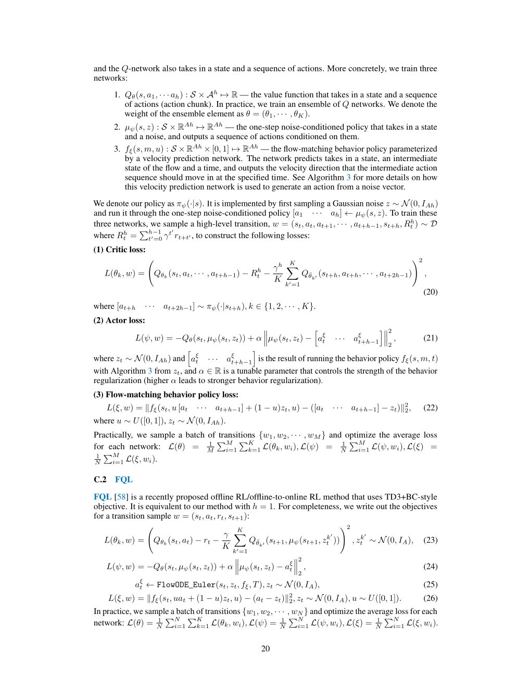

*Rendered source page for visual verification.*

and the Q-network also takes in a state and a sequence of actions. More concretely, we train three
networks:
       1. Qθ (s, a1 , · · · ah ) : S × Ah 7→ R — the value function that takes in a state and a sequence
          of actions (action chunk). In practice, we train an ensemble of Q networks. We denote the
          weight of the ensemble element as θ = (θ1 , · · · , θK ).
       2. µψ (s, z) : S × RAh 7→ RAh — the one-step noise-conditioned policy that takes in a state
          and a noise, and outputs a sequence of actions conditioned on them.
       3. fξ (s, m, u) : S × RAh × [0, 1] 7→ RAh — the flow-matching behavior policy parameterized
          by a velocity prediction network. The network predicts takes in a state, an intermediate
          state of the flow and a time, and outputs the velocity direction that the intermediate action
          sequence should move in at the specified time. See Algorithm 3 for more details on how
          this velocity prediction network is used to generate an action from a noise vector.
We denote our policy as πψ (·|s). It is implemented by first sampling a Gaussian noise z ∼ N (0, IAh )
and run it through the one-step noise-conditioned policy [a1 · · · ah ] ← µψ (s, z). To train these
three networks, we sample a high-level transition, w = (st , at , at+1 , · · · , at+h−1 , st+h , Rth ) ∼ D
              Ph−1 ′
where Rth = t′ =0 γ t rt+t′ , to construct the following losses:
(1) Critic loss:
                                                                  K
                                                                                                                 !2
                                                                h X
                                                            γ
   L(θk , w) =      Qθk (st , at , · · · , at+h−1 ) − Rth −              Qθ̄k′ (st+h , at+h , · · · , at+2h−1 )       ,
                                                            K
                                                                 k′ =1
                                                                                                                      (20)
where [at+h      ···   at+2h−1 ] ∼ πψ (·|st+h ), k ∈ {1, 2, · · · , K}.
(2) Actor loss:
                                                                  h                  i 2
            L(ψ, w) = −Qθ (st , µψ (st , zt )) + α µψ (st , zt ) − aξt · · · aξt+h−1     ,        (21)
                                                                                       2
                            h                   i
where zt ∼ N (0, IAh ) and aξt · · · aξt+h−1 is the result of running the behavior policy fξ (s, m, t)
with Algorithm 3 from zt , and α ∈ R is a tunable parameter that controls the strength of the behavior
regularization (higher α leads to stronger behavior regularization).
(3) Flow-matching behavior policy loss:
    L(ξ, w) = ∥fξ (st , u [at · · · at+h−1 ] + (1 − u)zt , u) − ([at               ···    at+h−1 ] − zt )∥22 ,        (22)
where u ∼ U ([0, 1]), zt ∼ N (0, IAh ).
Practically, we sample a batch of transitions {w1 , w2 , · · · , wM } and optimize the average loss
                               1
                                 PM PK                                   1
                                                                           PM
for each network: L(θ) = M          i=1    k=1 L(θk , wi ), L(ψ) = N          i=1 L(ψ, wi ), L(ξ) =
 1
   P M
N    i=1 L(ξ, w i ).

C.2     FQL

FQL [58] is a recently proposed offline RL/offline-to-online RL method that uses TD3+BC-style
objective. It is equivalent to our method with h = 1. For completeness, we write out the objectives
for a transition sample w = (st , at , rt , st+1 ):
                                              K
                                                                                  !2
                                         γ X                                   ′        ′
   L(θk , w) = Qθk (st , at ) − rt −               Qθ̄k′ (st+1 , µψ (st+1 , ztk )) , ztk ∼ N (0, IA ), (23)
                                        K ′
                                              k =1
                                                                     2
   L(ψ, w) = −Qθ (st , µψ (st , zt )) + α µψ (st , zt ) − aξt            ,                                            (24)
                                                                     2
              aξt ← FlowODE_Euler(st , zt , fξ , T ), zt ∼ N (0, IA ),                                                (25)
      L(ξ, w) = ∥fξ (st , uat + (1 − u)zt , u) − (at − zt )∥22 , zt ∼ N (0, IA ), u ∼ U ([0, 1]).                     (26)
In practice, we sample a batch of transitions {w1 , w2 , · · · , wN } and optimize the average loss for each
                     PN PK                                      PN                          PN
network: L(θ) = N1 i=1 k=1 L(θk , wi ), L(ψ) = N1 i=1 L(ψ, wi ), L(ξ) = N1 i=1 L(ξ, wi ).

                                                       20

---

<!-- source-page: 21 -->
## Source page 21

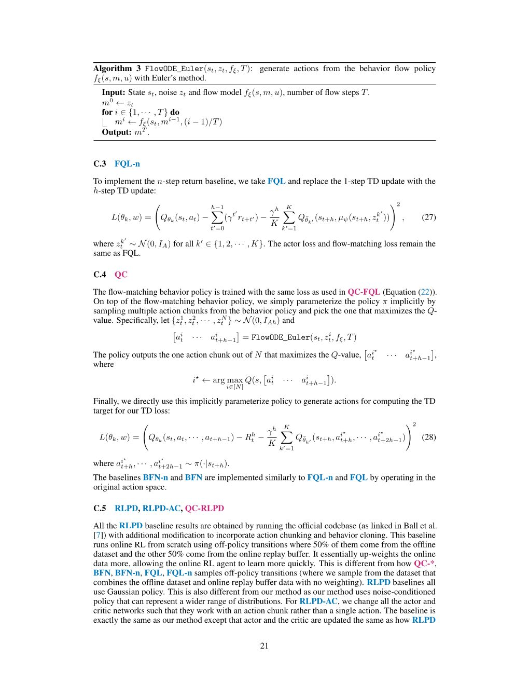

*Rendered source page for visual verification.*

Algorithm 3 FlowODE_Euler(st , zt , fξ , T ): generate actions from the behavior flow policy
fξ (s, m, u) with Euler’s method.
  Input: State st , noise zt and flow model fξ (s, m, u), number of flow steps T .
  m0 ← zt
  for i ∈ {1, · · · , T } do
      mi ← fξ (st , mi−1 , (i − 1)/T )
  Output: mT .

C.3   FQL-n

To implement the n-step return baseline, we take FQL and replace the 1-step TD update with the
h-step TD update:
                                  h−1                 K
                                                                                      !2
                                  X ′
                                        t          γh X                           k′
     L(θk , w) = Qθk (st , at ) −     (γ rt+t′ ) −      Qθ̄k′ (st+h , µψ (st+h , zt )) ,  (27)
                                   ′
                                                   K ′
                                     t =0                  k =1
          ′
where ztk ∼ N (0, IA ) for all k ′ ∈ {1, 2, · · · , K}. The actor loss and flow-matching loss remain the
same as FQL.

C.4   QC

The flow-matching behavior policy is trained with the same loss as used in QC-FQL (Equation (22)).
On top of the flow-matching behavior policy, we simply parameterize the policy π implicitly by
sampling multiple action chunks from the behavior policy and pick the one that maximizes the Q-
value. Specifically, let {zt1 , zt2 , · · · , ztN } ∼ N (0, IAh ) and
                          at · · · ait+h−1 = FlowODE_Euler(st , zti , fξ , T )
> [Extraction warning] One or more lines using an invalid PDF font map were omitted. Use the rendered source page and canonical LaTeX registry.

The policy outputs the one action chunk out of N that maximizes the Q-value, ait · · · ait+h−1 ,
where
                                  i⋆ ← arg max Q(s, ait · · · ait+h−1 ).
> [Extraction warning] One or more lines using an invalid PDF font map were omitted. Use the rendered source page and canonical LaTeX registry.
                                            i∈[N ]

Finally, we directly use this implicitly parameterize policy to generate actions for computing the TD
target for our TD loss:
                                                                                                     !2
                                                        h K
                                                      γ   X                   ⋆               ⋆
  L(θk , w) = Qθk (st , at , · · · , at+h−1 ) − Rth −        Qθ̄k′ (st+h , ait+h , · · · , ait+2h−1 )   (28)
                                                      K ′
                                                          k =1
         ⋆               ⋆
where ait+h , · · · , ait+2h−1 ∼ π(·|st+h ).
The baselines BFN-n and BFN are implemented similarly to FQL-n and FQL by operating in the
original action space.

C.5   RLPD, RLPD-AC, QC-RLPD

All the RLPD baseline results are obtained by running the official codebase (as linked in Ball et al.
[7]) with additional modification to incorporate action chunking and behavior cloning. This baseline
runs online RL from scratch using off-policy transitions where 50% of them come from the offline
dataset and the other 50% come from the online replay buffer. It essentially up-weights the online
data more, allowing the online RL agent to learn more quickly. This is different from how QC-*,
BFN, BFN-n, FQL, FQL-n samples off-policy transitions (where we sample from the dataset that
combines the offline dataset and online replay buffer data with no weighting). RLPD baselines all
use Gaussian policy. This is also different from our method as our method uses noise-conditioned
policy that can represent a wider range of distributions. For RLPD-AC, we change all the actor and
critic networks such that they work with an action chunk rather than a single action. The baseline is
exactly the same as our method except that actor and the critic are updated the same as how RLPD

                                                     21

---

<!-- source-page: 22 -->
## Source page 22

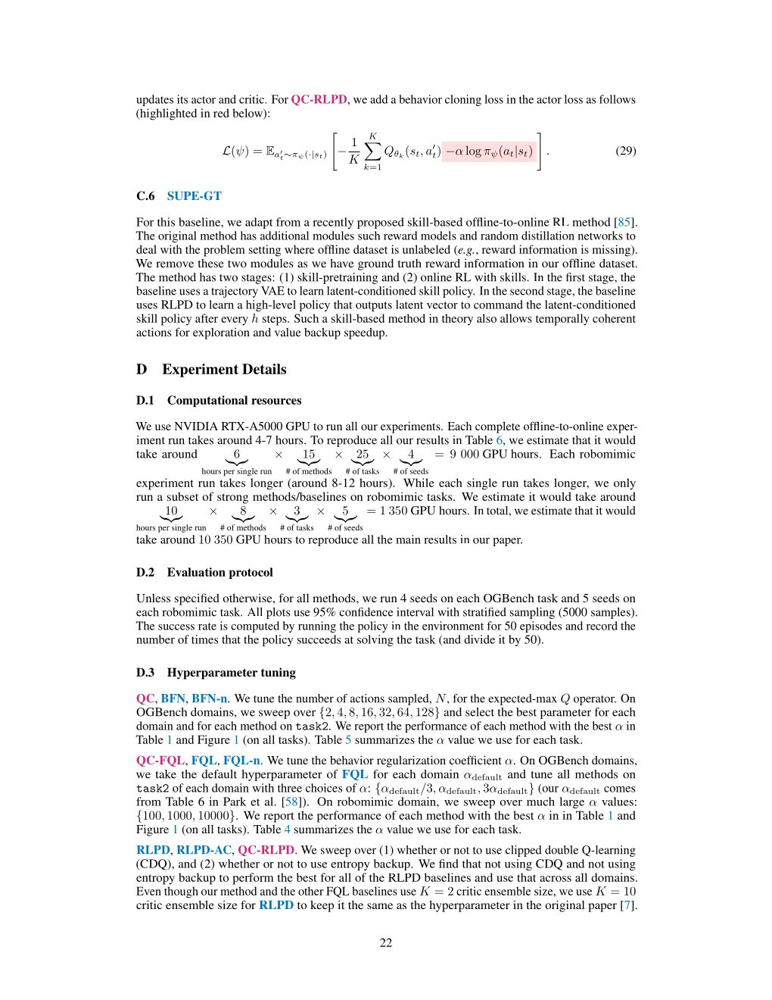

*Rendered source page for visual verification.*

updates its actor and critic. For QC-RLPD, we add a behavior cloning loss in the actor loss as follows
(highlighted in red below):
                                          "    K
                                                                                   #
                                             1 X            ′
                   L(ψ) = Ea′t ∼πψ (·|st ) −     Qθk (st , at ) −α log πψ (at |st ) .              (29)
                                             K
                                                                   k=1

C.6     SUPE-GT

For this baseline, we adapt from a recently proposed skill-based offline-to-online RL method [85].
The original method has additional modules such reward models and random distillation networks to
deal with the problem setting where offline dataset is unlabeled (e.g., reward information is missing).
We remove these two modules as we have ground truth reward information in our offline dataset.
The method has two stages: (1) skill-pretraining and (2) online RL with skills. In the first stage, the
baseline uses a trajectory VAE to learn latent-conditioned skill policy. In the second stage, the baseline
uses RLPD to learn a high-level policy that outputs latent vector to command the latent-conditioned
skill policy after every h steps. Such a skill-based method in theory also allows temporally coherent
actions for exploration and value backup speedup.

D      Experiment Details

D.1     Computational resources

We use NVIDIA RTX-A5000 GPU to run all our experiments. Each complete offline-to-online exper-
iment run takes around 4-7 hours. To reproduce all our results in Table 6, we estimate that it would
take around        6
                  |{z}     × |{z}
                                15 × |{z} 25 × |{z}  4     = 9 000 GPU hours. Each robomimic
                  hours per single run    # of methods     # of tasks        # of seeds
experiment run takes longer (around 8-12 hours). While each single run takes longer, we only
run a subset of strong methods/baselines on robomimic tasks. We estimate it would take around
      10
     |{z}     × |{z} 8   × |{z}
                              3 × |{z} 5 = 1 350 GPU hours. In total, we estimate that it would
hours per single run   # of methods      # of tasks   # of seeds
take around 10 350 GPU hours to reproduce all the main results in our paper.

D.2     Evaluation protocol

Unless specified otherwise, for all methods, we run 4 seeds on each OGBench task and 5 seeds on
each robomimic task. All plots use 95% confidence interval with stratified sampling (5000 samples).
The success rate is computed by running the policy in the environment for 50 episodes and record the
number of times that the policy succeeds at solving the task (and divide it by 50).

D.3     Hyperparameter tuning

QC, BFN, BFN-n. We tune the number of actions sampled, N , for the expected-max Q operator. On
OGBench domains, we sweep over {2, 4, 8, 16, 32, 64, 128} and select the best parameter for each
domain and for each method on task2. We report the performance of each method with the best α in
Table 1 and Figure 1 (on all tasks). Table 5 summarizes the α value we use for each task.
QC-FQL, FQL, FQL-n. We tune the behavior regularization coefficient α. On OGBench domains,
we take the default hyperparameter of FQL for each domain αdefault and tune all methods on
task2 of each domain with three choices of α: {αdefault /3, αdefault , 3αdefault } (our αdefault comes
from Table 6 in Park et al. [58]). On robomimic domain, we sweep over much large α values:
{100, 1000, 10000}. We report the performance of each method with the best α in in Table 1 and
Figure 1 (on all tasks). Table 4 summarizes the α value we use for each task.
RLPD, RLPD-AC, QC-RLPD. We sweep over (1) whether or not to use clipped double Q-learning
(CDQ), and (2) whether or not to use entropy backup. We find that not using CDQ and not using
entropy backup to perform the best for all of the RLPD baselines and use that across all domains.
Even though our method and the other FQL baselines use K = 2 critic ensemble size, we use K = 10
critic ensemble size for RLPD to keep it the same as the hyperparameter in the original paper [7].

                                                                        22

---

<!-- source-page: 23 -->
## Source page 23

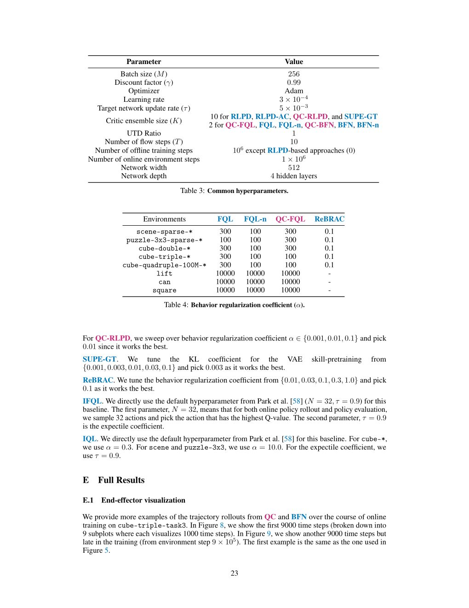

*Rendered source page for visual verification.*

Parameter                                              Value
              Batch size (M )                                       256
           Discount factor (γ)                                      0.99
                Optimizer                                          Adam
               Learning rate                                     3 × 10−4
      Target network update rate (τ )                            5 × 10−3
                                           10 for RLPD, RLPD-AC, QC-RLPD, and SUPE-GT
        Critic ensemble size (K)
                                           2 for QC-FQL, FQL, FQL-n, QC-BFN, BFN, BFN-n
            UTD Ratio                                                1
    Number of flow steps (T )                                        10
  Number of offline training steps                106 except RLPD-based approaches (0)
 Number of online environment steps                               1 × 106
          Network width                                             512
          Network depth                                       4 hidden layers
                                 Table 3: Common hyperparameters.

                     Environments             FQL       FQL-n     QC-FQL        ReBRAC
                 scene-sparse-*                300       100         300            0.1
               puzzle-3x3-sparse-*             100       100         300            0.1
                  cube-double-*                300       100         300            0.1
                  cube-triple-*                300       100         100            0.1
              cube-quadruple-100M-*            300       100         100            0.1
                      lift                    10000     10000       10000            -
                       can                    10000     10000       10000            -
                     square                   10000     10000       10000            -
                            Table 4: Behavior regularization coefficient (α).

For QC-RLPD, we sweep over behavior regularization coefficient α ∈ {0.001, 0.01, 0.1} and pick
0.01 since it works the best.
SUPE-GT. We tune the KL coefficient for the VAE                                 skill-pretraining   from
{0.001, 0.003, 0.01, 0.03, 0.1} and pick 0.003 as it works the best.
ReBRAC. We tune the behavior regularization coefficient from {0.01, 0.03, 0.1, 0.3, 1.0} and pick
0.1 as it works the best.
IFQL. We directly use the default hyperparameter from Park et al. [58] (N = 32, τ = 0.9) for this
baseline. The first parameter, N = 32, means that for both online policy rollout and policy evaluation,
we sample 32 actions and pick the action that has the highest Q-value. The second parameter, τ = 0.9
is the expectile coefficient.
IQL. We directly use the default hyperparameter from Park et al. [58] for this baseline. For cube-*,
we use α = 0.3. For scene and puzzle-3x3, we use α = 10.0. For the expectile coefficient, we
use τ = 0.9.

E     Full Results

E.1    End-effector visualization

We provide more examples of the trajectory rollouts from QC and BFN over the course of online
training on cube-triple-task3. In Figure 8, we show the first 9000 time steps (broken down into
9 subplots where each visualizes 1000 time steps). In Figure 9, we show another 9000 time steps but
late in the training (from environment step 9 × 105 ). The first example is the same as the one used in
Figure 5.

                                                   23

---

<!-- source-page: 24 -->
## Source page 24

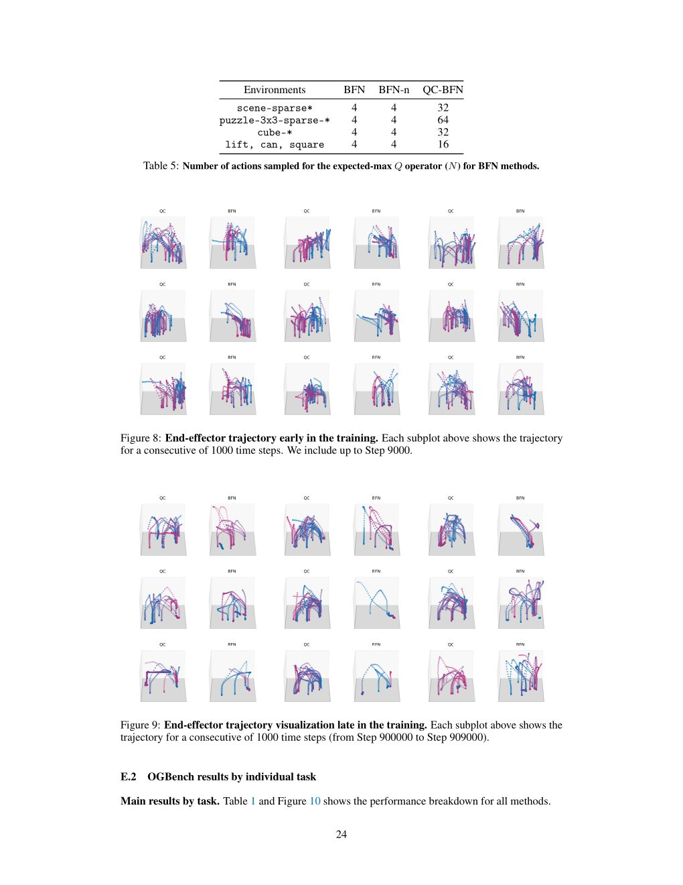

*Rendered source page for visual verification.*

Environments        BFN      BFN-n    QC-BFN
                         scene-sparse*               4         4       32
                      puzzle-3x3-sparse-*            4         4       64
                            cube-*                   4         4       32
                       lift, can, square             4         4       16
      Table 5: Number of actions sampled for the expected-max Q operator (N ) for BFN methods.

         QC             BFN              QC              BFN             QC             BFN

         QC             BFN              QC              BFN             QC             BFN

         QC             BFN              QC              BFN             QC             BFN

Figure 8: End-effector trajectory early in the training. Each subplot above shows the trajectory
for a consecutive of 1000 time steps. We include up to Step 9000.

         QC             BFN              QC              BFN             QC             BFN

         QC             BFN              QC              BFN             QC             BFN

         QC             BFN              QC              BFN             QC             BFN

Figure 9: End-effector trajectory visualization late in the training. Each subplot above shows the
trajectory for a consecutive of 1000 time steps (from Step 900000 to Step 909000).

E.2   OGBench results by individual task

Main results by task. Table 1 and Figure 10 shows the performance breakdown for all methods.

                                                24

---

<!-- source-page: 25 -->
## Source page 25

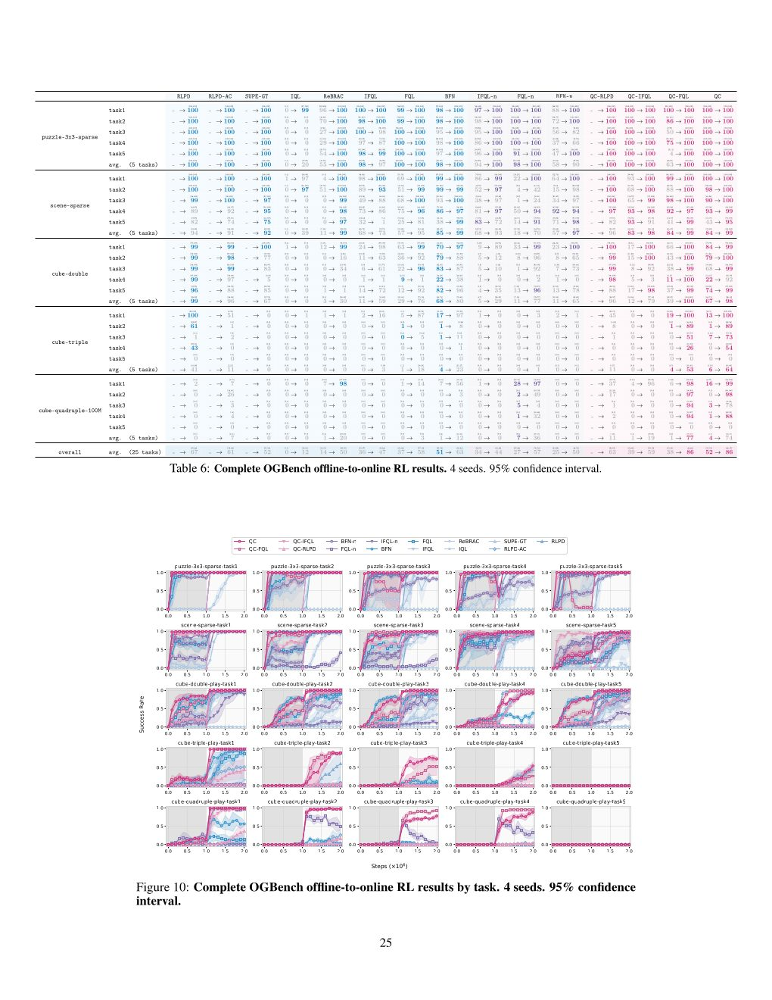

*Rendered source page for visual verification.*

RLPD                 RLPD-AC               SUPE-GT                              IQL                  ReBRAC                               IFQL                           FQL                            BFN                      IFQL-n                       FQL-n                         BFN-n                   QC-RLPD                  QC-IFQL                    QC-FQL                            QC
                                                                   [100,100]               [100,100]                 [100,100]        [0,0]         [97,100]   [90,100]   [100,100]          [98,100]        [100,100]     [98,100]          [100,100]     [97,100]         [100,100]       [94,100]    [100,100]     [98,100]     [100,100]          [86,91]       [100,100]              [100,100]    [100,100]    [100,100]   [100,100]    [100,100]    [100,100]         [100,100]

                      task1                               –    → 100               –   → 100             –     → 100                   0 → 99                  96 → 100                  100 → 100                          99 → 100                       98 → 100                          97 → 100                100 → 100                        88 → 100                    –    → 100            100 → 100                100 → 100                 100 → 100
                                                                   [100,100]               [100,100]                 [100,100]        [0,0]            [0,0]   [46,86]    [100,100]           [96,100]       [100,100]     [98,100]          [100,100]     [96,100]         [100,100]       [98,100]    [100,100]     [100,100]    [100,100]          [66,77]       [100,100]              [100,100]    [100,100]    [100,100]    [60,100]    [100,100]    [100,100]         [100,100]

                      task2                               –    → 100               –   → 100             –     → 100                   0→               0      70 → 100                       98 → 100                      99 → 100                       98 → 100                          98 → 100                100 → 100                        72 → 100                    –    → 100            100 → 100                  86 → 100                100 → 100
                                                                   [100,100]               [100,100]                 [100,100]        [0,0]            [0,0]    [6,56]    [100,100]          [98,100]          [96,100]   [98,100]           [100,100]     [89,100]         [100,100]        [92,98]    [100,100]     [98,100]     [100,100]          [55,57]         [76,88]              [100,100]    [98,100]     [100,100]      [0,99]    [100,100]    [100,100]         [100,100]

                      task3                               –    → 100               –   → 100             –     → 100                   0→               0      27 → 100                  100 → 98                         100 → 100                        95 → 100                          95 → 100                100 → 100                        56 → 82                     –    → 100            100 → 100                  50 → 100                100 → 100
 puzzle-3x3-sparse                                                 [100,100]               [100,100]                 [100,100]        [0,0]            [0,0]   [14,44]    [100,100]            [96,99]         [74,95]    [98,100]           [100,100]     [98,100]         [100,100]        [82,90]    [100,100]     [98,100]     [100,100]          [30,48]         [59,76]              [100,100]    [98,100]     [100,100]    [25,100]    [100,100]    [100,100]         [100,100]

                      task4                               –    → 100               –   → 100             –     → 100                   0→               0      29 → 100                       97 → 87                     100 → 100                        98 → 100                          86 → 100                100 → 100                        37 → 66                     –    → 100            100 → 100                  75 → 100                100 → 100
                                                                   [100,100]               [100,100]                 [100,100]        [0,0]            [0,0]   [29,74]    [100,100]           [95,100]         [98,100]   [100,100]          [100,100]     [95,100]         [100,100]        [94,97]    [100,100]      [79,100]    [100,100]          [38,55]        [98,100]              [100,100]    [98,100]     [100,100]       [0,11]   [100,100]    [98,100]          [100,100]

                      task5                               –    → 100               –   → 100             –     → 100                   0→               0      54 → 100                       98 → 99                     100 → 100                        97 → 100                          96 → 100                   91 → 100                      47 → 100                    –    → 100            100 → 100                      4 → 100             100 → 100
                                                                   [100,100]               [100,100]                 [100,100]        [0,0]         [19,20]    [47,65]    [100,100]            [98,99]         [94,99]    [99,100]           [100,100]     [96,99]          [100,100]        [93,96]    [100,100]      [95,100]    [100,100]          [55,61]         [89,92]              [100,100]    [99,100]     [100,100]     [48,76]    [100,100]    [99,100]          [100,100]

                      avg.    (5 tasks)                   –    → 100               –   → 100             –     → 100                   0 → 20                  55 → 100                       98 → 97                     100 → 100                        98 → 100                          94 → 100                   98 → 100                      58 → 90                     –    → 100            100 → 100                  63 → 100                100 → 100
                                                                   [100,100]               [100,100]                 [100,100]        [0,2]         [96,99]       [0,9]   [100,100]           [98,98]        [100,100]      [55,79]          [100,100]     [97,100]         [100,100]        [79,93]     [98,100]       [19,25]    [100,100]          [52,74]       [100,100]              [100,100]      [90,98]    [100,100]    [98,100]    [100,100]    [100,100]         [100,100]

                      task1                               –    → 100               –   → 100             –     → 100                   1 → 97                      4 → 100                    98 → 100                      69 → 100                       99 → 100                          86 → 99                    22 → 100                      64 → 100                    –    → 100              93 → 100                 99 → 100                100 → 100
                                                                   [100,100]               [100,100]                 [100,100]        [0,0]         [94,100]   [30,78]    [100,100]            [80,95]         [85,100]     [41,64]           [98,100]     [97,100]          [98,100]        [34,70]     [95,100]          [2,6]     [33,51]          [7,23]          [98,100]             [100,100]      [63,76]    [100,100]     [82,94]    [100,100]     [96,100]         [100,100]

                      task2                               –    → 100               –   → 100             –     → 100                   0 → 97                  51 → 100                       89 → 93                       51 → 99                        99 → 99                           52 → 97                        4 → 42                    15 → 98                     –    → 100              68 → 100                 88 → 100                  98 → 100
                                                                     [98,100]              [98,100]                   [92,100]        [0,0]            [0,0]      [0,2]    [98,100]            [39,58]         [84,93]      [48,83]          [100,100]     [90,96]          [100,100]        [33,43]      [95,98]          [0,2]     [9,40]           [21,47]         [95,99]              [100,100]      [58,72]     [97,100]    [96,100]    [100,100]      [83,96]         [100,100]

                      task3                               –    → 99                –   → 100              –    → 97                    0→               0          0 → 99                     49 → 88                       68 → 100                       93 → 100                          38 → 97                        1 → 24                    34 → 97                     –    → 100              65 → 99                  98 → 100                  90 → 100
   scene-sparse                                                        [84,95]               [84,97]                  [90,100]        [0,0]            [0,0]      [0,0]    [98,100]            [62,82]         [83,89]      [69,81]           [88,100]     [71,99]            [96,99]        [68,89]      [95,99]       [41,63]      [86,99]          [85,96]         [85,100]              [92,100]      [92,94]     [98,100]     [85,98]      [95,100]     [87,96]          [98,100]

                      task4                               –    → 89                –   → 92               –    → 95                    0→               0          0 → 98                     73 → 86                       75 → 96                        86 → 97                           81 → 97                    50 → 94                       92 → 94                     –    → 97               93 → 98                  92 → 97                   93 → 99
                                                                       [78,86]               [60,81]                  [32,100]        [0,0]            [0,0]      [0,0]     [95,98]            [24,42]            [0,3]     [18,32]            [73,88]     [14,52]           [98,100]        [77,92]      [44,88]       [12,17]      [78,98]          [56,82]         [97,100]               [79,85]      [92,94]      [85,96]     [34,50]      [98,100]     [14,70]          [91,100]

                      task5                               –    → 82                –   → 74               –    → 75                    0→               0          0 → 97                      32 →                1        25 → 81                        38 → 99                           83 → 72                    14 → 91                       71 → 98                     –    → 82               93 → 91                  41 → 99                   43 → 95
                                                                       [93,96]               [88,94]                   [82,99]        [0,0]         [39,39]     [7,16]      [99,99]            [66,71]         [72,75]      [55,60]            [93,98]     [82,87]           [99,100]        [62,74]      [86,96]       [17,21]      [64,76]          [50,64]         [95,99]                [95,97]      [80,85]      [96,99]     [81,87]      [99,100]     [79,89]          [98,100]

                      avg.    (5 tasks)                   –    → 94                –   → 91               –    → 92                    0 → 39                  11 → 99                        68 → 73                       57 → 95                        85 → 99                           68 → 93                    18 → 70                       57 → 97                     –    → 96               83 → 98                  84 → 99                   84 → 99
                                                                     [97,100]               [98,100]                 [100,100]        [0,2]            [0,0]    [8,16]      [98,100]           [18,30]         [96,100]     [50,76]           [97,100]     [55,86]           [94,100]          [3,20]     [83,94]       [22,43]     [97,100]          [22,24]        [98,100]              [98,100]        [8,25]    [98,100]      [52,77]    [100,100]      [79,90]          [98,100]

                      task1                               –    → 99                –   → 99              –     → 100                   1→               0      12 → 99                        24 → 98                       63 → 99                        70 → 97                              9 → 89                  33 → 99                       23 → 100                    –    → 100              17 → 100                 66 → 100                  84 → 99
                                                                     [98,100]               [97,100]                   [57,95]        [0,0]            [0,0]      [0,0]      [4,28]            [10,12]         [55,69]      [24,45]            [90,94]     [70,85]            [85,92]          [4,7]      [4,18]          [4,10]     [94,97]            [6,9]         [56,75]               [97,100]      [11,20]    [98,100]      [31,61]    [100,100]      [73,84]         [100,100]

                      task2                               –    → 99                –   → 98               –    → 77                    0→               0          0 → 16                     11 → 63                       36 → 92                        79 → 88                              5 → 12                      8 → 96                       8 → 65                   –    → 99               15 → 100                 43 → 100                  79 → 100
                                                                     [98,100]               [98,100]                   [68,95]        [0,0]            [0,0]      [0,0]     [14,54]              [3,9]         [51,75]      [10,34]            [94,99]     [82,85]            [84,91]          [5,6]      [6,18]           [0,3]     [88,96]            [4,10]        [60,84]               [97,100]        [5,12]     [89,96]     [22,52]      [98,100]     [56,80]          [98,100]

                      task3                               –    → 99                –   → 99               –    → 83                    0→               0          0 → 34                         6 → 61                    22 → 96                        83 → 87                              5 → 10                      1 → 92                       7 → 73                   –    → 99                   8 → 92               38 → 99                   68 → 99
    cube-double                                                      [97,100]                [96,98]                     [0,10]       [0,0]            [0,0]      [0,0]        [0,0]              [0,2]          [0,2]        [2,15]             [0,2]     [14,29]            [28,45]           [0,2]       [0,0]          [0,0]       [0,4]             [0,4]           [0,0]              [96,100]         [3,6]       [0,6]      [8,15]    [100,100]      [12,35]           [85,99]

                      task4                               –    → 99                –   → 97               –    →           5           0→               0          0→           0                  1→             1             9→                1        22 → 38                               1→          0              0→           2                1→              0       –    → 98                   5→          3        11 → 100                  22 → 92
                                                                       [94,98]               [84,92]                   [68,98]        [0,0]            [0,0]      [0,2]        [0,2]           [12,16]         [63,81]       [7,17]            [90,94]     [78,87]            [94,98]          [2,6]      [18,53]        [5,20]      [93,99]          [12,15]         [65,88]                [84,91]      [16,18]     [96,100]     [32,46]      [98,100]     [68,80]          [97,100]

                      task5                               –    → 96                –   → 88               –    → 85                    0→               0          1→           1             14 → 72                       12 → 92                        82 → 96                              4 → 35                  13 → 96                       13 → 78                     –    → 88               17 → 98                  37 → 99                   74 → 99
                                                                       [98,99]               [96,96]                   [57,76]        [0,0]            [0,0]      [2,3]     [28,32]            [10,12]         [55,62]      [23,34]            [75,76]     [63,73]            [78,81]          [4,7]      [26,32]        [7,13]      [76,77]          [10,13]         [62,69]                [96,97]      [10,16]      [77,80]     [32,47]    [100,100]      [64,71]           [96,99]

                      avg.    (5 tasks)                   –    → 99                –   → 96               –    → 67                    0→               0          3 → 30                     11 → 59                       29 → 76                        68 → 80                              5 → 29                  11 → 77                       11 → 65                     –    → 96               12 → 79                  39 → 100                  67 → 98
                                                                   [98,100]                   [4,98]                      [0,0]       [0,0]            [0,2]      [0,2]        [0,2]             [0,3]         [0,48]          [3,8]           [78,96]     [11,23]            [95,98]           [0,2]       [0,0]          [0,0]       [0,6]             [0,4]           [0,3]               [20,75]         [0,0]       [0,0]     [13,26]    [100,100]       [8,19]         [100,100]

                      task1                               –    → 100               –   → 51               –    →           0           0→               1          1→           1                 2 → 16                        5 → 87                     17 → 97                               1→          0              0→           3                2→              1       –    → 45                   0→          0        19 → 100                  13 → 100
                                                                       [22,87]                  [0,3]                     [0,0]       [0,0]            [0,0]      [0,0]        [0,0]              [0,0]          [0,0]         [0,2]             [0,0]        [0,2]             [0,26]          [0,0]       [0,0]          [0,0]       [0,0]             [0,0]           [0,0]                 [3,12]        [0,0]       [0,0]        [0,2]     [84,93]         [0,2]          [82,94]

                      task2                               –    → 61                –   →         1        –    →           0           0→               0          0→           0                  0→             0             1→                0            1→                8               0→          0              0→           0                0→              0       –    →         8            0→          0            1 → 89                    1 → 89
                                                                         [0,3]                  [0,6]                     [0,0]       [0,0]            [0,0]      [0,0]        [0,0]              [0,0]          [0,0]         [0,2]             [0,12]       [0,3]           [5,18]            [0,0]       [0,0]          [0,0]       [0,0]             [0,0]           [0,0]                  [0,2]        [0,0]       [0,0]        [0,0]     [29,70]        [1,14]          [70,78]

                      task3                               –    →          1        –   →         2        –    →           0           0→               0          0→           0                  0→             0             0→                5            1 → 11                            0→          0              0→           0                0→              0       –    →         1            0→          0            0 → 51                    7 → 73
    cube-triple                                                        [29,53]                  [0,0]                     [0,0]       [0,0]            [0,0]      [0,0]        [0,0]              [0,0]          [0,0]         [0,0]             [0,0]        [0,0]             [0,2]           [0,0]       [0,0]          [0,0]       [0,0]             [0,0]           [0,0]                  [0,2]        [0,0]       [0,0]        [0,0]     [10,52]         [0,0]          [40,65]

                      task4                               –    → 43                –   →         0        –    →           0           0→               0          0→           0                  0→             0             0→                0            0→                1               0→          0              0→           0                0→              0       –    →         0            0→          0            0 → 26                    0 → 54
                                                                         [0,0]                  [0,0]                     [0,0]       [0,0]            [0,0]      [0,0]        [0,0]              [0,0]          [0,0]         [0,0]             [0,0]        [0,0]             [0,0]           [0,0]       [0,0]          [0,0]       [0,0]             [0,0]           [0,0]                  [0,0]        [0,0]       [0,0]        [0,0]       [0,0]         [0,0]            [0,0]

                      task5                               –    →          0        –   →         0        –    →           0           0→               0          0→           0                  0→             0             0→                0            0→                0               0→          0              0→           0                0→              0       –    →         0            0→          0            0→          0             0→               0
                                                                       [33,46]                [2,21]                      [0,0]       [0,0]            [0,0]      [0,0]        [0,0]             [0,1]           [0,10]        [1,2]           [16,20]        [3,5]           [21,27]           [0,0]       [0,0]          [0,0]       [0,1]             [0,1]           [0,1]                [6,17]         [0,0]       [0,0]        [3,5]     [46,61]        [3,10]          [61,66]

                      avg.    (5 tasks)                   –    → 41                –   → 11               –    →           0           0→               0          0→           0                 0→              3             1 → 18                         4 → 23                            0→          0              0→           1                0→              0       –    → 11                   0→          0            4 → 53                    6 → 64
                                                                         [0,4]                 [3,15]                     [0,0]       [0,0]            [0,0]     [2,10]     [97,100]              [0,0]          [0,0]         [0,2]           [2,31]        [5,10]           [52,64]           [0,3]       [0,0]       [23,33]      [95,99]             [0,0]           [0,0]               [12,59]        [0,11]     [94,98]       [3,10]    [96,100]       [6,27]          [98,100]

                      task1                               –    →          2        –   →         7        –    →           0           0→               0          7 → 98                          0→             0             1 → 14                         7 → 56                            1→          0          28 → 97                           0→              0       –    → 37                   4 → 96                   6 → 98                16 → 99
                                                                         [0,0]               [18,40]                      [0,0]       [0,0]            [0,0]      [0,0]        [0,0]              [0,0]          [0,0]         [0,0]             [0,0]        [0,0]             [0,8]           [0,0]       [0,0]          [0,3]     [39,59]             [0,0]           [0,0]               [11,24]         [0,0]       [0,0]        [0,0]     [96,99]         [0,0]         [98,100]

                      task2                               –    →          0        –   → 26               –    →           0           0→               0          0→           0                  0→             0             0→                0            0→                3               0→          0              2 → 49                        0→              0       –    → 17                   0→          0            0 → 97                    0 → 98
                                                                         [0,0]                  [1,5]                     [0,0]       [0,0]            [0,0]      [0,0]        [0,2]              [0,0]          [0,0]         [0,0]             [0,0]        [0,0]             [0,2]           [0,0]       [0,0]          [4,7]       [2,6]             [0,0]           [0,0]                  [0,2]        [0,0]       [0,0]        [0,0]     [91,96]         [0,8]          [74,82]

                      task3                               –    →          0        –   →         3        –    →           0           0→               0          0→           0                  0→             0             0→                0            0→                0               0→          0              5→           4                0→              0       –    →         1            0→          0            0 → 94                    3 → 78
cube-quadruple-100M                                                      [0,0]                  [1,6]                     [0,0]       [0,0]            [0,0]      [0,0]        [0,0]              [0,0]          [0,0]         [0,0]             [0,0]        [0,0]             [0,0]           [0,0]       [0,0]          [0,3]     [18,46]             [0,0]           [0,0]                  [0,5]        [0,0]       [0,0]        [0,0]     [91,97]         [0,2]          [82,95]

                      task4                               –    →          0        –   →         4        –    →           0           0→               0          0→           0                  0→             0             0→                0            0→                0               0→          0              1 → 32                        0→              0       –    →         2            0→          0            0 → 94                    1 → 88
                                                                         [0,0]                  [0,0]                     [0,0]       [0,0]            [0,0]      [0,0]        [0,0]              [0,0]          [0,0]         [0,0]             [0,0]        [0,0]             [0,0]           [0,0]       [0,0]          [0,0]       [0,0]             [0,0]           [0,0]                  [0,0]        [0,0]       [0,0]        [0,0]       [0,0]         [0,0]            [0,0]

                      task5                               –    →          0        –   →         0        –    →           0           0→               0          0→           0                  0→             0             0→                0            0→                0               0→          0              0→           0                0→              0       –    →         0            0→          0            0→          0             0→               0
                                                                         [0,1]                 [3,11]                     [0,0]       [0,0]            [0,0]      [0,2]     [20,20]               [0,0]          [0,0]         [0,0]             [0,6]        [1,2]           [12,13]           [0,1]       [0,0]          [6,8]     [36,37]             [0,0]           [0,0]                [7,16]         [0,2]     [19,20]        [1,2]     [76,77]         [2,7]          [72,75]

                      avg.    (5 tasks)                   –    →          0        –   →         7        –    →           0           0→               0          1 → 20                          0→             0             0→                3            1 → 12                            0→          0              7 → 36                        0→              0       –    → 11                   1 → 19                   1 → 77                    4 → 74
                                                                       [65,68]               [59,64]                   [51,54]        [0,0]         [12,12]    [13,15]      [49,50]            [35,37]         [45,48]      [36,38]            [57,60]     [50,52]            [62,63]        [32,35]      [43,46]       [25,28]      [56,58]          [24,26]         [48,52]                [61,65]      [38,40]      [59,59]     [35,41]      [84,88]      [50,53]           [86,87]

      overall         avg.    (25 tasks)                  –    → 67                –   → 61               –    → 52                    0 → 12                  14 → 50                        36 → 47                       37 → 58                        51 → 63                           34 → 44                    27 → 57                       25 → 50                     –    → 63               39 → 59                  38 → 86                   52 → 86

                                                      Table 6: Complete OGBench offline-to-online RL results. 4 seeds. 95% confidence interval.

                                                                                                              QC                              QC-IFQL                        BFN-n                                IFQL-n                            FQL                         ReBRAC                              SUPE-GT                          RLPD
                                                                                                              QC-FQL                          QC-RLPD                        FQL-n                                BFN                               IFQL                        IQL                                 RLPD-AC

                                                              puzzle-3x3-sparse-task1                                             puzzle-3x3-sparse-task2                                                 puzzle-3x3-sparse-task3                                                        puzzle-3x3-sparse-task4                                                 puzzle-3x3-sparse-task5
                                              1.0                                                              1.0                                                                     1.0                                                                            1.0                                                                      1.0

                                              0.5                                                              0.5                                                                     0.5                                                                            0.5                                                                      0.5

                                              0.0                                                              0.0                                                                     0.0                                                                            0.0                                                                      0.0
                                                    0.0          0.5             1.0    1.5             2.0          0.0             0.5        1.0            1.5        2.0                0.0             0.5          1.0            1.5              2.0               0.0             0.5         1.0           1.5          2.0               0.0            0.5          1.0       1.5          2.0
                                                                scene-sparse-task1                                                  scene-sparse-task2                                                      scene-sparse-task3                                                             scene-sparse-task4                                                      scene-sparse-task5
                                              1.0                                                              1.0                                                                     1.0                                                                            1.0                                                                      1.0

                                              0.5                                                              0.5                                                                     0.5                                                                            0.5                                                                      0.5

                                              0.0                                                              0.0                                                                     0.0                                                                            0.0                                                                      0.0
                                                    0.0          0.5             1.0    1.5             2.0          0.0             0.5        1.0            1.5        2.0                0.0             0.5          1.0            1.5              2.0               0.0             0.5         1.0           1.5          2.0               0.0            0.5          1.0       1.5          2.0
                                                              cube-double-play-task1                                              cube-double-play-task2                                                  cube-double-play-task3                                                         cube-double-play-task4                                                  cube-double-play-task5
                                              1.0                                                              1.0                                                                     1.0                                                                            1.0                                                                      1.0

                               Success Rate
                                              0.5                                                              0.5                                                                     0.5                                                                            0.5                                                                      0.5

                                              0.0                                                              0.0                                                                     0.0                                                                            0.0                                                                      0.0
                                                    0.0          0.5             1.0    1.5             2.0          0.0             0.5        1.0            1.5        2.0                0.0             0.5          1.0            1.5              2.0               0.0             0.5         1.0           1.5          2.0               0.0            0.5          1.0       1.5          2.0
                                                               cube-triple-play-task1                                              cube-triple-play-task2                                                  cube-triple-play-task3                                                         cube-triple-play-task4                                                  cube-triple-play-task5
                                              1.0                                                              1.0                                                                     1.0                                                                            1.0                                                                      1.0

                                              0.5                                                              0.5                                                                     0.5                                                                            0.5                                                                      0.5

                                              0.0                                                              0.0                                                                     0.0                                                                            0.0                                                                      0.0
                                                    0.0          0.5             1.0    1.5             2.0          0.0             0.5        1.0            1.5        2.0                0.0             0.5          1.0            1.5              2.0               0.0             0.5         1.0           1.5          2.0               0.0            0.5          1.0       1.5          2.0
                                                      cube-quadruple-play-task1                                            cube-quadruple-play-task2                                                    cube-quadruple-play-task3                                                 cube-quadruple-play-task4                                               cube-quadruple-play-task5
                                              1.0                                                              1.0                                                                     1.0                                                                            1.0                                                                      1.0

                                              0.5                                                              0.5                                                                     0.5                                                                            0.5                                                                      0.5

                                              0.0                                                              0.0                                                                     0.0                                                                            0.0                                                                      0.0
                                                    0.0          0.5             1.0    1.5             2.0          0.0             0.5        1.0            1.5        2.0                0.0             0.5          1.0            1.5              2.0               0.0             0.5         1.0           1.5          2.0               0.0            0.5          1.0       1.5          2.0

                                                                                                                                                                                                           Steps (×106)

                                Figure 10: Complete OGBench offline-to-online RL results by task. 4 seeds. 95% confidence
                                interval.

                                                                                                                                                                                                                25

---

<!-- source-page: 26 -->
## Source page 26

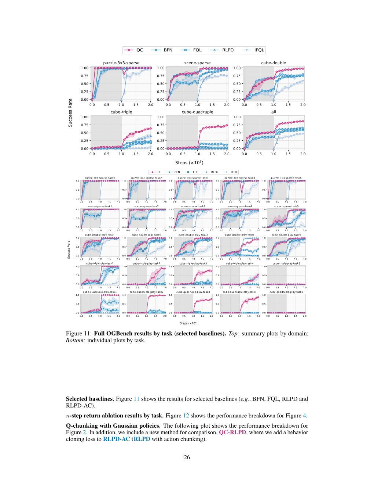

*Rendered source page for visual verification.*

QC                        BFN                           FQL                           RLPD                               IFQL
                                           puzzle-3x3-sparse                                                               scene-sparse                                                                   cube-double
                     1.00                                                                   1.00                                                                              1.00
                     0.75                                                                   0.75                                                                              0.75
                     0.50                                                                   0.50                                                                              0.50
                     0.25                                                                   0.25                                                                              0.25
                     0.00                                                                   0.00                                                                              0.00

Success Rate
                              0.0          0.5        1.0               1.5         2.0                0.0              0.5            1.0         1.5               2.0                0.0         0.5               1.0        1.5            2.0
                                                 cube-triple                                                             cube-quadruple                                                                               all
                     1.00                                                                   1.00                                                                              1.00
                     0.75                                                                   0.75                                                                              0.75
                     0.50                                                                   0.50                                                                              0.50
                     0.25                                                                   0.25                                                                              0.25
                     0.00                                                                   0.00                                                                              0.00
                              0.0          0.5        1.0               1.5         2.0                0.0              0.5            1.0         1.5               2.0                0.0         0.5               1.0        1.5            2.0
                                                                                                                   Steps (×106)
                                                                                                QC                BFN             FQL               RLPD                   IFQL
                           puzzle-3x3-sparse-task1                     puzzle-3x3-sparse-task2                         puzzle-3x3-sparse-task3                       puzzle-3x3-sparse-task4                          puzzle-3x3-sparse-task5
               1.0                                         1.0                                             1.0                                           1.0                                              1.0

               0.5                                         0.5                                             0.5                                           0.5                                              0.5

               0.0                                         0.0                                             0.0                                           0.0                                              0.0
                     0.0      0.5    1.0     1.5     2.0         0.0      0.5    1.0      1.5        2.0         0.0      0.5    1.0         1.5   2.0         0.0      0.5       1.0         1.5   2.0         0.0      0.5    1.0     1.5      2.0
                             scene-sparse-task1                          scene-sparse-task2                              scene-sparse-task3                            scene-sparse-task4                               scene-sparse-task5
               1.0                                         1.0                                             1.0                                           1.0                                              1.0

               0.5                                         0.5                                             0.5                                           0.5                                              0.5

               0.0                                         0.0                                             0.0                                           0.0                                              0.0
                     0.0      0.5    1.0     1.5     2.0         0.0      0.5    1.0      1.5        2.0         0.0      0.5    1.0         1.5   2.0         0.0      0.5       1.0         1.5   2.0         0.0      0.5    1.0     1.5      2.0
                           cube-double-play-task1                      cube-double-play-task2                          cube-double-play-task3                        cube-double-play-task4                           cube-double-play-task5
               1.0                                         1.0                                             1.0                                           1.0                                              1.0

Success Rate
               0.5                                         0.5                                             0.5                                           0.5                                              0.5

               0.0                                         0.0                                             0.0                                           0.0                                              0.0
                     0.0      0.5    1.0     1.5     2.0         0.0      0.5    1.0      1.5        2.0         0.0      0.5    1.0         1.5   2.0         0.0      0.5       1.0         1.5   2.0         0.0      0.5    1.0     1.5      2.0
                            cube-triple-play-task1                      cube-triple-play-task2                          cube-triple-play-task3                        cube-triple-play-task4                           cube-triple-play-task5
               1.0                                         1.0                                             1.0                                           1.0                                              1.0

               0.5                                         0.5                                             0.5                                           0.5                                              0.5

               0.0                                         0.0                                             0.0                                           0.0                                              0.0
                     0.0      0.5    1.0     1.5     2.0         0.0      0.5    1.0      1.5        2.0         0.0      0.5    1.0         1.5   2.0         0.0      0.5       1.0         1.5   2.0         0.0      0.5    1.0     1.5      2.0
                       cube-quadruple-play-task1                   cube-quadruple-play-task2                       cube-quadruple-play-task3                     cube-quadruple-play-task4                        cube-quadruple-play-task5
               1.0                                         1.0                                             1.0                                           1.0                                              1.0

               0.5                                         0.5                                             0.5                                           0.5                                              0.5

               0.0                                         0.0                                             0.0                                           0.0                                              0.0
                     0.0      0.5    1.0     1.5     2.0         0.0      0.5    1.0      1.5        2.0         0.0      0.5    1.0         1.5   2.0         0.0      0.5       1.0         1.5   2.0         0.0      0.5    1.0     1.5      2.0

                                                                                                                        Steps (×106)

Figure 11: Full OGBench results by task (selected baselines). Top: summary plots by domain;
Bottom: individual plots by task.

 Selected baselines. Figure 11 shows the results for selected baselines (e.g., BFN, FQL, RLPD and
 RLPD-AC).
 n-step return ablation results by task. Figure 12 shows the performance breakdown for Figure 4.
 Q-chunking with Gaussian policies. The following plot shows the performance breakdown for
 Figure 2. In addition, we include a new method for comparison, QC-RLPD, where we add a behavior
 cloning loss to RLPD-AC (RLPD with action chunking).

                                                                                                                           26

---

<!-- source-page: 27 -->
## Source page 27

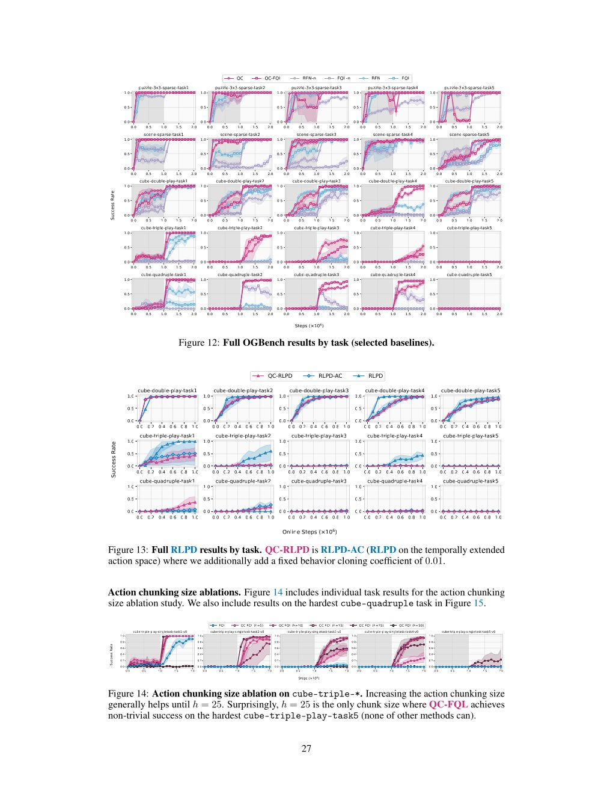

*Rendered source page for visual verification.*

QC                    QC-FQL                        BFN-n                 FQL-n                       BFN                 FQL
                                 puzzle-3x3-sparse-task1                                   puzzle-3x3-sparse-task2                                puzzle-3x3-sparse-task3                                  puzzle-3x3-sparse-task4                                 puzzle-3x3-sparse-task5
                 1.0                                                       1.0                                                       1.0                                                      1.0                                                     1.0

                 0.5                                                       0.5                                                       0.5                                                      0.5                                                     0.5

                 0.0                                                       0.0                                                       0.0                                                      0.0                                                     0.0
                           0.0           0.5     1.0    1.5        2.0               0.0       0.5      1.0       1.5         2.0           0.0        0.5       1.0       1.5         2.0           0.0        0.5       1.0       1.5         2.0          0.0        0.5       1.0       1.5          2.0
                                    scene-sparse-task1                                       scene-sparse-task2                                       scene-sparse-task3                                      scene-sparse-task4                                       scene-sparse-task5
                 1.0                                                       1.0                                                       1.0                                                      1.0                                                     1.0

                 0.5                                                       0.5                                                       0.5                                                      0.5                                                     0.5

                 0.0                                                       0.0                                                       0.0                                                      0.0                                                     0.0
                           0.0           0.5     1.0    1.5        2.0               0.0       0.5      1.0       1.5         2.0           0.0        0.5       1.0       1.5         2.0           0.0        0.5       1.0       1.5         2.0          0.0        0.5       1.0       1.5          2.0
                                  cube-double-play-task1                                   cube-double-play-task2                                  cube-double-play-task3                                  cube-double-play-task4                                   cube-double-play-task5
                 1.0                                                       1.0                                                       1.0                                                      1.0                                                     1.0

Success Rate
                 0.5                                                       0.5                                                       0.5                                                      0.5                                                     0.5

                 0.0                                                       0.0                                                       0.0                                                      0.0                                                     0.0
                           0.0           0.5     1.0    1.5        2.0               0.0       0.5      1.0       1.5         2.0           0.0        0.5       1.0       1.5         2.0           0.0        0.5       1.0       1.5         2.0          0.0        0.5       1.0       1.5          2.0
                                  cube-triple-play-task1                                    cube-triple-play-task2                                  cube-triple-play-task3                                  cube-triple-play-task4                                   cube-triple-play-task5
                 1.0                                                       1.0                                                       1.0                                                      1.0                                                     1.0

                 0.5                                                       0.5                                                       0.5                                                      0.5                                                     0.5

                 0.0                                                       0.0                                                       0.0                                                      0.0                                                     0.0
                           0.0           0.5     1.0    1.5        2.0               0.0       0.5      1.0       1.5         2.0           0.0        0.5       1.0       1.5         2.0           0.0        0.5       1.0       1.5         2.0          0.0        0.5       1.0       1.5          2.0
                                  cube-quadruple-task1                                      cube-quadruple-task2                                    cube-quadruple-task3                                    cube-quadruple-task4                                     cube-quadruple-task5
                 1.0                                                       1.0                                                       1.0                                                      1.0                                                     1.0

                 0.5                                                       0.5                                                       0.5                                                      0.5                                                     0.5

                 0.0                                                       0.0                                                       0.0                                                      0.0                                                     0.0
                           0.0           0.5     1.0    1.5        2.0               0.0       0.5      1.0       1.5         2.0           0.0        0.5       1.0       1.5         2.0           0.0        0.5       1.0       1.5         2.0          0.0        0.5       1.0       1.5          2.0

                                                                                                                                                    Steps (×106)

                                                             Figure 12: Full OGBench results by task (selected baselines).

                                                                                                                              QC-RLPD                                 RLPD-AC                              RLPD
                                 cube-double-play-task1                                    cube-double-play-task2                                 cube-double-play-task3                                 cube-double-play-task4                                   cube-double-play-task5
                      1.0                                                      1.0                                                        1.0                                                  1.0                                                     1.0
                      0.5                                                      0.5                                                        0.5                                                  0.5                                                     0.5
                      0.0                                                      0.0                                                        0.0                                                  0.0                                                     0.0
                                 0.0 0.2 0.4 0.6 0.8 1.0                               0.0 0.2 0.4 0.6 0.8 1.0                                  0.0 0.2 0.4 0.6 0.8 1.0                                  0.0 0.2 0.4 0.6 0.8 1.0                                  0.0 0.2 0.4 0.6 0.8 1.0
                                  cube-triple-play-task1                                   cube-triple-play-task2                                 cube-triple-play-task3                                   cube-triple-play-task4                                  cube-triple-play-task5
                      1.0                                                      1.0                                                        1.0                                                  1.0                                                     1.0

Success Rate
                      0.5                                                      0.5                                                        0.5                                                  0.5                                                     0.5
                      0.0                                                      0.0                                                        0.0                                                  0.0                                                     0.0
                                 0.0 0.2 0.4 0.6 0.8 1.0                               0.0 0.2 0.4 0.6 0.8 1.0                                  0.0 0.2 0.4 0.6 0.8 1.0                                  0.0 0.2 0.4 0.6 0.8 1.0                                  0.0 0.2 0.4 0.6 0.8 1.0
                                  cube-quadruple-task1                                     cube-quadruple-task2                                   cube-quadruple-task3                                     cube-quadruple-task4                                    cube-quadruple-task5
                      1.0                                                      1.0                                                        1.0                                                  1.0                                                     1.0
                      0.5                                                      0.5                                                        0.5                                                  0.5                                                     0.5
                      0.0                                                      0.0                                                        0.0                                                  0.0                                                     0.0
                                 0.0 0.2 0.4 0.6 0.8 1.0                               0.0 0.2 0.4 0.6 0.8 1.0                                  0.0 0.2 0.4 0.6 0.8 1.0                                  0.0 0.2 0.4 0.6 0.8 1.0                                  0.0 0.2 0.4 0.6 0.8 1.0

                                                                                                                                           Online Steps (×106)

 Figure 13: Full RLPD results by task. QC-RLPD is RLPD-AC (RLPD on the temporally extended
 action space) where we additionally add a fixed behavior cloning coefficient of 0.01.

Action chunking size ablations. Figure 14 includes individual task results for the action chunking
size ablation study. We also include results on the hardest cube-quadruple task in Figure 15.

                                                                                            FQL             QC-FQL (h=5)                  QC-FQL (h=10)               QC-FQL (h=15)                 QC-FQL (h=25)               QC-FQL (h=50)
                            cube-triple-play-singletask-task1-v0                      cube-triple-play-singletask-task2-v0                      cube-triple-play-singletask-task3-v0                     cube-triple-play-singletask-task4-v0                     cube-triple-play-singletask-task5-v0
               1.0                                                       1.0                                                        1.0                                                      1.0                                                      1.0
               0.8                                                       0.8                                                        0.8                                                      0.8                                                      0.8

Success Rate
               0.6                                                       0.6                                                        0.6                                                      0.6                                                      0.6
               0.4                                                       0.4                                                        0.4                                                      0.4                                                      0.4
               0.2                                                       0.2                                                        0.2                                                      0.2                                                      0.2
               0.0                                                       0.0                                                        0.0                                                      0.0                                                      0.0
                     0.0           0.5         1.0     1.5         2.0         0.0           0.5      1.0        1.5          2.0         0.0        0.5        1.0        1.5         2.0         0.0        0.5        1.0        1.5         2.0         0.0        0.5        1.0        1.5          2.0
                                                                                                                                                       Steps (×106)

 Figure 14: Action chunking size ablation on cube-triple-*. Increasing the action chunking size
 generally helps until h = 25. Surprisingly, h = 25 is the only chunk size where QC-FQL achieves
 non-trivial success on the hardest cube-triple-play-task5 (none of other methods can).

                                                                                                                                                           27

---

<!-- source-page: 28 -->
## Source page 28

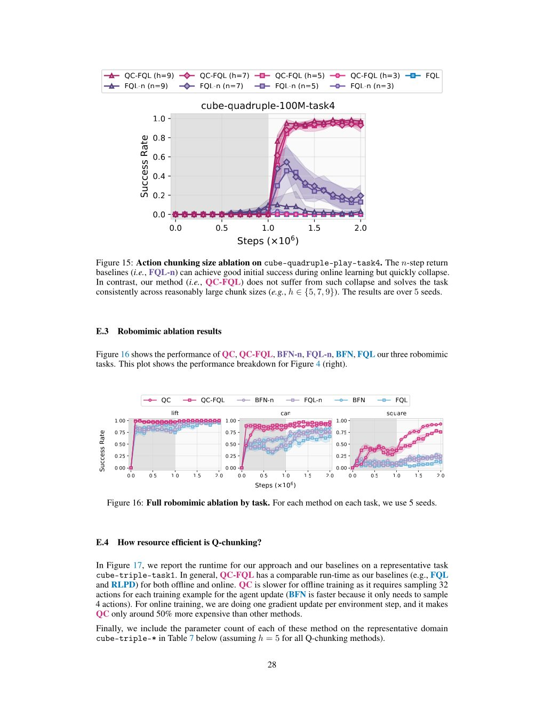

*Rendered source page for visual verification.*

QC-FQL (h=9)                         QC-FQL (h=7)                      QC-FQL (h=5)                QC-FQL (h=3)                 FQL
                    FQL-n (n=9)                          FQL-n (n=7)                       FQL-n (n=5)                 FQL-n (n=3)
                                                             cube-quadruple-100M-task4
                                         1.0
                                         0.8

                          Success Rate
                                         0.6
                                         0.4
                                         0.2
                                         0.0
                                               0.0              0.5                 1.0            1.5                   2.0
                                                                             Steps (×106)
 Figure 15: Action chunking size ablation on cube-quadruple-play-task4. The n-step return
 baselines (i.e., FQL-n) can achieve good initial success during online learning but quickly collapse.
 In contrast, our method (i.e., QC-FQL) does not suffer from such collapse and solves the task
 consistently across reasonably large chunk sizes (e.g., h ∈ {5, 7, 9}). The results are over 5 seeds.

 E.3              Robomimic ablation results

 Figure 16 shows the performance of QC, QC-FQL, BFN-n, FQL-n, BFN, FQL our three robomimic
 tasks. This plot shows the performance breakdown for Figure 4 (right).

                                           QC                QC-FQL                BFN-n          FQL-n                 BFN            FQL
                                                lift                                        can                                      square
                 1.00                                                 1.00                                      1.00
                 0.75                                                 0.75                                      0.75

Success Rate
                 0.50                                                 0.50                                      0.50
                 0.25                                                 0.25                                      0.25
                 0.00                                                 0.00                                      0.00
                        0.0         0.5         1.0    1.5      2.0          0.0    0.5     1.0   1.5     2.0          0.0     0.5    1.0     1.5     2.0
                                                                                   Steps (×106)
               Figure 16: Full robomimic ablation by task. For each method on each task, we use 5 seeds.

 E.4              How resource efficient is Q-chunking?

In Figure 17, we report the runtime for our approach and our baselines on a representative task
cube-triple-task1. In general, QC-FQL has a comparable run-time as our baselines (e.g., FQL
and RLPD) for both offline and online. QC is slower for offline training as it requires sampling 32
actions for each training example for the agent update (BFN is faster because it only needs to sample
4 actions). For online training, we are doing one gradient update per environment step, and it makes
QC only around 50% more expensive than other methods.
 Finally, we include the parameter count of each of these method on the representative domain
 cube-triple-* in Table 7 below (assuming h = 5 for all Q-chunking methods).

                                                                                      28

---

<!-- source-page: 29 -->
## Source page 29

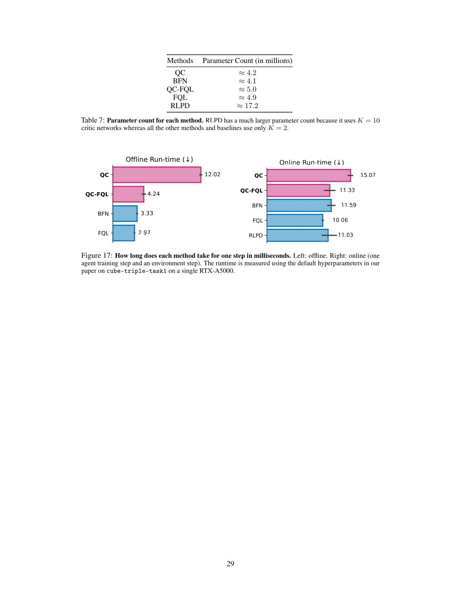

*Rendered source page for visual verification.*

Methods      Parameter Count (in millions)
                                 QC                       ≈ 4.2
                                BFN                       ≈ 4.1
                               QC-FQL                     ≈ 5.0
                                 FQL                      ≈ 4.9
                                RLPD                      ≈ 17.2
Table 7: Parameter count for each method. RLPD has a much larger parameter count because it uses K = 10
critic networks whereas all the other methods and baselines use only K = 2.

                Offline Run-time ( )                                     Online Run-time ( )
      QC                                     12.02             QC                                      15.07

 QC-FQL                 4.24                              QC-FQL                               11.33
                                                              BFN                              11.59
     BFN             3.33
                                                               FQL                          10.06
      FQL           2.97                                     RLPD                             11.03

Figure 17: How long does each method take for one step in milliseconds. Left: offline. Right: online (one
agent training step and an environment step). The runtime is measured using the default hyperparameters in our
paper on cube-triple-task1 on a single RTX-A5000.

                                                     29
